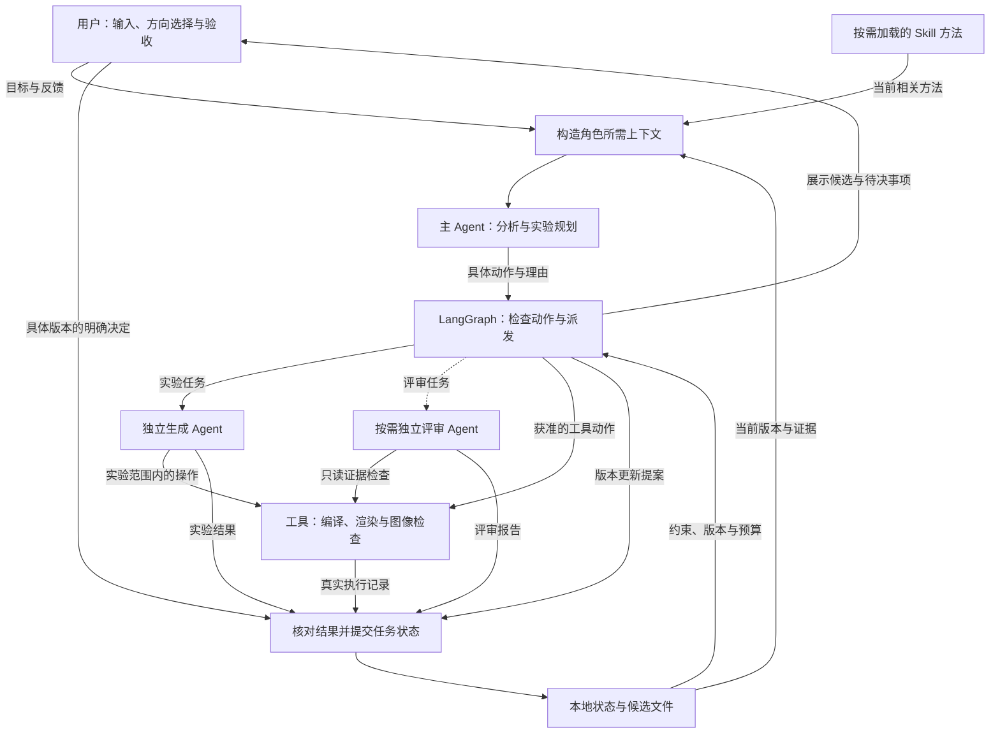
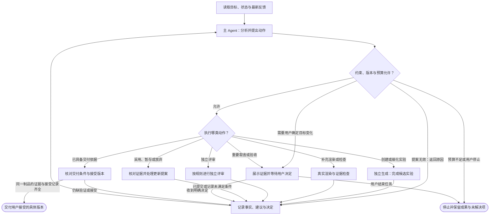
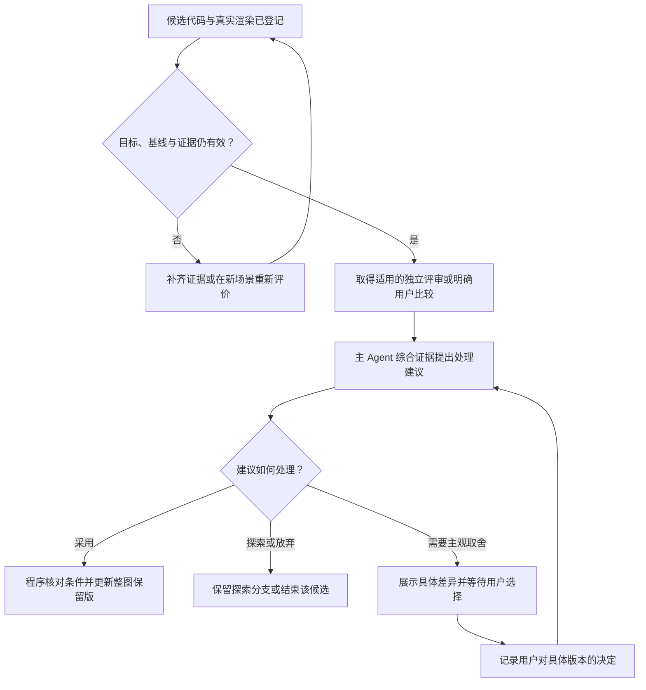

# PNG → Shader：主 Agent 统筹与独立生成方案

> 版本：v0.2 · 2026-09-08\
> 状态：拟议设计，尚未实现或完成运行验证。\
> 核心决定：主 Agent 持续负责分析与实验规划；生成保持独立；视觉评审在明确的决策节点按需调用。\
> 原始讨论材料：[PNG-to-Shader-主Agent方案.md](/Users/douwen/Documents/HUAWEl/Shader-Agent/shader-deep/PNG-to-Shader-主Agent方案.md)。本版单独保存。

## 1. 架构决定

采用 **一个主 Agent、一个独立生成 Agent、一个按需评审 Agent，加上薄 LangGraph 主循环、统一工具和本地任务状态**。

这是三类角色。主 Agent 就是此前确定的“分析与实验规划 Agent”，承担全局负责人职责。生成 Agent 接受它提出的实验任务。评审 Agent 提供独立的视觉证据。并行时可以启动多个同类任务实例，角色类型不随候选数量增加。

主 Agent 决定当前最值得解决的问题、需要检验的机制和下一步去向；LangGraph 检查并执行动作，管理等待、结果交接与状态提交。生成 Agent 自行安排当前实验内部的代码修改、编译修复和局部试验。

选择这一结构的理由是：保留一个连续理解视觉目标的负责人，同时隔离大量实现细节，并在需要时获得独立判断。它是当前优先验证的架构，尚不能断言视觉质量或成本优于单 Agent 包办或其他动态编排方式。

### 与 v0.1 的主要差异

| 项目 | 本版决定 |
| --- | --- |
| 分析与生成 | 保持独立，主 Agent 可读代码辅助分析，候选代码修改由生成 Agent 完成 |
| 全局决策 | 由主 Agent 持续负责；外层图执行经过检查的动作 |
| 视觉评审 | 内部小步修改可累计，在候选晋升、重要取舍、停滞与交付节点按规则触发 |
| 实验粒度 | 每次明确起始场景、目标问题、机制假设、允许变化和预算 |
| 版本更新 | 评审提供证据，主 Agent 提交建议，普通程序执行状态更新 |
| 框架组合 | Deep Agents 承担角色内部工作，薄 LangGraph 主循环承担跨角色派发 |
| Skill | 复用既有分析、研究、构建、细化与验证方法，按角色和当前问题加载 |

## 2. 三个 Agent 的职责

| 角色 | 负责的判断与工作 | 主要输出 |
| --- | --- | --- |
| 主 Agent | 理解目标，拆解尺度与元素，梳理依赖，提出假设，安排实验，综合反馈，决定回退层级，提出候选采用建议 | 分析记录、实验任务、下一步动作、采用或暂存理由 |
| 生成 Agent | 实现原型、修改候选、修复编译、调用真实渲染、进行假设范围内的局部优化、组合场景 | 候选代码、渲染记录、有效预览、变化说明、剩余问题 |
| 评审 Agent | 比较参考图、保留版和新候选，检查目标问题、保护项与整体影响，指出不确定性 | 绑定具体制品的视觉差异报告 |

### 2.1 主 Agent：全局负责人

主 Agent 管理“现在理解到了什么，以及下一次实验值得做什么”。它区分参考图中直接观察到的事实、用户明确要求，以及仍可能被推翻的模型假设。

它可以读取相关代码和既有案例，检查一种机制是否与实现相符；实际候选代码的写入和修改统一委派给生成 Agent。主 Agent 只需要看到与决策有关的实现信息，完整编译日志和修改过程留在实验记录中按需读取。

主 Agent 提出的动作包括：补充分析、创建候选实验、请求局部细化、重新组合与渲染、请求独立评审、建议更新保留版、请求用户决定、准备交付或停止。

它提交具体动作及理由，不直接改写正式候选指针或用户接受记录。重要视觉取舍由用户决定；已有明确授权范围内的工作继续执行。

### 2.2 生成 Agent：完成一个有边界的实验

生成 Agent 负责实验内部的操作计划，例如读取相关函数、实现一个假设、修复编译、调整参数、检查渲染，再继续小步修改。每次工具操作都记录结果并计入预算。

“完成实验”指交付了可检查的结果或清楚说明为什么无法继续。它不等于复刻成功，也不等于应该替换整图保留版。

当需要改变实验的核心假设、元素拆解或允许资源时，生成 Agent 返回证据与改向建议。新方向可以另建实验，原方向的身份和失败记录保留。

### 2.3 评审 Agent：独立检查图像证据

评审首先看到参考图、整图保留版、候选图、目标与保护项，再按需查看局部图像、指标和实现说明。生成者的自我评价不作为预设结论。

评审区分可见差异与机制推断，报告具体位置、影响程度和不确定性。独立上下文有助于提供不同视角，但不保证判断正确。

评审可以使用只读的图像分析与证据查询工具。代码写入、正式版本更新和任务目标修改不在其工具范围内。

## 3. 总体架构图

以下是同一应用内的逻辑模块，普通方框不表示独立服务。虚线表示按需调用。

上下文构造同样服务于生成和评审角色，图中只展开主 Agent 的入口。执行层根据任务类型构造对应的输入包；各角色不直接共享整段聊天历史。

工具内部的预算检查和记录适用于所有调用者。生成 Agent 在自身循环中调用渲染工具，也经过同一检查与记账入口。结果提交模块根据来源只接收允许的字段：工具追加执行事实，worker 追加实验或评审结果，正式指针由通过检查的提交动作更新。

## 4. LangGraph 与 Deep Agents 的分工

### 4.1 外层管理实验，内层管理操作

| 层次 | 规划或执行的内容 |
| --- | --- |
| 主 Agent | 选择问题、提出假设、确定实验依赖、解释结果、建议下一步 |
| LangGraph 主循环 | 校验动作、派发角色任务、汇集结果、触发所需评审、提交状态、等待与恢复 |
| 生成 Agent 内部循环 | 当前实验需要读取、修改、编译、渲染和检查的具体步骤 |
| 普通工具 | 执行确定操作，保存真实结果，检查参数、范围、版本和预算 |

主 Agent 可以在一次阅读与分析过程中调用多个只读工具，完成后交出下一项跨角色动作。外层不推进生成 Agent 的内部待办列表，也不把每次参数修改拆成独立业务节点。

首版跨角色派发统一走外层图。主 Agent 通过结构化动作提出任务；生成和评审角色只处理收到的任务。按需多视角分析可以复用分析角色配置创建独立上下文，由同一入口派发。

### 4.2 六阶段是方法框架

已讨论的六阶段继续适用：目标与拆解、选择元素、机制探索、局部优化、整图比较、最终确认。主 Agent 根据当前事实选择工作粒度，允许跳过已完成的阶段，也允许返回更高层。

例如，已确认机制的简单轮廓偏差可以直接进入细化；多个候选共享错误支撑场时返回分析；目标变化后重新评价历史版本。流程图中的每个细节框无需分别创建一个 Agent 或一次模型调用。

### 4.3 框架接入方式

主 Agent 和生成 Agent采用独立 Deep Agents 配置与上下文。评审保持独立角色接口，首版可以用一次结构化 VLM 调用实现；需要额外证据查询时再加入受限工具循环。

外层通过薄适配节点构造输入、调用角色并提取结构化结果。Deep Agents 已运行在 LangGraph 上，底层调用 LangChain `create_agent()`；自定义工作流可以把完整 Agent 作为一个节点调用。这一组合有源码和官方文档依据，具体业务集成仍需验证。[本地架构](/Users/douwen/Documents/HUAWEl/Shader-Agent/shader-deep/libs/ARCHITECTURE.md:24)、[官方自定义工作流](https://docs.langchain.com/oss/python/langchain/multi-agent/custom-workflow)

当前本地 SDK 默认可添加 `general-purpose` 子 Agent。要让跨角色派发统一走外层，应显式配置角色可用工具与委派能力；仅传 `subagents=[]` 不代表关闭默认委派。具体配置以实施时的版本为准。[本地配置说明](/Users/douwen/Documents/HUAWEl/Shader-Agent/shader-deep/libs/deepagents/deepagents/graph.py:408)

## 5. 主循环：每次根据新证据决定下一步

主 Agent 可在自己的分析调用中重新观察图像和加载方法，所以“重新分析”不必成为另一个常设 Agent。任何分支都使用统一预算。没有用户回复时，等待节点保持暂停，不能推断为接受。

更新提案若缺少必需评审，程序记录 `pending_review` 并安排对应复核；主 Agent 不能通过反复提交相同提案免除该条件。缺少预算时保存原保留版和候选，明确以未完成状态停止。

## 6. 一次实验的最小交接约定

以下字段用于说明接口边界，是拟议的小型数据结构，不要求先建设通用任务协议或大型 IR。

### 6.1 主 Agent → 生成 Agent：ExperimentRequest

| 字段组 | 必须说明的内容 |
| --- | --- |
| 身份 | `experiment_id`、`target_revision`、`scene_baseline_id` |
| 问题与假设 | 要改善的具体问题、待检验的机制，以及候选之间应体现什么差别 |
| 修改范围 | 允许修改的元素、参数族或局部实现；需要保护的特征；受影响的依赖组 |
| 输入证据 | 原参考图、基线渲染、必要局部图、相关代码和已知失败记录 |
| 运行条件 | 尺寸、时间、相机、色彩与 Alpha 规则，以及允许的 Pass、资源和运行环境 |
| 输出与额度 | 独立产物目录、子预算、停止条件和交付要求 |

用户明确要求作为约束保存。模型推断的支撑曲面和机制作为可修正假设保存，不能在摘要中自动变成用户要求。

### 6.2 生成 Agent → 主流程：ExperimentResult

返回同一组实验、目标和基线标识，附候选与实际渲染引用、变化说明、剩余差异和执行记录。消耗从工具账本读取，模型报告仅作解释。

| 结果状态 | 含义 |
| --- | --- |
| `completed` | 本轮实验完成并交出可检查的结果，不表示视觉达标或候选已被采用 |
| `needs_reanalysis` | 当前假设或允许范围不足以继续，需要主 Agent 重新分析 |
| `technical_failure` | 未得到可用的技术结果，保留失败诊断和已经存在的产物 |
| `stopped` | 子预算耗尽、被取消或到达停止条件，记录具体原因与已有成果 |

`needs_reanalysis` 至少指出被反证的假设、对应证据以及建议回退的层级。生成者可以保留新的想法，但应作为待立项的新方向描述。

实验内部的每次代码版本与实际执行都可回查。生成者可以推荐一个实验内工作版，同时保留其他有效候选；它不直接替换任务的整图保留版。

### 6.3 评审 Agent → 主流程：ReviewReport

评审报告绑定目标修订、被比较的候选、实际渲染记录和比较条件，回答四件事：目标问题是否改善，保护项是否退步，整图及依赖区域发生了什么变化，哪些结论仍不确定。

报告分开保存可见观察与机制解释。主 Agent 据此提出采用、继续探索、放弃或请求用户选择的建议。评审报告本身不更新正式指针。

## 7. 按需评审与版本采用

### 7.1 评审触发条件

生成 Agent 在同一实验内修复代码、微调参数、比较局部版本时，可以连续工作。以下节点触发独立视觉复核：

- 申请把新候选提升为整图保留版，包括机制改向后的正式采用。
- 已记录保护项冲突，或者主 Agent、工具诊断与既有评审之间出现重要分歧。
- 同一问题达到配置的停滞阈值，需要重新检查已有解释。
- 准备将具体制品提交最终验收。

同一目标、同一批候选和同一渲染条件下，已经完成的评审可以复用。用户已经对同一组具体制品给出的明确视觉选择，也可以作为该次取舍的依据；程序仍核对技术条件和目标范围。修改代码、资源、目标或相关渲染条件后，应重新判断旧报告是否适用。

触发条件由程序根据已登记的动作和状态检查。主 Agent 可以额外请求评审，但不能自行把已触发的复核标记为完成。首次可运行粗稿可以作为初始比较基线，明确标注尚未验收，不因它是唯一版本就宣称视觉合格。

### 7.2 采用候选的责任链

该图展示正式采用路径；技术失败或明确无继续价值的尝试，可以直接归档，不需要为每个失败候选安排完整评审。

程序检查候选、评价、目标和当前指针是否对应，执行已经形成的选择；它不根据一个总分替代审美判断。指标提高、代码更复杂、机制更真实，都不能单独构成晋升理由。

新的用户决定应进入下一次判断，不能在没有新证据时反复询问同一事项。用户改变必保要求时，先更新目标修订，再评价候选。整图保留与用户最终接受是两种不同记录。

## 8. 分层方法、Skill 与上下文

### 8.1 分层工作粒度

| 粒度 | 关注的问题 | 主要角色 |
| --- | --- | --- |
| 整体场景 | 构图、主体尺度、负空间、整体视觉身份 | 主 Agent 分析，生成 Agent 建立粗稿 |
| 元素依赖组 | 主体与倒影、透明体与背景、发光体与光晕 | 主 Agent 定义依赖，生成 Agent 联合实现 |
| 特征与机制 | 支撑几何、微观图元、聚合方式、材质成因 | 主 Agent 提出假设，生成 Agent 验证 |
| 参数与细节 | 边缘、高光、密度、弧度、颜色层级 | 生成 Agent 局部优化，主 Agent 综合收益 |

先建立能看到整体关系的真实基线，再选择最值得处理的问题。重要性与复杂程度分别判断。优化时固定无关输入，但重算受影响的倒影、光照和遮挡。

局部停滞时，回退到证据指向的层级：参数问题继续细化，机制问题重新探索，支撑场或元素边界错误重新分析。多个候选全被拒绝时，要检查它们是否共享同一错误假设。

分层不等于每层一个 Pass。运行目标与资源约束在任务开始时记录；追加动画、相机或背景联动属于目标选择，不能仅凭一张静态图断言这些行为已经确定。

### 8.2 复用现有 Skill 方法

| 方法来源 | 加载到哪个角色 | 使用方式 |
| --- | --- | --- |
| 分析、研究与策略探索方法 | 主 Agent；必要时独立分析实例 | 观察层级、提出竞争解释、设计区分实验 |
| 构建与局部细化方法 | 生成 Agent | 实现候选、控制修改范围、保护已有成果 |
| 视觉验证方法 | 评审 Agent与主 Agent | 构造比较问题，检查局部与整体差异 |
| 编译、捕获与制品校验规则 | 普通程序工具 | 执行并记录可核验条件 |

首版按现有 `analyze-raster-for-shader`、`research-shader-mechanisms`、`search-shader-strategies`、`plan-and-build-shader`、`refine-shader-candidate`、`validate-shader-artifact` 的相关方法分配上下文。这里是复用规划，不表示这些 Skill 已接入新系统；无需为了三个角色先把现有 Skill 重写成三份。

Skill 中的方向确认与主流程共享同一目标和用户决定记录。已经满足的确认条件可以复用，涉及新目标或新范围时再处理。Skill 提供操作方法，文件权限、预算和正式状态更新由工具入口落实。

### 8.3 角色上下文

| 角色 | 默认需要看到 | 按需展开 |
| --- | --- | --- |
| 主 Agent | 当前目标、原参考图、整图保留版、当前问题、候选比较、预算和用户反馈 | 局部图、相关源码、历史失败与研究案例 |
| 生成 Agent | 实验任务、真实输入图、基线代码、当前假设、修改范围、保护项与子预算 | 相关依赖代码和该实验历史 |
| 评审 Agent | 原参考图、保留版与新候选图、目标问题、保护项、比较条件 | 局部裁图、指标、实现证据和生成者解释 |

每次角色调用都显式构造上下文。文件路径只有通过读取或图像输入转换后才成为模型可见证据；文本摘要不能替代图像。完整历史保留在文件中，选取当前相关材料进入上下文。

同一实验内部保留操作连续性。新的竞争假设或独立评审默认使用独立上下文，并携带明确的任务记录。主 Agent 的长期任务摘要应保留决定、证据引用和不确定性，不把反复出现的推测升级为事实。

## 9. 任务状态、并行与恢复

### 9.1 本地记录

首版使用本地任务文件、候选目录与可恢复的执行记录。由单一提交入口更新任务级状态，角色只写被授权的产物位置。

| 记录 | 最小内容 |
| --- | --- |
| 目标 | 目标模式、用户要求、参考图、运行约束、目标修订号 |
| 当前问题与假设 | 观察、解释、不确定性、依赖组、保护项与停滞记录 |
| 实验 | 身份、起始整图、假设、范围、子预算、状态和结果引用 |
| 候选与执行 | 父版本、代码资源、实际渲染、捕获来源、技术状态和评价依据 |
| 版本指针 | 最新尝试、整图保留版、用户接受版；实验内工作版单独记录 |
| 预算与决定 | 已消耗及已预留额度、进行中动作、用户选择、待评审或待验收事项 |

新尝试可以失败，整图保留版用于后续比较，用户接受版绑定明确决定。三者分开。目标改变后保留旧历史，重新判断哪些候选可用于新目标。

### 9.2 并行只扩大实验数量

同一批候选共享目标修订、起始整图和比较条件，各自使用独立目录和子预算。首版先串行跑通；增加并行时，先采用批次结束后统一比较与选择的方式。

结果返回时如果目标或场景已变化，标记为待重新验证。旧结果仍可作为历史参考；在新场景采用前重新组合、渲染和评价，不能直接沿用旧比较结论。提交时核对预期的当前整图版本，防止后到结果覆盖新状态。

同一生成 Agent 定义可以复用为多个实例，独立目录不自动意味着代码或依赖可无冲突合并。强依赖元素放入同一实验，或明确先后关系。

### 9.3 预算与恢复

模型调用、分析、编译修复、渲染、独立评审和子任务均计入同一任务预算。并行派发前预留子预算，完成后按实际记录结算。图节点数和框架递归上限不能代替实际消耗。

任务记录与制品文件保存业务事实；LangGraph checkpoint 保存执行进度和会话状态。恢复时核对动作或实验标识、已记录结果和磁盘产物，再选择重用、继续或重跑。

未确认完成的动作保持“状态未知”，不能直接当作未执行或零消耗。框架恢复不会自动保证外部模型调用、文件写入和制品提交只发生一次。首版首先保证已确认成果可回查，恢复中的未确认操作被明确处理。

角色持久化通过输入输出适配实现。新实验采用独立调用上下文；同一实验确需延续时保留其会话。并行调用与暂停恢复按所选子图模式验证，尤其避免共享一个持续会话导致候选互相污染。[官方子图说明](https://docs.langchain.com/oss/python/langgraph/use-subgraphs)

## 10. 一个完整例子：发光粒子波面

这是说明角色交接的设计示例，没有在本次运行新的 Shader 实验。

1. 主 Agent 观察原图，识别连续脊谷、粒子节律和倒影关系，将“连续曲面采样”和“轨迹聚合”保留为两个待验证解释。
2. 主 Agent 创建粗稿实验，独立生成 Agent 建立能看清构图和依赖的真实场景基线。初始基线尚未表示视觉达标。
3. 主 Agent 基于同一基线创建两个机制实验，明确要区分空间连续性、排列和遮挡，不允许只改变随机种子就宣称验证了另一机制。
4. 生成 Agent 在各实验内连续实现和修复。若某个机制必须改变资源范围才能成立，返回 `needs_reanalysis`，主 Agent 重新安排。
5. 候选技术有效后，在相同条件下进行独立评审。若两者都呈现错误的四拱顶结构，评审指出可见问题，主 Agent 检查共同支撑场，返回更高层分析。
6. 有证据支持某个方向时，主 Agent 建议采用；程序核对比较、评审和当前基线后更新整图保留版。仍有取舍时展示真实候选请用户选择。
7. 主 Agent 下发局部细化任务。生成 Agent 调整曲率或采样密度，保护已成立的构图与颜色，并重算倒影和光晕。
8. 最终制品在约定条件下真实渲染，取得适用复核后交用户验收。接受记录绑定同一代码、资源、参数和预览；后续动画需求形成目标修订。

## 11. 首版落地顺序与完成依据

| 阶段 | 实现范围 | 可观察的完成依据 |
| --- | --- | --- |
| 一：串行协作闭环 | 三角色接口、主 Agent 与独立生成、边界评审、统一渲染、版本和预算记录 | 从输入到真实候选，再根据证据修改；退步时能继续使用原保留版；最终接受指向具体制品 |
| 二：分层探索与恢复 | 依赖组、机制实验、保护项、停滞回退、用户等待与恢复 | 能区分调参与重分析；目标变化使旧评价重新待验证；恢复后能核对任务与制品 |
| 三：选择性并行 | 同基线多候选、按需独立分析、子预算与统一选择 | 并行产物可分别核验；过期结果不会直接采用；实际成本可比较 |

上述是未来实施的完成依据，本次只交付设计文档。首版可在一个进程中使用少量函数、工具和本地状态实现，数据库、分布式调度、统一图元 DSL 和复杂搜索算法等留待实际需求出现后评估。

验证时先使用现有本地案例：简单轮廓与高光、连续波面及依赖、透明材质与背景关系。记录视觉选择、局部退步、有效候选、失败原因、调用成本和耗时，不能只以“工具链跑通”证明架构更好。

比较主 Agent 与图编排时保持角色、模型、工具和预算一致，只改变调度方式；比较角色拆分时保持调度方式一致。少量案例用于发现问题，不用于宣称普遍最优。

## 12. 仍需通过实现与案例确认的判断

| 不确定项 | 需要观察的现象 |
| --- | --- |
| 主 Agent 的目标理解能否长期保持 | 历史压缩后是否丢失空间关系，是否持续沿用被反证的假设 |
| 分析与生成交接是否完整 | 输入任务是否传递了关键图像、作用范围和区分实验的要求 |
| 按需评审的收益是否覆盖成本 | 是否实际拦截重要退步，是否造成重复检查或过多等待 |
| 实验粒度是否合适 | worker 能否完成有意义的探索，是否频繁因范围不清而返回 |
| 候选保留能否帮助继续改善 | 是否只是保存了好版本，之后仍在同一方向反复无进展 |

本版先明确全局负责人、实验交接和版本决定权，再通过具体实现验证粒度与成本。架构正确运行与视觉任务成功分别记录。
