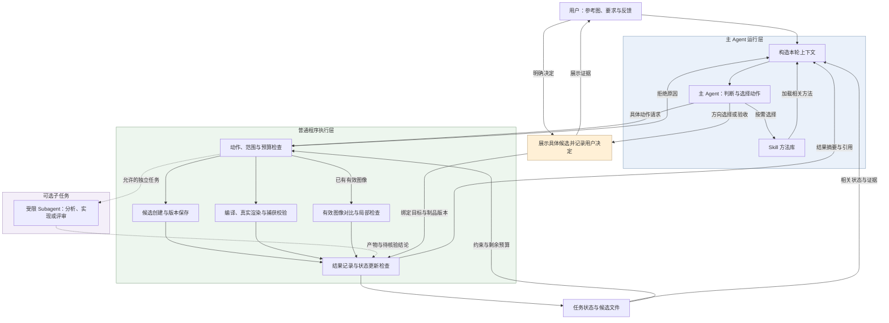
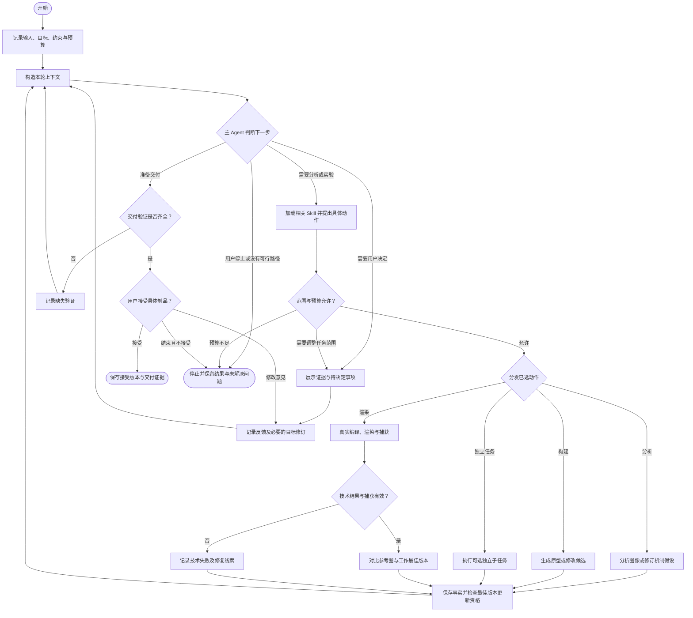
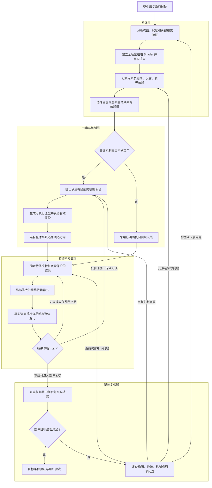

# PNG → Shader 主 Agent 方案

> 版本：v0.1 · 日期：2026-09-08\
> 状态：设计草案。本文整理本次讨论形成的方案；图中的模块、工具和数据字段为拟议设计，不表示当前仓库已经实现。\
> 目标：由一个主 Agent 持续负责视觉目标与下一步决策，通过按需加载 Skill、调用真实渲染工具、维护候选状态，完成参考图到可控制 Shader 的生成与迭代。

## 1. 方案结论与适用范围

建议采用 **一个主 Agent + 按需 Skill + 普通程序执行层 + 本地任务状态** 的结构。Subagent 作为可选能力，在需要独立判断或并行实验时使用，首版可以关闭。

主 Agent 保持对整体视觉目标的理解，根据实际反馈决定分析、试验、编写、渲染、细化或回退。Skill 提供不同阶段的方法；执行层负责真实编译、渲染、文件保存和预算计算；任务状态记录已有事实与版本关系。

这一选择适合当前需要反复探索表示方法、不断回看参考图的 PNG → Shader 场景。它属于工程设计判断，尚未通过相同模型、相同预算的对照实验，证明其视觉质量必然优于固定多 Agent 流水线。

### 1.1 输入与交付

| 项目 | 内容 |
| --- | --- |
| 输入 | 参考 PNG、用户描述、目标运行环境、尺寸、是否需要动画或交互、允许的资源与预算 |
| 目标模式 | 参考复刻、现象探索、审美改版、机制研究；按当前任务确定，模式改变时记录目标修订 |
| 交付 | Shader 程序及实际需要的运行配置、参数说明、目标条件下的真实渲染图、已知差异 |
| 验收 | 用户接受某个具体版本；记录代码、渲染图与运行条件，不能仅记录一句“效果满意” |

参考复刻以参考图为主要视觉目标；审美改版需要记录新的方向，不能继续把原图像素误差当作唯一优化依据。仅有一张静态图时，运动规律与交互行为属于额外设计选择，不能宣称已从图中确定。

### 1.2 首版范围

先支持一个明确的 Shader 运行目标，把“分析 → 生成 → 真实渲染 → 对比 → 修改 → 保存结果”跑通。使用本地文件记录任务状态，直接复用已有且适用的渲染工具。

数据库、分布式调度、统一图元 DSL、大规模搜索算法和常驻多 Agent 协作，均在出现具体需求后再引入。多 Pass 根据画面机制需要增加；图中的分层是分析与生成粒度，不等于每层都必须对应一个 Pass。

## 2. 模块职责与总体架构

| 模块 | 负责什么 | 关键边界 |
| --- | --- | --- |
| 主 Agent | 理解目标、维护机制假设、选择工作粒度、提出动作、解释结果、整合候选 | 模型判断必须引用真实产物；不能自行宣布工具已经执行成功 |
| Skill 方法库 | 指导观察、候选探索、实现、局部细化与验证 | 加载 Skill 不会创建新 Agent，也不会自动运行其中描述的工具 |
| 上下文构造 | 为本轮模型调用选择参考图、状态、代码、反馈和相关方法 | 保存到文件的内容不会自动成为模型本轮可见内容 |
| 执行层 | 工具调度、编译渲染、捕获校验、版本保存、预算记账、状态更新检查 | 用普通代码保证可核验的规则，不承担主观审美裁决 |
| 任务状态 | 保存目标修订、候选谱系、执行证据、当前问题、预算和接受记录 | 与聊天摘要分开保存；可从文件恢复任务 |
| 可选 Subagent | 独立分析、独立候选实现或评审 | 提交受限任务的结果，由主 Agent 整合；无权直接覆盖正式最佳版本 |
| 用户交互 | 确定目标、处理重要方向分歧、验收具体制品 | 已明确授权的范围内继续工作；无需每轮重新确认 |

以下是进程内部的逻辑模块图，可以在一个应用中实现，不要求拆成独立服务。

执行层的“检查”只覆盖已有任务约束与工具规则，例如预算是否足够、待比较图像是否有效、接受记录是否指向存在的制品。视觉上哪个方向更好，仍由模型结合图像和用户要求判断，必要时交给用户决定。

## 3. 主 Agent 的运行流程

主循环每次根据最新事实决定下一步。分析、编写、渲染和委派都是可选择的动作，不要求每轮走完全部阶段。

在一次动作开始前，主 Agent 应说明本轮要解决的问题、基于哪个候选、准备改变什么，以及如何判断结果。执行代码检查这个具体动作，而不是先批准一个尚未确定内容的步骤。

图中“检查最佳版本更新资格”并不意味着每次动作都能更新最佳版本。分析报告、刚写出的代码、未经核验的子任务结论，都只增加任务记录；具有有效渲染与可比评价的候选才进入视觉比较。

用户决定尚未返回时，相关分支保持等待。等待时间、没有回复或模型推测都不构成接受。目标尺寸验证所需的渲染同样经过工具和预算检查，不能从交付分支绕过。

## 4. 分层生成方法

在主循环内部，工作粒度分为“整体场景 → 元素依赖组 → 特征与机制 → 参数和细节”。主 Agent 根据问题来源选择在哪一层工作。

### 4.1 分层生成流程图

这是主循环可采用的业务方法。图中省略的预算、技术失败处理、版本保存和等待状态，均沿用第 3 节规则。简单任务可以直接完成整体实现与验证，不必机械地拆出每一层。

### 4.2 分层时需要保持的规则

1. **先得到整体基线。** 基线可以粗糙，但必须让主体尺度、空间分布和背景关系可见。否则容易把预算投入到组合后仍然失真的局部细节中。
2. **重要程度和复杂程度分别判断。** 一个简单轮廓可能决定图像身份，一个复杂噪声背景可能只占很小视觉权重。
3. **按依赖组优化。** 玻璃与背景、发光体与光晕、物体与倒影需要共同检查；独立元素的局部优胜者未必能组合成更好的整体。
4. **候选区分机制。** 例如连续曲面采样、粒子轨迹、体积密度场属于不同解释；只改变三个噪声种子的版本通常不足以验证机制。
5. **冻结无关输入，重算相关输出。** 修改发光体位置时可以冻结其颜色和背景参数，但依赖新位置的光晕、反射和遮挡需要重新计算。
6. **允许回退到更高层。** 局部调整持续无效时，回看承载几何、拓扑、投影和组合关系，避免把结构错误当成参数误差。

候选图默认来自可执行 Shader 的真实渲染。若任务另行使用生成式概念图，它只能帮助表达审美方向，必须单独标记，不能作为某个 Shader 已经实现该效果的证据。

## 5. Skill 如何组织

首版建议保留三个主要 Skill，把详细方法放在按需读取的参考文件中。下面的名称是建议命名，本次文档没有创建这些 Skill。

| Skill | 主要触发条件 | 方法与输出 |
| --- | --- | --- |
| `analyze-reference` | 开始任务、机制不清楚、整体偏差明显、局部优化停滞 | 分析尺度层级、主体身份、元素依赖；提出有区分度的假设，给出下一次实验要验证的差别 |
| `build-and-refine` | 已有待验证假设或明确修改目标 | 生成最小原型或候选修改；指出变化范围、保护项、依赖输出和预期可见变化 |
| `validate-result` | 有真实渲染、准备更新工作最佳版本、准备交付 | 检查输入证据有效性；比较整体和局部；指出回退、继续细化或提交验收的依据 |

多视角分析、机制候选探索、反射与发光实现、参数细化等可以先作为 Skill 内的专题方法。只有某种方法足够独立、频繁使用、需要单独上下文时，再拆成新的 Skill。

每份 Skill 至少讲清楚：何时使用、需要什么输入、怎么执行、输出什么、遇到什么情况应回退或请求用户决定。案例应说明适用机制与失败条件，不能只保留一次成功时的参数。

加载机制采用两级方式：常驻上下文提供简短的 Skill 目录；主 Agent 选中后，再读取相关正文与必要案例。切换 Skill 后，仍然是同一个 Agent、同一个任务状态，也会保留已有判断带来的偏差。

## 6. 工具与执行层

工具名称仅表达职责，落地时按现有渲染器接口实现，不要求把每一项都拆成独立服务。

| 能力 | 输入 | 应保存的真实结果 |
| --- | --- | --- |
| 候选保存 | 基础版本、代码和资源、修改说明 | 新候选标识、父版本、文件路径、内容校验值 |
| 编译与渲染 | 候选版本、尺寸、时间点、随机种子、参数、资源 | 编译结果、运行错误、实际渲染条件、捕获图像和来源 |
| 捕获校验 | 渲染记录与输出图像 | 是否捕获了指定版本的实际渲染目标，以及失败原因 |
| 图像对比 | 有效候选图、参考图或基准候选、局部区域、比较设置 | 叠图、差异图、局部检查和指标；视觉评论标记为模型或用户判断 |
| 状态更新 | 已存在的候选和证据、更新提案或用户决定 | 更新后的版本指针、理由、目标修订号与预算消耗 |

### 6.1 真实渲染是评价前提

编译通过、页面打开、截图文件存在，是三个不同事实。需要确认输出对应指定候选，目标画布已经实际渲染，且没有捕获错误页面、加载遮罩或不相关界面。优先使用渲染器能够明确绑定的 framebuffer 或 canvas 输出。

全黑图不一定代表技术失败，因为目标本身可能很暗；“文件存在”也不代表渲染成功。有效性判断应结合编译、运行状态和捕获来源，不能只靠一个亮度阈值。

技术无效的结果进入诊断与修复，不参加视觉排名。修复后生成新的执行记录；保留原始失败，方便判断预算为什么被消耗。

### 6.2 可比较性与视觉评价

比较必须绑定参考图版本、目标模式、分辨率、时间点、随机种子，以及裁剪、缩放和色彩处理规则。不同规则下的分数不能直接排序。

评价同时看整体构图和关键局部，例如交叉点、轮廓转折、透明边缘、亮度层级。MAE、SSIM 等指标作为诊断信号，模型视觉判断也是需要证据支持的意见。关键身份特征退化时，不能因为总分升高就自动替换工作最佳版本。

## 7. 任务状态与候选版本

首版可以使用一份任务 JSON 和各候选的独立目录。只有主运行流程提交任务级状态；子任务可以写自己的候选目录。

| 状态信息 | 最小内容 | 用途 |
| --- | --- | --- |
| 目标 | 模式、用户要求、参考图、目标修订号 | 区分用户要求与模型假设，保留目标变化历史 |
| 运行约束 | 运行目标、尺寸、资源、动画或交互要求 | 保证代码与评价使用同一任务条件 |
| 当前判断 | 元素依赖、机制假设、证据和不确定点 | 支持回退与继续推理 |
| 当前工作项 | 基础候选、首要问题、本轮变化范围、保护项 | 限制一次修改的范围，便于归因 |
| 候选索引 | 候选标识、父候选、代码与资源引用 | 找回每次尝试并比较不同方向 |
| 执行与评价 | 渲染条件、技术状态、图像、评价来源和设置 | 区分程序事实、模型意见与用户判断 |
| 版本指针 | 最新候选、工作最佳候选、用户接受候选 | 防止最新尝试覆盖更好的结果 |
| 预算 | 总额、已用量、进行中预留量、停止原因 | 主任务与子任务共同记账 |
| 用户决定 | 决定内容、目标修订号、具体制品和证据引用 | 确保方向确认或验收指向明确对象 |

三个版本指针必须分开：

- **最新候选**：最近创建的尝试，可能还没渲染，也可能失败。
- **工作最佳候选**：在当前目标与比较条件下，已有证据支持继续作为基线的版本。
- **用户接受候选**：用户明确接受的具体制品；后续修改生成新候选，原接受记录保留。

工作最佳版本的更新需要有效执行证据、可比较的设置和明确更新理由。出现视觉取舍或证据冲突时，可以并列保留候选，待用户决定。历史候选不必全部载入模型上下文，但应能按标识重新读取。

目标改变后，历史候选与接受记录继续保留；在新目标下重新判断工作最佳版本的适用性。不能通过修改一个全局目标字段，让旧的验收自动覆盖新的要求。

## 8. 每轮上下文如何构造

这里的上下文构造指模型每次调用前的检索、筛选、排序、内容压缩和预算分配。Skill 是可选材料之一；任务文件则是材料来源，二者都不会自动等于本轮实际输入。

建议按以下顺序提供信息，并根据当前动作调整：

1. 当前目标、用户最近的有效反馈和必须遵守的运行约束。
2. 参考图与整体基线；当前操作涉及的区域可补充局部裁图。
3. 工作最佳候选的渲染图，以及本轮需要修改的代码和资源片段。
4. 当前机制假设、最重要的差异、保护项及未解决问题。
5. 本轮选中的 Skill 正文与少量直接相关案例。
6. 最近执行结果、可用预算、证据文件引用和必要失败摘要。

完整日志、所有历史候选和整套 Skill 留在文件中，按需读取。压缩历史时保留决定、证据引用、失败原因和目标修订关系，不能把旧推测压缩成确定事实。

上下文不足或反复失败时，应重新打开原图、关键局部和相关候选；摘要不能替代图像，也不能保证保留拓扑与空间关系。

## 9. Subagent 的使用方式

Subagent 提供独立的上下文，适用于三个边界明确的工作：

| 子任务 | 适合的情况 | 输入与输出 |
| --- | --- | --- |
| 独立机制分析 | 主 Agent 长时间沿同一方向优化无效 | 输入原图、目标和约束；输出观察、竞争假设与区分实验 |
| 并行原型 | 两种或少量机制都值得试验，能够独立实现 | 输入统一场景条件和子预算；输出独立代码、实际执行证据和差异说明 |
| 独立评审 | 准备替换关键候选，或指标与视觉判断冲突 | 输入参考图和候选图；输出具体位置、差异与严重程度 |

需要独立评审时，优先让评审先看参考图与候选图，再看生成者解释，减少先入为主。独立上下文可以增加视角，但不保证判断正确。

每个子任务指定目标、输入候选、允许的工具、输出位置、预算和结束条件。并发写入时分开候选目录；涉及同一源码工作树时，需要进一步隔离写入范围。上下文隔离并不自动限制文件权限。

子任务返回的是产物和结论提案。执行证据须核对版本与运行条件，才允许进入正式评价。子任务不能修改用户目标、正式版本指针或验收记录。首版关闭递归委派，所有调用与渲染计入同一总预算。

## 10. 示例：发光粒子波面的生成

以下是说明方案如何运行的示例，不是本次新执行的实验结果，也不声称复现了某个历史 case。

**输入与整体基线。** 用户希望复刻一张发光粒子波面图。主 Agent 先确定主体位置、波面轮廓、亮暗分布和粒子尺度，建立背景、波面占位和光晕的粗略整体渲染。

**机制存在歧义。** 图像可能来自连续曲面上的离散采样，也可能来自多条运动轨迹叠加。主 Agent 调用分析 Skill，描述两种解释在弯曲连续性、粒子排列与遮挡关系上的区别。

**生成机制原型。** 在统一构图、尺寸和发光参数下，分别生成两个可执行原型。可以由主 Agent 顺序完成；只有并行能够带来实际收益时才委派独立任务。

**按结构选择方向。** 对比重点先放在承载几何、空间关系和粒子分布，避免把更强的光晕误认为更正确的机制。若证据仍不能确定，向用户展示具体渲染进行方向选择。

**局部细化。** 假设曲面采样方向更符合目标，下一轮只调整曲率或采样密度，冻结已成立的构图和颜色设置，同时重算依赖粒子位置的光晕。每轮同时检查局部和整体。

**发现结构错误时回退。** 如果加密粒子只让画面更亮，却始终无法得到正确交叉关系，主 Agent 回到几何或投影假设，记录当前方向的失败证据，保留已有最佳候选。

**交付。** 通过目标条件下的真实渲染检查后，展示具体候选及剩余差异，用户接受后绑定该版本。后续动画设计或审美改版另记目标修订。

## 11. 主要限制与应对

| 限制 | 可能出现的具体问题 | 应对方式 |
| --- | --- | --- |
| 主 Agent 容易延续原有判断 | 多轮修改都沿用同一个错误几何假设 | 设置停滞复盘；回读原图；必要时引入独立分析 |
| Skill 指令不能强制执行 | 模型声称保存了最佳版本，文件却没有对应更新 | 把文件操作、预算和指针更新放入可检查的程序路径 |
| 上下文容量有限 | 大量候选、日志挤掉参考图和关键约束 | 按当前动作加载材料，保留可回查的完整产物 |
| 单主循环可能成为吞吐瓶颈 | 多个独立机制需要串行尝试 | 在统一预算和输入下，按需并行少量独立原型 |
| 自动视觉判断仍有误差 | 全图指标改善，但关键轮廓或交叉点退化 | 局部检查与保护项参与评价；重要取舍由用户决定 |
| 工作最佳版本不会自动带来收敛 | 保留了好版本，但之后多轮都没有进展 | 记录实验收益；停滞后改变机制、粒度或停止 |
| 元素存在相互依赖 | 局部好看的透明体在组合后失去背景关系 | 从早期整体基线出发，在场景条件下比较候选 |
| 子任务增加成本且可能偏题 | 多个候选投入相同方向，或返回无法运行的结果 | 明确机制差异、输出和预算；核验产物后再整合 |

连续无改善轮数、候选数量、调用额度与渲染额度应按任务规模配置。首版可以采用简单上限，观察真实成本后再调整，不需要先设计复杂收益预测器。

## 12. 分阶段落地与验证

| 阶段 | 实现内容 | 完成依据 |
| --- | --- | --- |
| 第一阶段：可核验闭环 | 一个主 Agent、三个 Skill、候选保存、真实渲染与对比、本地状态 | 能从参考图生成候选，根据真实结果修改，并找回每个版本的代码与渲染条件 |
| 第二阶段：分层迭代 | 整体基线、元素依赖、机制候选、局部保护项、停滞回退 | 能判断应改参数还是换机制，局部调整会检查依赖输出与整体效果 |
| 第三阶段：选择性委派 | 独立分析、少量并行原型、独立评审与统一预算 | 子任务产物可独立核验，正式状态由主流程统一提交，成本有记录 |

第一阶段优先验证以下可观察行为：

- 编译或捕获失败时，系统保留诊断，不把无效图像排入视觉候选。
- 新候选退化时，历史工作最佳版本仍可恢复和继续修改。
- 重新打开任务时，能找回目标、代码、渲染条件和接受记录。
- 用户修改目标后，旧接受记录仍有原来的适用范围。
- 预算耗尽后停止继续调用，明确保留了什么、还缺什么。

验证方案质量时，可选择机制不同的本地案例，在相同参考图、目标约束和预算下比较。记录用户的视觉选择、关键局部差异、有效候选数、渲染失败次数、总耗时和调用成本；如果用户未参与验收，应明确结果只得到技术验证或模型评审。

本文仅持久化方案与 Mermaid 源码。实际 Skill 文件、运行循环、工具接入、子任务能力和上述行为验证，需要在后续确认实施范围后逐步完成。
