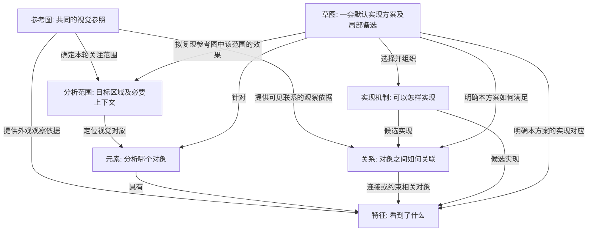

# 五库与报告数据设计

更新日期: 2026-09-30.

状态: 首版五库业务字段与本轮公共 state 字段已收口. 用户已确认最终交付采用“完整五库包 + 短入口报告 + 按草图读取”, 见第 8.9 节; 首版文件布局约定见第 8.8 节, 文本对象引用的设计契约见第 8.10 节. 用户授权实施后已接入五库模型、引用维护及文件包读取; 验收与未覆盖范围见[五库实施记录](work-items/five-library-implementation.md).

本文只维护五库对象语义、字段、引用关系和报告数据契约, 是这些定义的唯一主要记录位置. 模块职责、主 agent 与 worker、skill、调度和探索批次见[分析架构与 Agent 工作流设计](analysis-architecture-design.md); 当前已实现代码见[架构说明](architecture.md).

## 1. 已确认的数据设计约束

1. 最终业务对象分成五库: 元素、草图、特征、关系、实现机制. 特征和关系都有对应的实现机制.
2. 报告需要轻量化, 减少重复内容与下游 AI 处理压力.
3. 草图的定义遵循用户原话:

   > 草图是一套默认选定的实现方案，包含机制组合及组织方式，并为确有不确定性的部分保留可替换候选。

4. 草图库允许多个草图. 不能把整个草图库压缩成唯一的 S1, 也不能把所有差异都塞进同一个草图的替换列表.
5. 用户认可《同一个粉色圆形，五个库分别记录什么》的五库关系演示. 该图表达的逻辑关系, 连同后续明确的多个草图及参考图关联, 构成后续数据设计的语义基线. 不再以“先讨论五库逻辑关系”为由重新打开已确认问题.
6. 跨图片出现相似特征时, 新建各自的特征观察, 复用适用的实现机制. 不把不同图片中的相似亮斑直接合并为同一条特征记录; 多个草图可以共享本轮的同一观察. 这项决定确认复用边界, 不自动冻结元素与特征之间的存储字段.
7. 用户随后认可元素、特征的轻量字段及引用关系: 元素为 `id`, `name`, `region`, `feature_ids`; 特征为 `id`, `description`, `mechanism_refs`. 候选机制引用包含 `id` 与可选 `reason`. 元素引用特征, 特征引用候选机制, 草图决定实际采用哪些机制.
8. 关系库字段已确认: `id`, `participants`, `description`, `mechanism_refs`. 参与项使用 `ref` 与可选 `role`, 支持多对象关系; 候选机制引用与特征库一致. 对称关系可省略角色, 非对称关系明确各自作用, 不靠数组顺序暗示方向.
9. 实现机制库字段已确认: `id`, `name`, `method`, 可选 `conditions`. `method` 说明构造方式、必要输入/调节量和输出; `conditions` 只保存方法内在前提. 参数含义属于机制, 特定图片的取值、位置、应用次数和组合属于使用上下文; 本次候选适配理由放在引用中的 `reason`. 首版不独立展开参数表.
10. 草图库字段已确认: `id`, `element_id`, `name`, `default`, `composition`, 可选 `alternatives`. 局部备选必填 `choices`, `reason`, 可选 `conditions`, `composition`. 默认映射表示实际选择, 组织说明明确应用次数与共同满足的关系; 备选只替换列出的目标选择, 未列出的保留, 并检查受影响关系. 不新增 `parts` 或实例层.
11. 用户确认这里的 state 仅指本轮分析. 统一称为“本轮分析公共业务状态”, 由本轮视角与五库共用上下文; 不解释成跨图片、跨任务共享一份运行状态. 此确认是作用域澄清, 不自动冻结报告公共字段的具体序列化格式.
12. 用户确认最终交付也改为五库独立文件组成的文件包, 按引用或链接读取, 不再以聚合成一份 JSON 作为必需交付方式. 五库内部字段与既有公共字段语义不变, “五库”不限制包内辅助文件的总数.
13. 用户进一步确认“完整五库包 + 短入口报告 + 按草图读取”. 完整包保留全部合法业务结果; 短入口提供轻量导航; 按草图读取提供同一快照上的相关材料视图, 不自动裁掉其他方案或选定唯一默认草图. 具体读取工具属于架构与实现事项.

“每个草图内部有默认方案”不意味着“整个草图库已经选定一个默认草图”. 草图之间的优先级和选择策略尚未确定.

## 2. 五库各自的职责

以下职责对应已确认的五库逻辑关系, 字段基线见第 8 节. 后续实现待办和当前范围之外的扩展见第 7 节.

| 库 | 保存什么 | 与其他库的联系 |
| --- | --- | --- |
| 元素 | 被分析的视觉对象及其范围 | 具有特征、参与关系; 可以有多套针对它的草图 |
| 特征 | 特定参考图中元素呈现的可见属性或现象 | 不跨图合并观察身份; 与候选实现机制关联; 草图决定本方案如何实现它 |
| 关系 | 对象之间可见的联系或需要满足的约束 | 明确关联对象; 与候选实现机制关联; 草图决定如何满足它 |
| 实现机制 | 可复用的方法及其内在适用条件 | 可被不同图片和草图选用; 具体作用目标在使用方或关联记录中表达, 不在机制正文绑定消费者 ID |
| 草图 | 针对目标元素的一套默认实现方案 | 绑定要实现的特征/关系与所选机制, 组织机制, 并保留必要的局部备选 |

这里的草图是结构化实现构想, 不要求生成一张草图图片. 机制是待编码与渲染验证的候选方法, 不能从图像外观直接宣称唯一真实成因.

## 3. 关系模型

### 3.1 五类对象的连接

参考图是五库共同的观察来源与复现参照. 本轮分析范围用于确定关注参考图中的哪个对象及其必要上下文; 参考图和分析范围是输入上下文, 不新增第六个业务库.



图中的箭头表示语义联系, 不是执行阶段或五库写入顺序. 草图指向分析范围表示它要复现的目标, 不是已经生成图像或完成视觉验证. 示例中的特征间关系是已确认模型的一部分; 元素关联见职责表, 实例组或关系自身是否可作为端点属于尚未确定的扩展, 不影响当前基线.

| 对象 | 与参考图的联系 | `pink_circle.png` 中的例子 |
| --- | --- | --- |
| 元素 | 对应参考图中被识别和定位的视觉对象, 不是任意抽象名称 | E1 对应粉色圆形主体 |
| 特征 | 记录该对象在参考图中可见的属性, 应能指出观察位置或范围 | F3 对应主体左上方的白色长亮斑 |
| 关系 | 记录参考图中相关对象如何分布、接触、遮挡等, 需要同时对照参与对象 | R1 需要同时观察 F1 轮廓与 F3、F4 亮斑的位置 |
| 实现机制 | 本轮依据观察选入或提出候选, 通过本轮特征/关系的适用关联连接参考图; 方法本身可跨图复用, 不永久绑定原图 | 弧形遮罩与曲面光照都可作为亮斑形成方式的候选 |
| 草图 | 针对参考图中的同一目标范围组织一套复现方案; 多个草图可以面向同一参照 | S1、S2 都尝试复现 E1 及其特征和关系 |

参考图定位、观察描述、实现假设和复现方案不能混为同一层. 观察可能有误或不完整; 机制与参考图的关联不能当作机制已被证实.

同一轮的这些联系应能追溯到同一份参考图和明确的目标范围. 不要求每个条目重复图片内容或完整路径; 可通过本轮公共输入和对象引用还原. 首版参考图由 `reference` 绑定, 元素范围使用文字 `region`; 可执行区域坐标或分割遮罩留作后续扩展. 聚焦一个元素也不等于只允许读取其裁剪图, 必要时仍需要整图上下文来解释关系.

### 3.2 候选关联与方案选择是两层信息

- **候选层**: 某个特征或关系可以由哪些机制实现. 允许多对多: 一个现象有多个备选解释, 一个机制也可能同时实现多个特征或关系.
- **方案层**: 某个草图默认采用哪些机制, 分别作用于哪些特征或关系, 以及这些机制怎样共同工作.

不能只给草图一串没有作用对象的机制 ID, 然后让下游猜测每个机制实现什么. 可以通过引用推导的联系无需重复存储, 但必须能无歧义地还原本方案的作用范围.

共享机制不等于自动合并机制. 名称相同但适用范围、条件或构造方法不同, 仍可能是不同候选. 单个观察尚无可用机制时应保留缺口, 不为满足字段要求编造实现.

### 3.3 视觉关系与方案内部组织分开

| 类型 | 示例 | 归属 |
| --- | --- | --- |
| 希望复现的视觉关系 | 两处亮斑沿圆形轮廓分布 | 关系库 |
| 实现的组织或计算依赖 | 先计算轮廓距离, 再用距离限制亮斑范围 | 草图的组织方式及机制的必要前提 |

不能因为程序按顺序计算两项, 就把它们登记成图像中观察到的关系.

## 4. 多个草图与局部备选

一个目标元素可以对应多个草图. 每个草图都必须说清自己的默认方案; 不把若干互斥机制平铺成“全部采用”.

| 层级 | 含义 | 如何区分 |
| --- | --- | --- |
| 草图之间 | 不同的整体实现构想 | 基础表示、组成或组织方式存在实质差异 |
| 同一草图内部 | 一套方案中的局部不确定性 | 替换部分机制后, 仍保留该方案的主要结构; 必要的依赖变化需明确 |

每个局部备选应能回答: 作用于哪些特征/关系、替换什么、保留什么、有哪些新的必要条件. 已确定用第 8.3 节的 `choices`、`reason` 及可选 `conditions`、`composition` 表达, 不沿用此前示例中的裸 `replace` / `with` 数组.

不为每个草图强制生成备选. 也不把局部机制的所有组合展开成大量新草图. 如果替换实际上改变了整体表示或组织方式, 应重新评估它是否需要成为另一套草图.

独立视角与草图没有一一对应关系. 一个视角可能提出多个草图; 多个视角也可能支持同一草图. [架构设计](analysis-architecture-design.md)中的视角数量限制不构成草图数量限制.

## 5. `pink_circle.png` 示例

用户提供的本地参考图: `/Users/douwen/Documents/HUAWEl/pink_circle.png`. 该文件不在仓库内, 本文保留文字示例, 不要求其他环境存在此绝对路径.

本例只分析粉色圆形主体. 背景及下方晕影不在本例展开范围内. 下列观察是用于解释关系的人工定性示例, 不是测量结果; 所列机制和草图均未经编码或渲染验证.

### 5.1 元素、特征和关系

| ID | 库 | 内容 |
| --- | --- | --- |
| E1 | 元素 | 粉色圆形主体 |
| F1 | 特征 | 近圆形的闭合外轮廓 |
| F2 | 特征 | 上方较深、下方较浅的粉色渐变 |
| F3 | 特征 | 左上方白色长亮斑 |
| F4 | 特征 | 右下方白色弧形亮斑 |
| R1 | 关系 | F3、F4 沿 F1 分布, 亮斑位置与轮廓相关 |

F3、F4 在此作为 E1 的特征, 不因它们有独立实现机制就自动升级为新元素. “沿轮廓分布”也不能直接证明亮斑来自曲面反射.

### 5.2 候选实现机制

下表的“作用对象”是这张参考图中的候选关联, 不是机制对象持有的固有字段. 机制方法可复用, 本例的位置、数量和具体 F/R 对应属于本次使用上下文.

| ID | 候选机制 | 作用对象 | 必要说明 |
| --- | --- | --- | --- |
| M1 | 圆形距离场/遮罩 | F1 | 提供轮廓和裁切范围 |
| M2 | 方向性颜色渐变 | F2 | 调节渐变方向和颜色分布 |
| M3 | 局部弧形亮斑遮罩 | F3、F4、R1 | 本例使用两处, 位置及方向受轮廓约束 |
| M4 | 拉伸的高斯亮斑, 配合轮廓裁切 | F3、F4、R1 | 需调整形状、位置和方向, 不能假定自然贴合轮廓 |
| M5 | 曲面法线与光源产生亮斑 | F3、F4、R1 | 需要曲面表示、法线和光源设置, 不等价于无条件替换一个亮斑函数 |

### 5.3 多个草图

| 草图 | 默认实现组合与组织 | 局部备选 |
| --- | --- | --- |
| S1: 二维分层方案 | M1 构造轮廓; M2 填充渐变; M3 在轮廓约束下叠加亮斑 | M4 替代 M3 的局部亮斑构造, 作用仍是 F3、F4、R1 |
| S2: 曲面着色方案 | M1 限定可见轮廓; 在该范围构造曲面与法线; 使用 M2 控制底色分布、M5 形成亮斑 | 曲面轮廓或光源形状的局部候选, 只有明确不确定时才具体列出 |

两套草图服务于同一元素和观察集合, 可以共享适用机制. 在本例中, 引入曲面法线及光照组织构成独立 S2, 不沿用早期演示里直接把曲面光照当作 S1 无条件局部替换的简化.

没有确定优先运行 S1 还是 S2. 默认方案只是各自草图内部的选择, 不代表任一方案已经证明更准确.

## 6. 轻量化原则与容易偏离的地方

- 五库正文按职责组织, 同一观察或机制说明尽量只写一次; 草图引用并组织, 不复制一份完整报告.
- 减少冗余不能丢失机制的作用对象、必要条件和实际未解决项.
- 独立机制库不只是把嵌套候选搬到新数组; 需明确它与特征、关系、草图的关联.
- 不把关系库变成程序执行步骤表; 不把草图库变成没有对应目标的机制列表.
- 多个草图可以共存, 局部备选也可以共存; 不把二者强行压成同一层.
- 分析范围是一个目标元素, 不代表禁止读取整图或描述必要的外部影响; 如何编码外部引用尚待确定.
- “已交付”“默认选定”和“已验证正确”分别记录. 报告格式简化不能掩盖失败或缺口.

## 7. 实现待办与后续扩展

首版字段讨论已结束. 本节记录数据契约实现与扩展事项, 不将这些事项当作字段基线尚未确定. 目标选择、调度预算、探索批次及草图选择策略集中在[架构设计的待办](analysis-architecture-design.md)维护.

| 项目 | 当前状态 |
| --- | --- |
| 参考图与区域引用 | 实现固定原图保存及 `reference.path` / `sha256` 绑定; 首版 `region` 使用文字, 自动裁剪坐标或分割遮罩不在当前字段范围 |
| 关系端点扩展 | 当前 `participants` 的 `ref` 与可选 `role` 已确认, 支持多个元素/特征; 实例组或关系自身作为端点的扩展暂不引入 |
| 引用身份与解析 | 实现报告内短 ID、对象类型与范围校验, 并保留本轮明确的候选引用; 共享机制来源按第 8.7 节存入程序记录 |
| 共享机制身份 | 报告携带本次使用的机制快照; 实际复用时记录来源身份及固定版本/内容指纹. 持久 ID 和映射存储细节由实现确定, 不向五库新增消费者字段, 不假定同名等价 |
| 后续可执行接口扩展 | 首版已确定目标到机制的默认映射、文字组织说明与局部替代; 自动填参、实例寻址和可执行依赖结构属于未来扩展, 不作为当前字段讨论的前置条件 |
| 报告载体与验证 | 按第 8.7-8.9 节实现完整五库包、短入口和按草图读取; 公共字段单独保存, 日志与完整来源旁存, 校验包内引用、部分交付及输入一致性 |

## 8. 数据结构: 首版字段基线

本节记录首版五库及公共封装的字段基线, 不重新设计业务对象或关系. 字段设计完成不代表第 7 节实现待办已经完成. 五个业务库不意味着数据库只能有五张物理表.

### 8.1 公共分析上下文

一次分析在公共上下文中记录参考图引用、目标元素和交付状态. 图片身份、哈希及尺寸由程序登记, 不要求各视角反复生成. 运行日志、来源映射、版本和合并回执继续由程序维护, 不塞入每个业务对象.

公共封装的具体字段集中在第 8.7 节, 与五库共同构成当前首版基线.

采用同一文件包内唯一的对象 ID, 不为每个文件单独建立可冲突的对象命名空间. 关系与机制引用通过 ID 查到对象并校验类型, 不单靠 ID 前缀判断类型. 跨报告合并时由程序处理命名空间及来源, 不让模型生成长运行 ID. 机制的本地短 ID 与共享来源身份的对应放入程序记录, 存储细节属于实现事项; 相同本地 ID 不足以证明两个报告使用了同一机制.

### 8.2 五类对象的字段与确认状态

五个库均按用户已认可的首版结构记录. 示例 ID 沿用第 5 节, 不新增业务对象类型.

可视化速查: [字段与引用对照图 PNG](diagrams/five-libraries-fields.png)、[可放大的 SVG](diagrams/five-libraries-fields.svg); [图源及维护说明](diagrams/README.md). 图中同时列出本轮公共 state, 不另定义一套字段.

引用方向: 已确认 E → F → 候选 M, R 引用参与对象及候选 M, S 针对 E 并选择 F/R 对应的 M. 不恢复 `feature.element_id` 或机制固有 `targets`. 五库与第 8.7 节公共封装共同作为首版基线, 不表示实现已经完成.

#### 元素 `elements`: 已确认

| 字段 | 类型 | 必填 | 内容 |
| --- | --- | --- | --- |
| `id` | 字符串 | 是 | 元素 ID, 如 E1 |
| `name` | 字符串 | 是 | 中性名称, 如“粉色圆形主体” |
| `region` | 字符串 | 是 | 参考图中的定位与范围, 如“中央圆形主体, 不包含外围背景与下方晕影” |
| `feature_ids` | 特征 ID 数组 | 是 | 该元素的观察特征引用; 不承载机制选择 |

首版 `region` 是定性定位, 不当作裁剪坐标或分割结果使用. 后续若需要可执行裁剪, 再讨论结构化区域字段. 元素通过 `feature_ids` 引用特征, 反向索引由程序生成, 不同时要求模型维护 `feature.element_id`. 图像身份沿用公共分析上下文; 引用必须留在该观察所属的参考图上下文内.

以下片段引用第 5 节已有的 F1-F4, 不构成完整报告:

```json
{
  "id": "E1",
  "name": "粉色圆形主体",
  "region": "画面中央的圆形主体, 不包含外围背景和下方晕影",
  "feature_ids": ["F1", "F2", "F3", "F4"]
}
```

#### 特征 `features`: 已确认

| 字段 | 类型 | 必填 | 内容 |
| --- | --- | --- | --- |
| `id` | 字符串 | 是 | 特征 ID, 如 F3 |
| `description` | 字符串 | 是 | 可见现象, 如“左上方有白色长亮斑” |
| `mechanism_refs` | 机制候选引用数组 | 是 | 每项为 `id` 与可选 `reason`, 表示候选适用关联, 不是默认选择 |

特征保存本图的观察与位置, 首版位置写在 `description` 中, 不另设 `location` 字段; 不因观察独立就成为跨图通用特征模板. 元素归属由 `feature_ids` 反查. 不内嵌机制正文, 不为压缩篇幅把不确定的观察写成确定事实.

候选引用中的 `reason` 是“这个方法为何适合本次观察”的简短依据, 与机制自身的 `method`、内在 `conditions` 不同. 它是可选字段, 只在能帮助区分候选时填写, 不要求每条重复解释. 多条 `mechanism_refs` 表示可供草图选择的候选, 不表示都需要叠加.

```json
{
  "id": "F3",
  "description": "左上方有一处白色长亮斑",
  "mechanism_refs": [
    {"id": "M3", "reason": "可沿轮廓控制狭长亮斑的形状"},
    {"id": "M4", "reason": "可表达亮斑的柔和衰减"}
  ]
}
```

没有有效观察或没有找到候选时, 相应引用数组可以为空, 但必须保留相关缺口, 不能据此宣布分析完整. `feature_ids` 与 `mechanism_refs` 不得重复登记同一引用. 后续不重复询问是否保留可选 `reason`, 除非用户提出新的修正.

#### 关系 `relations`: 已确认

沿用特征库的候选机制引用格式, 加上关系特有的参与对象. 以下四个字段已由用户确认.

| 字段 | 类型 | 必填 | 内容 |
| --- | --- | --- | --- |
| `id` | 字符串 | 是 | 关系 ID, 如 R1 |
| `participants` | 参与对象数组 | 是 | 至少两个不同的元素/特征引用; 每项为 `ref` 与可选 `role` |
| `description` | 字符串 | 是 | 可见联系, 如“F3、F4 沿 F1 分布” |
| `mechanism_refs` | 机制候选引用数组 | 是 | 与特征库相同, 每项为 `id` 与可选 `reason`; 表示可以怎样实现这项关系 |

`ref` 根据报告对象索引解析到元素或特征. `role` 表达参与者在本条关系中的作用, 不表达模型角色或候选优先级. 对称关系可省略; 非对称关系需明确角色, 例如“遮挡方”“被遮挡方”, 不能靠数组顺序暗示方向. 首版用简短语义标签, 不预设完整枚举或通用关系推理能力.

```json
{
  "id": "R1",
  "participants": [
    {"ref": "F1", "role": "参照轮廓"},
    {"ref": "F3", "role": "亮斑"},
    {"ref": "F4", "role": "亮斑"}
  ],
  "description": "两处亮斑沿该轮廓分布.",
  "mechanism_refs": [
    {"id": "M3", "reason": "可根据轮廓定位并限制弧形亮斑"},
    {"id": "M4", "reason": "调整亮斑位置与方向后, 可配合轮廓裁切"}
  ]
}
```

设计取舍:

- `participants` 保留多个参与者, 不强制压成一个 `source` 与一个 `target`. 本例表达两处亮斑遵循同一个轮廓约束, 可保留为一条 R1; 如果两者关系不同或需要独立判断, 再拆成独立关系. 不按所有参与者两两展开来凑记录.
- 只存 ID 列表最短, 但复杂或非对称关系容易丢失参与作用. `ref` 与可选 `role` 在不强制所有关系冗长化的前提下保留角色; `description` 仍负责具体语义.
- `description` 描述观察到的联系, 不因亮斑接近轮廓就断言“轮廓产生亮斑”. 物理解释属于候选机制; `reason` 说明为什么值得尝试, 不证明成因.
- 同一机制可以同时被特征和关系引用: F3/F4 关联亮斑外观, R1 关联其位置约束. 这是不同适用关联, 不表示要重复执行该机制.
- 关系无需单一 `element_id`: 它可以跨元素, 归属和相关元素可沿 `participants` 以及元素的 `feature_ids` 查询, 不新增元素侧的重复索引字段.
- 参与对象至少两个、引用有效且不重复; 候选机制引用不可重复. 未找到候选时允许空数组并保留缺口, 不编造机制. 首版关系连接本轮实际观察, 不因为换图后描述相似就共享同一条关系记录.
- 暂不增加必填 `name`、关系类型大枚举、评分或置信度. 当前结构服务于分析与下游模型理解, 不等于已经建立自动因果判定或约束求解器.

#### 实现机制 `mechanisms`: 已确认

首版确定保留四个字段. 方法描述的粒度和通用方法与本次使用的边界一并确认, 不增加新的业务层.

| 字段 | 类型 | 必填 | 内容 |
| --- | --- | --- | --- |
| `id` | 字符串 | 是 | 机制 ID, 如 M3 |
| `name` | 字符串 | 是 | 方法短名称, 如“局部弧形亮斑” |
| `method` | 字符串 | 是 | 说明如何构造、必要输入/调节量及输出; 可包含必要公式, 不要求每种方法都写公式或代码 |
| `conditions` | 字符串数组 | 否 | 方法成立或可用的内在前提, 有内容才输出 |

机制正文不持有具体图片的特征/关系 ID. “F3 可采用 M3”属于本轮候选关联, 特征和关系侧均已确定用 `mechanism_refs` 表达; 草图再记录实际选择. `method` 描述可复用方法, `conditions` 描述方法内在前提; 特定图片中的使用理由、位置、数量与参数属于使用上下文. 条件文字不是已实现的自动约束求解语言.

轻量化不能把 `method` 缩成另一个名称. “用高斯做亮斑”不足以说明如何实现; 描述到局部坐标变换、衰减方式、可调量与输出性质, 才能为下游提供有效信息. 首版将这些内容保留在一段方法说明中, 不单独增加 `inputs`、`outputs` 或参数表. 若之后需要自动填参、数值范围校验或调用预制函数, 再讨论结构化接口.

以第 5 节的 M4 为例:

```json
{
  "id": "M4",
  "name": "椭圆高斯亮斑",
  "method": "将二维坐标平移到亮斑中心, 旋转并按长短轴尺度缩放, 再进行高斯衰减, 输出强度遮罩. 中心、方向、两轴尺度和强度可调.",
  "conditions": ["两轴尺度必须大于零."]
}
```

| 信息 | 放在哪里 | 理由 |
| --- | --- | --- |
| 方法需要中心、方向、长短轴尺度, 输出强度遮罩 | 机制的 `method` | 说明方法本身怎样使用, 不绑定特定图片 |
| 尺度必须为正 | 机制的 `conditions` | 算法本身的必要前提 |
| 原图亮斑边缘柔和, 因此值得尝试高斯方法 | 使用方 `mechanism_refs.reason` | 解释本次候选适配依据 |
| 本图在左上和右下各使用一次, 并受轮廓裁切 | 草图的组织与本次使用说明 | 应用次数、取值和组合随具体方案变化 |

“可调参数的含义”属于机制; “某张图采用的参数值”属于使用上下文. 同一方法可在不同位置应用多次, 不为每个位置新建几乎相同的机制. 引用次数既不强制执行次数, 也不意味着同一机制全图只能应用一次, 具体由草图组织说明. 单个特征可由多个机制共同实现, 单个机制也不必独立解释全部观察.

`conditions` 不记录“已经通过验证”或“适用于 F3”这样的状态/消费者信息, 也不把仅为本例复现关系所需的轮廓裁切写成所有高斯亮斑算法的无条件前提. 机制何时被实际验证及共享身份如何管理, 由后续公共记录表达.

#### 草图 `sketches`: 已确认

已确定使用五个必填字段和一个可选字段, 直接表达草图定义. 每条草图都是一套独立方案, 首版不增加实例层或执行图.

| 字段 | 类型 | 必填 | 内容 |
| --- | --- | --- | --- |
| `id` | 字符串 | 是 | 草图 ID, 如 S1 或 S2 |
| `element_id` | 元素 ID | 是 | 该方案针对的目标元素 |
| `name` | 字符串 | 是 | 区分方案的名称, 如“二维分层方案” |
| `default` | 目标 ID 到机制 ID 数组的映射 | 是 | 对每个要实现的特征/关系, 本草图默认采用哪些机制 |
| `composition` | 字符串 | 是 | 说明各目标如何组合, 包括裁切、叠加、依赖, 以及同一方法多处应用还是共享结果 |
| `alternatives` | 局部备选数组 | 否 | 仅保存确有不确定性的替代选择, 结构见下一节 |

不新增 `parts` 层. 不为每个特征或关系额外生成相似的 `name` 与 `description`; 需要用于区分方案或方法时才保留名称.

`default` 只记录方案的实际选择, 不重复保存特征/关系的全部候选. 例如 F3 的 `mechanism_refs` 可以含 M3、M4, S1 默认只选 M3; S2 可以作不同选择. `default` 中的多个机制表示共同作用, 不表示“随便选一个”.

具体观察或方案缺口不得因可选字段省略而丢失. 公共 `open_questions` 以 `refs` 与 `description` 记录业务未知项; 未完成必要工作放入 `gaps`, 详见第 8.7 节. 某草图未实现的目标需显式记录缺口, 不能通过遗漏 `default` 键声称完整覆盖. 程序交付状态与业务未知项分开计算, 空问题列表也不证明视觉验证通过.

### 8.3 草图字段应直接表达已确认语义

此前助手提出的 `parts` / P1-P3 是额外的结构化建议, 并未获得用户确认. 已从当前字段基线撤下, 不将它作为继续讨论的前提, 也不将它误写成用户认可的演示内容.

下面将演示中的对应表直接写成 `default`, S1 以外可以有独立的 S2 等草图. 此示例只展示一条草图记录, 不是完整报告:

```json
{
  "id": "S1",
  "element_id": "E1",
  "name": "二维分层方案",
  "default": {
    "F1": ["M1"],
    "F2": ["M2"],
    "F3": ["M3"],
    "F4": ["M3"],
    "R1": ["M3"]
  },
  "composition": "先构造 [[F1]] 轮廓遮罩并填充 [[F2]] 渐变; 再在左上和右下分别生成 [[F3]]、[[F4]] 亮斑, 以同一轮廓约束两处亮斑的位置和裁切, 共同满足 [[R1]].",
  "alternatives": [
    {
      "choices": {
        "F3": ["M4"],
        "F4": ["M4"],
        "R1": ["M4"]
      },
      "reason": "亮斑的形状与衰减尚不足以确定具体构造.",
      "conditions": ["调整高斯亮斑的位置与方向, 保留轮廓裁切."]
    }
  ]
}
```

已确认字段的精确语义:

- `default` 的键是特征或关系 ID, 值是本草图共同采用的机制 ID 数组, 不能是空数组或互斥选项. 同一机制重复出现在多个目标下是共享引用, 引用次数不决定应用次数; 需要在不同位置应用多次时由组织说明表达.
- 本例 F3、F4 各使用默认方法生成一处亮斑, 两处应用共同满足 R1. `R1: [M3]` 不意味着第三次生成亮斑, 也不意味着两处亮斑只能共享同一个输出. `composition` 通过目标 ID 对应 `default`, 不必重复方法正文.
- 每个选择需引用有效的本轮观察与可用机制, 并符合特征/关系的 `mechanism_refs` 中登记的候选适用关联. 不再依赖机制固有 `targets` 进行校验, 也不因某机制被复用就假定它适用于新图片的任意观察.
- `composition` 说明组织方式; 对象键顺序和机制数组顺序均不自动表示执行顺序.
- 一个备选项的 `choices` 是非空映射, 一起替换列出目标的整组默认选择. 键必须来自该草图的 `default`, 未列出的目标沿用默认选择. 修改共同实现的目标时应把需要联动的目标写在同一项中.
- 局部替换需要核对受影响关系: 例如仅改变 F3 的方法时, 必须考虑 R1 是否仍由剩余组合满足. 需要改动 R1 时将它纳入同一 `choices`; 不改动时, 仍应在必要的组织说明或使用条件中说明关系如何保持. 不把 ID 替换成功等同于方案一致.
- 每个备选项必填 `choices` 与 `reason`; `conditions` 和 `composition` 仅在必要时提供. 备选提供 `composition` 时替换整段组织说明, 省略则沿用默认说明. 如果原说明引用被替换机制而不再成立, 必须同步提供有效组织说明.
- 不同备选项不默认同时生效. 验证替换后的完整组合, 不只检查新机制 ID 是否存在. 条件文字保留给模型判断, 结构校验不宣称证明语义或实现兼容性.
- 引入新观察对象或改变整套表示不属于这份局部替换示例; 按已有多草图定义表达或另行讨论.

已确认的局部备选字段:

| 字段 | 必填 | 语义 |
| --- | --- | --- |
| `choices` | 是 | 本项需要一起替换的目标选择; 每项均以本草图 `default` 为基准 |
| `reason` | 是 | 为何保留这个局部不确定性或替代, 不重复方法正文 |
| `conditions` | 否 | 本次替换成立所需的局部前提 |
| `composition` | 否 | 默认组织方式不再适用时, 提供完整替代说明; 不作为含糊的追加补丁 |

只有方法变了而组织方式仍适用时, 备选无需重复 `composition`; 本例的弧形遮罩与高斯遮罩保持相同的两处应用与裁切组织. 首版由下游模型读取方法和组织说明实施, 文本可表达使用次数及具体参数安排, 但不声称这些文字已经是自动执行或自动兼容性验证的接口.

### 8.4 JSON 与表结构的对应

| 逻辑内容 | JSON 表达建议 | 若使用关系数据库 |
| --- | --- | --- |
| 五类业务对象 | 五个独立 JSON 文件分别承载对应集合; 容器封装见第 8.8 节 | 五张核心表: `elements`, `features`, `relations`, `mechanisms`, `sketches` |
| 参考图与分析归属 | 公共上下文, 机制引用可映射共享定义 | 元素、特征、关系及草图归属本次分析; 机制定义可由多次分析引用, 本轮适用关联单独记录 |
| 元素与特征 | 已确认元素保存 `feature_ids` | 元素-特征关联记录; 引用方向不要求数据库使用数组列 |
| 关系参与对象 | `participants` 数组 | 参与对象关联表; 对元素与特征引用分别保证有效性 |
| 机制与特征/关系 | 特征和关系均已确认 `mechanism_refs` 及可选适用理由 | 本轮机制-特征、机制-关系关联表; 机制核心表不保存具体消费者 ID |
| 草图的默认组合、组织方式与局部备选 | 已确认 `default` 映射、`composition` 与 `alternatives[].choices`, 不引入 `parts` | 默认选择可映射为草图-目标-机制关联记录; 组织说明及备选可先保留结构化字段 |

关联表是存储实现, 不是新的业务库. SQL 外键只能保护已表达的引用约束; JSON 内的类型、作用范围、候选覆盖与组合条件仍需业务校验. 本轮不引入数据库、迁移脚本或 ORM.

### 8.5 字段收口与下一阶段

首版字段设计结束: 五库业务结构、本轮分析公共 state 及格式元数据形成当前实施基线. 业务正文与程序维护的来源、版本和运行日志分开. 不再次讨论已确认的草图职责或默认/局部备选语义, 也不为未来可能的需求继续添加字段.

下一阶段是落实数据模型、引用校验、报告序列化、保存与数据验证. 完整流程的目标指定、角色协作和预算等见[分析架构设计](analysis-architecture-design.md), 不因执行细节尚待细化就扩展业务报告字段. 物理数据库选型、通用关系推理等不作为首版字段收口的前置条件. 本段记录后续待办, 不表示本轮已开始修改业务代码.

### 8.6 引用方向与复用: 已确认的边界及实现归属

用户提出: 越底层的对象后续可能越常复用, 因此应由高层对象引用底层对象, 例如元素引用特征. 用户同时要求通过理由和反例讨论取舍, 不能把其提议自动当作定论.

当前分析:

- **支持元素引用特征的理由**: 读取一个元素时可以直接知道它由哪些特征描述; 特征不被单个 `element_id` 固定归属, 有语义依据时可供多个元素引用. 反向查询由程序生成, 不必让模型同时维护两套关联.
- **引用方向不自动产生可复用性**: “本图 E1 左上方的这处白色亮斑”是具体观察; 另一张图中相似亮斑不等于同一条观察. 若直接共用记录, 位置、证据或后续修订可能相互污染. 多个草图共享同一观察则没有这个问题.
- **机制的具体目标绑定已调整**: 原建议 `M3.targets=[F3,F4,R1]` 使机制对象依赖本轮目标身份. 按已确认的跨图复用边界, 从机制正文撤下这些消费者 ID, 具体适用对应放在引用方或关联记录中. 机制的内在前提与它用于某处观察的理由也不能混写.
- **五库不必强行排成严格的五层树**: 元素、特征、关系、机制和草图有组成、关联和方案选择等不同联系. 关系仍须指明参与对象; 草图仍须明确实现目标. 这些业务关联不能机械套用代码模块的单向依赖规则.

用户已选择具体场景的后者: 下一张图也出现白色长亮斑时, 新建该图的特征观察, 复用适用的实现机制. 例如图 A 的 F3 与图 B 的 F7 是不同观察, 可以分别关联到同一个可复用方法; 不能通过复用把位置或观察依据合并掉. 同一图片的多个草图仍可共享同一观察.

后续确认了元素的 `feature_ids`、特征和关系的 `mechanism_refs`、草图的默认选择与局部备选字段. 共享机制身份与报告内引用的映射按第 8.7 节由程序记录, 具体存储在实现阶段确定. 不再重复询问跨图是否合并观察. 这些决定不要求新增特征模板/实例库, 也不表示跨图检索、版本管理或自动复用流程已经实现.

### 8.7 报告公共封装: 首版字段基线

用户已确认最终报告改为五库文件包, 不再要求交付为单份聚合 JSON. `elements.json`、`features.json`、`relations.json`、`mechanisms.json`、`sketches.json` 分别保存对应库. 本节六个公共字段的含义保持不变, 按第 8.8 节的首版布局集中保存到 `manifest.json`. 交付只包含业务结果、必要状态、缺口和未知项, 不将完整运行日志或来源账本一起发送给下游.

作用域已由用户明确: 本节的公共业务 state 只属于本轮分析. 跨图共享机制定义与共享本轮运行状态是不同事项; 后续不再重复询问这一作用域.

**与 state 的关系.** 从新设计的语义看, 除格式元数据 `schema_version` 外, `reference`, `target_element_id`, `status`, `open_questions`, `gaps` 这五项可理解为本轮分析的公共业务状态. “公共”是同一轮视角与五库共用, 不是所有图片、所有任务共用一份可变状态. 这些字段只表达报告需要的公共业务信息; 完整运行状态与执行资源的归属见[架构设计](analysis-architecture-design.md).

最终文件包是五库内容与公共业务状态在交付时的同一份输出快照/投影. 程序读取其权威来源, 计算交付状态并包装文件; 不将交付文件包与运行 state 当成两份需要双向同步的独立权威状态. 此处说明新设计中的职责关系, 不声称现有 `BlackboardState` 已包含这些新增字段, 也不要求所有状态物理上装入同一个字典.

| 字段 | 类型 | 负责提供 | 含义 |
| --- | --- | --- | --- |
| `schema_version` | 字符串 | 程序 | 首版报告格式标识为 `five_libraries_v1`, 不与现有四库协议混淆 |
| `reference` | 对象 | 程序 | 本轮固定参考图的 `path` 与 `sha256` |
| `target_element_id` | 元素 ID | 程序绑定已选目标 | 本轮主分析元素, 不从元素数组位置猜测 |
| `status` | `completed` 或 `partial` | 程序 | 已交付报告是否完成本轮必要工作 |
| `open_questions` | 对象数组 | 分析角色提出, 程序校验引用 | 已分析后仍无法确定的业务问题, 每项为 `refs` 与 `description`, 无问题时为空数组 |
| `gaps` | 对象数组 | 程序汇总 | 未完成的必要工作, 每项为 `refs` 与 `description`, 无缺口时为空数组 |

五库仍为 `elements`, `features`, `relations`, `mechanisms`, `sketches`, 内部字段不变. `open_questions` 和 `gaps` 是文件包级公共信息, 不是新业务库. 整轮问题或失败没有对应业务对象时, `refs` 可以为空数组; 有明确关联时引用有效本轮对象.

**参考图.** `path` 使用相对于文件包根目录的路径, 指向随包保存的固定原图, 建议为 `reference.png`, 不指向用户可能随后修改的原始输入路径. `sha256` 由程序根据这份实际图像字节计算; 下游通过路径读取图像、通过哈希核对内容. 原始文件名、尺寸及更完整的资产信息可由运行记录提供, 不要求各条目重复保存. 裁剪只作为另有来源记录的补充材料, 不静默替换这个主参考图.

**目标元素.** 由任务绑定或已确认的目标选择产生 `target_element_id`, 必须存在于 `elements`. 保留必要上下文元素时, 也不改变“一个主分析元素”的范围. 目标选择的交互入口另属工作流设计, 不让模型根据输出数组顺序自行改变目标.

**完成与未知.** `completed` 可以带有 `open_questions`, 例如两种亮斑机制仍待渲染区分; 这不等于观察或机制已验证. 必要任务失败、目标未覆盖、必要整合未完成等进入 `gaps`, 并使报告为 `partial`. 如果某项未知阻止了必要方案产出, 相应缺失仍应记为交付缺口; 不能把未执行的工作改写成“已分析但不确定”来获得 completed. 部分完成也不能被写成视觉效果差或机制错误.

**谁决定状态.** 模型不得自行提交顶层成功状态来绕过程序判定. 已通过结构与引用校验的材料可以部分交付; 未形成任何合法可用报告时, 运行记录标记失败并返回明确失败结果, 不用空五库冒充有效报告. 运行的 stopped/failed 原因继续单独保留, 不被部分报告状态覆盖. `status` 和 `gaps` 应与五库一同交给下游, 避免传递正文时丢掉实际缺口.

以下展示 `manifest.json` 的公共字段; 哈希占位符由程序替换, 此片段不构成完整可验证文件包:

```json
{
  "schema_version": "five_libraries_v1",
  "reference": {
    "path": "reference.png",
    "sha256": "<程序计算的实际哈希>"
  },
  "target_element_id": "E1",
  "status": "completed",
  "open_questions": [
    {
      "refs": ["F3", "F4"],
      "description": "两处亮斑的衰减方式仍需通过渲染比较."
    }
  ],
  "gaps": []
}
```

**本地 ID 与跨图复用.** E/F/R/S/M 的短 ID 仅在当前文件包内有效. 文件包 A 的 M4 与文件包 B 的 M4 不自动视为同一机制. 首版每份文件包在 `mechanisms.json` 中提供本次所引用机制的完整方法快照, 不只输出需要到包外查库才能理解的外部 ID. 这会重复少量跨报告方法正文, 但包内每种方法只保存一份, 下游也不必拉取共享全库或承担来源版本改变的影响.

实际复用已有机制时, 程序在运行记录中保存“本地 M ID → 来源报告/机制身份及固定版本或内容指纹”的对应. 来源身份可由已有报告记录提供, 暂不要求建立全局注册库. 尚无明确来源的新候选只保存本轮快照与来源记录; 不能凭名称相同或外观相似伪造复用来源. 内容指纹用于校验快照一致, 不证明两个不同描述的机制语义等价. 后续共享库可以在不改变五库业务字段的前提下提供持久身份和检索.

上述公共字段与已确认五库仍是首版业务字段基线; 用户调整的是交付载体. 程序内部的持久来源 ID、版本存储与复用检索属于实现事项, 不继续扩展业务字段. 字段收口不表示对应交付或复用逻辑已经实现.

### 8.8 文件包入口与读取约定

用户确认了第 8.9 节的三部分交付形式. 为落实该决定, 首版采用以下文件布局约定: `README.md` 是短入口报告, `manifest.json` 集中保存第 8.7 节既有六个公共字段, 五个库文件各自直接保存对应对象数组. 文件名与容器属于实现约定, 不新增业务字段或每条对象中的文件路径. 包内包含六个 JSON、短入口报告及参考图, 不将其描述为严格只有五个物理文件:

```text
report/
  README.md        # 短入口报告: 目标、状态、草图目录、缺口与读取导航
  manifest.json    # 本轮公共字段与格式版本
  elements.json    # 元素集合
  features.json    # 特征集合
  relations.json   # 关系集合
  mechanisms.json  # 实现机制集合
  sketches.json    # 草图集合
  reference.png    # 本轮固定参考图
```

所有对象字段保持第 8.2 节定义. `manifest.json` 是机器可读的公共信息入口, `README.md` 是从同一快照生成的可读导航, 两者均不构成第六个业务库. 短入口展示的状态以公共字段为准, 不独立编辑形成另一份权威状态; 参考图是既有输入资产, 不改变业务库数量.

入口先让下游读取 `status`、`gaps` 与目标元素, 再选择草图及相关对象. 业务引用继续使用 ID; 读取器在包内建立对象索引并校验实际类型. 文件包可整体移动, 不依赖原机器上的绝对路径或原运行目录.

所有已表达的引用都应能在包内解析, 包括默认方案、候选机制和局部备选所引用的对象. 允许某库为空数组, 但空库是否合法及是否影响完成状态需结合本轮必要工作判断. 缺少业务工作写入公共 `gaps`, 不用悬空 ID、缺失文件或伪造条目代替缺口说明. 机制正文不能只留外部链接. 文件包发布及版本一致性的执行方式由[架构设计](analysis-architecture-design.md)维护.

### 8.9 已确认的交付组合与读取视图

用户明确认可“完整五库包 + 短入口报告 + 按草图读取”, 作为首版交付基线. 完整包保存结果, 短入口负责导航, 按草图读取服务于下游实现任务. 文件数量、模型实际读入的内容和人工查阅体验分别考虑; 拆文件本身不保证降低下游上下文占用.

以下保留选择时的方案比较; 单份 JSON 和 HTML 属于可选扩展, 不与已确认交付组合并列为必须实现项:

| 方案 | 主要价值 | 代价与适用条件 |
| --- | --- | --- |
| 单份结构化 JSON | 单次传递方便, 所有引用可在一个制品内解析 | 若全文发送给模型, 内容会集中占用上下文; 可以作为面向无文件读取工具的消费者的可选导出, 不恢复成当前必需交付方式 |
| 简短入口说明 + 五库数据包 | 入口展示目标、状态、缺口、现有草图及读取位置; 人和带读取工具的 AI 都容易找到需要的内容 | 入口应从已有数据生成, 只做导航, 避免重新写一遍五库正文; 第 8.8 节的公共字段入口与可读说明承担不同作用 |
| 按草图提供实现材料 | 下游准备实现某一草图时, 先读取该方案及相关观察、关系和机制, 降低首次读取的范围 | 推荐作为完整文件包上的读取视图; 独立小包必须补全全部引用依赖, 不保证一定更小 |
| 可浏览的 HTML 报告 | 可同时查看参考图、草图和对象联系, 便于人工审阅与对照 | 需要额外展示实现; 建议由五库数据派生, 机器仍读取结构化数据, 不将 HTML 页面变成另一套可修改的权威内容 |

首版按已确认组合提供完整五库快照、Markdown 短入口及按草图取材能力. HTML 查阅页和单份 JSON 导出作为未来可选扩展, 不列入首版完成条件, 也不新增必需的模型总结阶段.

入口说明控制在一屏可扫读的范围, 只展示本轮目标、实际完成状态与缺口、草图目录及关键差异、读取入口. 例如粉色圆形的 S1“二维分层”和 S2“曲面着色”可并列展示, 不自动排序或选定全局默认草图. 这是导航示例, 不表示对应方案已经渲染验证.

**按草图读取与独立导出不同.** 如果下游选择查看 S1, 读取器可以先提供 S1 的默认方案及必要正文, 其余候选仍在原包中按需读取. 这是一份有明确范围的上下文视图, 不宣称包含所有观察和候选. 若导出的是声称自包含、仍使用原字段结构的独立小包, 必须递归处理 `element.feature_ids`、特征/关系的 `mechanism_refs`、关系参与项和草图备选等全部引用; 不能只保留 `default` 中的机制而留下悬空引用, 也不能静默删除候选来缩小文件.

所有展示或导出均来自同一已发布快照. 原整轮 `status` 和全局 `gaps` 继续随交付保留, 与所选方案相关的未知项不能丢失; 选中草图的材料可用不等于整轮已完成. 具体批量读取工具和依赖加载方式属于[架构设计](analysis-architecture-design.md), 本文仅约定交付视图的语义.

### 8.10 文本中的对象引用: 设计契约

业务说明文本中指向五库对象的引用统一使用显式标记 `[[ID]]`, 例如 `沿 [[F1]] 裁切, 再叠加 [[F3]]`, 以便合并后同步维护正文引用. 这是正式的字符串内容设计契约, 不新增业务字段. 第 8.3 节草图示例已采用该约定; 解析、校验及重写代码见 `domain/five_libraries/`, 行为验收见实施记录.

- 结构化引用字段仍保存普通 ID, 例如 `default` 的键仍为 `F1`, 不包裹标记. 非引用文字保持原样.
- 标记中的 ID 非空, 标记不能嵌套或跨行. 标记内容必须与已登记 ID 精确匹配, 不通过去空格、改大小写或补写字符猜测目标.
- 按来源报告及其明确输入的对象索引解析标记, 对象类型由实际索引校验, 不仅凭 ID 前缀推断. 同名本地 ID 依据来源区分, 不跨报告猜测对应关系.
- 模型提交说明与校验器共同约束对象引用的写法. 不存在或格式不合法的标记, 以及疑似未标记的业务引用, 均返回包含字段位置、相关文本与原因的具体修复问题, 不静默猜测或自动纠正. 不声称程序能识别所有自然语言隐含指代.
- 显式标记不扩大允许的业务关系. 例如机制的通用 `method` / `conditions` 仍不能借此绑定本图 F/R 等消费者; 继续遵循既有字段语义.

程序按来源解析标记, 将来源命名空间转换与已接受的合并映射合成后, 依据原内容一次重写, 不让本次替换结果再次参与后续替换. 例如本报告 F1 映射到 F7, 则 `[[F1]]` 变成 `[[F7]]`, 不误改 `[[F10]]`, 也不对普通文本执行裸字符串替换. 具体执行与验证见[架构修复设计契约](analysis-architecture-design.md#82-三项修复设计契约).

标记能解析只证明引用有效, 不证明语义保持. 若合并使关系端点重合、草图选择撞键, 或使原说明必须重新解释, 仍按既定规则拒绝相关合并或报告冲突, 保留原项与原方案. 草图非引用文本不交给整合 agent 重写.

## 9. 实现状态与后续维护

2026-09-28 源码核对: [现有模型](../src/shader_deep/domain/library/models.py)的 `PossibilityLibrary` 仍为四库, `Candidate` 仍嵌套在 `Feature` / `Relation` 内. 该四库已转为兼容实现. 2026-09-30 用户授权后默认入口接入 `domain/five_libraries/` 与五库文件包; 当前验证由[五库实施记录](work-items/five-library-implementation.md)维护, 尚未进行真实模型视觉验证.

后续维护方式:

1. 涉及五库语义、字段、引用或报告数据契约时先读本文; 涉及角色、skill 与调度时转到[分析架构设计](analysis-architecture-design.md). 实现状态仍须核对源码.
2. 用户新增或修正决定时, 更新对应正文和实现待办, 在下表简记变化. 不只追加一段与旧正文矛盾的聊天摘录; 不因新建议而自行推翻已收口字段.
3. 设计被实现后, 单独更新实现状态、验证命令和证据; 不能因为文档写了就标记完成.
4. 当前实现由[架构说明](architecture.md)维护; 架构与工作流方案由[分析架构设计](analysis-architecture-design.md)维护; 本文集中维护数据定义. 跨文档联系通过链接引用.
5. 示例和图示不能推翻已确认定义; 遇到“多个草图”“局部备选”的新解释, 先检查第 1、4 节是否一致.
6. 用户提出方向或质疑时, 记录其理由与需要检验的反例; 讨论形成明确结论后再更新确认状态. 不把建议自动升级为决定, 也不在用户已认可关系后无故重复概念设计.

| 日期 | 变化 | 状态/验证 |
| --- | --- | --- |
| 2026-09-28 | 建立五库关系讨论基线; 保留多草图与局部备选两层结构; 将关系端点、引用方向和报告字段列为未定 | `TOoSad-deep/repo/structure-refactor` 的本轮未提交文档变更; 在应用目录执行 `make repository_check` 通过, 0 findings; `git diff --check` 通过. 未修改业务代码, 未运行模型或渲染验证 |
| 2026-09-28 | 按用户反馈补全第 3.1 节: 参考图、目标范围与五库的联系; 区分观察依据、候选机制和草图复现目标 | 仅设计文档变更; 图片与区域引用字段仍未冻结 |
| 2026-09-28 | 增加数据结构讨论稿: 公共参考图上下文、五类对象字段、带作用目标的草图部分及关系数据库映射 | 尚未由用户确认字段; 未修改源码或引入数据库 |
| 2026-09-28 | 用户明确认可粉色圆形五库演示; 将逻辑关系标记为已确认, 后续转入字段与存储表达; 撤下未确认的 `parts` 层作为当前设计前提 | 仅文档修正, 不表示 Schema 已冻结或五库已实现 |
| 2026-09-28 | 细化五库候选字段的类型与必填性; 草图按已认可对应表提出 `default` 与局部 `choices` 映射, 明确候选适用范围与方案选择的差别 | 字段建议待用户确认; 未修改业务代码或运行真实模型 |
| 2026-09-28 | 用户提出按复用方向优化引用; 记录元素引用特征的理由、具体观察不可无条件共享的反例及机制绑定本轮目标的限制 | 正在讨论, 暂不冻结新的引用字段; 旧候选稿的相关字段标为待重新评估 |
| 2026-09-28 | 用户选择跨图新建特征观察、复用实现机制; 同步撤下机制正文 `targets`, 修正候选校验和存储归属说明 | 复用边界已确认; 关联字段与共享机制身份待讨论; 仅文档变更 |
| 2026-09-28 | 继续细化元素与特征字段: 提出 `element.feature_ids` 与 `feature.mechanism_refs`, 并区分候选适用理由与通用方法正文 | 当前字段建议, 非用户已确认 Schema; 没有恢复反向所属字段或新增业务层 |
| 2026-09-28 | 用户认可元素、特征字段的轻量性与引用关系; 将对应结构及可选 `reason` 标为已确认 | 仅确认本轮展示的两个库; 其余库字段继续讨论; 尚未修改业务代码 |
| 2026-09-29 | 细化关系库建议: `id`, `participants`, `description`, `mechanism_refs`; 对比可选参与角色与固定二元 source/target, 补充本图多对象关系示例 | 字段待用户确认, 保持元素和特征已确认结构; 仅文档变更 |
| 2026-09-29 | 用户认可关系库字段; 更新三个库的确认状态, 将剩余字段讨论收敛为机制、草图和公共封装 | 仅关系库新增确认, 不自动确认机制/草图字段; 尚未修改业务代码 |
| 2026-09-29 | 细化机制库四字段建议与高斯亮斑示例; 区分参数含义、本次取值、候选适配理由和方法内在前提; 明确共享引用不限制应用次数 | 实现机制字段仍待用户确认; 未增加参数库或执行接口, 仅文档变更 |
| 2026-09-29 | 用户确认实现机制库四字段及其内容边界; 更新四个库的确认状态 | 草图和公共封装继续讨论; 仅文档变更, 尚未实现五库 |
| 2026-09-29 | 细化草图库六字段建议与局部备选字段; 明确同一方法的多次应用、关系共同满足以及替换后的关联检查 | 草图字段待用户确认; 沿用已定四库, 未增加实例层或执行图 |
| 2026-09-29 | 用户确认草图库及局部备选字段; 五库业务结构全部标为已确认, 剩余数据结构讨论收敛到公共封装 | 仅文档变更; 报告公共字段及跨报告身份未冻结, 尚未实现五库 |
| 2026-09-29 | 提出六字段公共封装: 版本、固定参考图、主目标、程序交付状态、业务未知项和交付缺口; 提出自包含机制快照与运行记录中的复用来源映射 | 公共封装待用户确认; 不改变已定五库字段, 未实现交付或跨图复用代码 |
| 2026-09-29 | 解释公共字段与 state 的边界: 五项本轮业务状态加一项格式元数据; 报告为交付时快照, 不等于完整运行状态 | 语义澄清, 不将公共字段方案或现有状态实现自动标为已确认/已完成 |
| 2026-09-29 | 用户明确 state 仅指本轮分析; 固定“本轮分析公共业务状态”的作用域 | 作用域已确认, 不扩大成跨任务共享状态或完整报告格式已定 |
| 2026-09-29 | 按用户收口意图结束首版字段讨论, 统一五库与公共封装为当前基线; 清理过期的字段未定描述, 将工作流及持久来源映射细节归到实现待办 | 字段设计完成, 业务代码尚未修改; 不将设计完成写成实现或验证完成 |
| 2026-09-29 | 根据首版字段生成五库与本轮 state 对照图, 保存 Graphviz 图源、SVG 与 PNG, 并在第 8.2 节加入查阅入口 | 已渲染并目视检查字段与连线; `make repository_check` 和 `git diff --check` 通过, 未改业务实现 |
| 2026-09-29 | 按用户要求拆分数据设计与架构设计; 迁出调度、角色、skill、批次约束及对应讨论记录, 保留五库与报告契约 | 仅文档结构调整, 已定字段与确认状态保持不变; 架构内容见独立设计文档 |
| 2026-09-29 | 用户确认最终交付也改为五库文件包, 更新原单份 JSON 载体说明; 保留五库和公共字段语义, 提出独立 manifest 入口建议 | 五库文件包已确认; 额外公共字段入口文件及精确容器布局待确认. 仅文档变更, 未生成真实交付包或修改业务代码 |
| 2026-09-29 | 比较单 JSON、短入口加数据包、按草图提供材料和 HTML 查阅报告; 建议保留完整五库快照, 配合轻量导航与按需读取 | 新增交付视图仍为建议, 不改业务字段或默认草图选择; 仅文档变更, 未生成报告或读取工具 |
| 2026-09-29 | 用户确认“完整五库包 + 短入口报告 + 按草图读取”; 更新交付基线, 用 `README.md` 和 `manifest.json` 分别落实可读导航与既有公共字段的首版文件布局 | 交付组合已确认, 文件名为实现约定; 业务字段与默认草图选择不变. 仅文档变更, 尚未生成真实报告或实现读取工具 |
| 2026-09-30 | 针对 review 的正文 ID 问题, 提出 `[[对象ID]]` 标记约定并区分引用校验与语义保持 | 字段结构不变; 当前为修复设计, 尚未实现解析器或修改业务代码, 早期逻辑示例不视为已通过新协议校验 |
| 2026-09-30 | 按用户澄清仅修复设计契约, 将文本对象引用统一为 `[[ID]]`, 明确标记语法、来源解析、具体修复问题及依据原内容一次重写; 同步草图 JSON 示例和架构互链 | 文本引用设计契约已收口, 业务字段结构不变; 解析、校验及重写代码待实现, 未修改业务代码 |

| 2026-09-30 | 用户授权实施已确认字段与引用契约, 默认交付切换为完整五库包、短入口及按草图视图 | 当前字段保持不变; 新模型、来源映射与读取代码已接入, 验收证据见[五库实施记录](work-items/five-library-implementation.md), 跨图检索和视觉机制验证未完成 |
