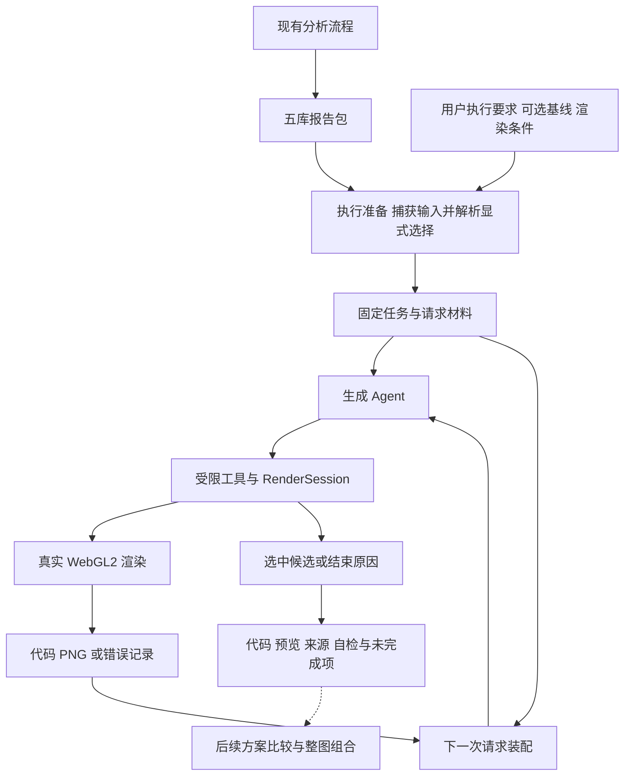

# Shader 生成整体架构与模块设计

日期: 2026-10-03.

状态: 分阶段实施的设计基线. 本文承接[宏观分析](generation-execution-design.md), 具体规定目录、模块职责、数据交接和四个实施分支. 01 至 04 已落地, 验证及交付状态见各阶段记录; [04 整图组合记录](work-items/generation-04-scene-composition.md#实施记录)是最新进展. 当前代码以[当前架构](architecture.md)为准, 真实模型效果不由离线测试代替.

目标是用最小交接层, 把固定五库方案送入现有生成与渲染闭环. 首先完成单方案, 再做方案比较, 最后完成多元素整图组合. 设计与实现保持在 `apps/shader_deep/` 内, 复用现有 DeepAgents、黑板、WebGL2 和文件存储.

## 文档与实施入口

| 能力阶段 | 实施分支 | 方案文档 | 交付能力 |
| --- | --- | --- | --- |
| 一 单方案闭环 | `TOoSad-deep/repo/generation-input-binding` | [01 输入绑定与上下文](work-items/generation-01-input-binding.md) | 固定方案可成为完整生成请求, 暂不调用模型 |
| 一 单方案闭环 | `TOoSad-deep/repo/generation-execution-loop` | [02 生成执行闭环](work-items/generation-02-execution-loop.md) | 报告到 GLSL、预览及可解释结束 |
| 二 方案比较 | `TOoSad-deep/repo/generation-plan-comparison` | [03 多方案比较](work-items/generation-03-plan-comparison.md) | 相同输入条件下比较独立试验 |
| 三 整图组合 | `TOoSad-deep/repo/generation-scene-composition` | [04 多元素整图组合](work-items/generation-04-scene-composition.md) | 将选定元素方案合成为整图候选 |

先单独交付当前五库读取修复和设计文档, 再依次从已合并前序工作建立分支. 01、02 是近期实施范围; 03、04 给出可执行的最小方案, 开始前结合前序结果复核. 每个分支可独立审查, 只有 02 完成后才称为单方案闭环完成.

本文维护共同架构和契约, 四份实施方案只维护各自步骤、范围和验证. 宏观分析保留选择理由; 五库字段仍由[五库数据设计](analysis-five-libraries.md)维护, 不在多份文档复制定义.

## 设计尺度

按真实输入和当前调用链设计. 在读取外部报告、登记任务、执行工具和交付结果处做必要校验, 内部调用复用已通过的契约. 首版采用独立运行目录、一次输入捕获和现有单线程渲染会话; 模型读取本轮已固定材料, 无需每轮遍历原目录或重新计算整包哈希.

恢复引擎、分布式锁、插件注册中心、数据库、通用执行图和所有参数的组合测试均不属于首版. 仅在后续出现实际需求时引入. 现有引用校验、工具白名单、预览回读和资源清理继续保留, 它们保护当前实际行为.

新增测试围绕可观察行为: 方案是否正确进入模型、结果是否来自实际渲染、失败是否如实交付. 复用现有夹具和回归测试, 不以覆盖每个函数、内部调用顺序或新增文件数量作为目标.

## 整体流程与职责



调用方先明确草图和可选的一项局部备选, 程序把有效选择固定到新生成任务. 生成 Agent 决定代码实现和方案内参数修正, 程序负责渲染、计数、选择资格和结果保存. 更换草图或备选时创建新任务, 保留旧试验; 当前分析主 Agent 的职责不随这次接线改变.

## 目录设计

以下是按阶段落地的目录. 现有文件按职责扩展, 不为每个辅助函数拆包. 具体实现及调整理由见各阶段记录.

```text
src/shader_deep/
  api.py                               # 02 导出新增报告生成入口; 旧入口保留
  cli/
    generation.py                      # 02 为现有生成命令增加显式报告输入模式
  domain/
    tasks.py                           # 01 为生成任务增加可选的方案绑定
    generation.py                      # 01 方案绑定记录及纯业务校验
    generation_comparison.py           # 03 比较条目与共同条件
    scene.py                           # 04 精简整图组合计划
    five_libraries/                    # 复用已定五库模型与引用规则
  workflows/
    generation.py                      # 复用生成运行与最终代码读取
    generation_from_report.py          # 01 输入准备; 02 报告生成入口
    generation_comparison.py           # 03 顺序组织独立方案试验并汇总
    scene_generation.py                # 04 构造整图任务并复用生成闭环
  agents/generation/
    agent.py                           # 02 接收准备好的会话, 复用模型循环
    context.py                         # 01 注入方案材料; 后续接入组合材料
    middleware.py                      # 请求装配、权限与结束检查
    contracts.py                       # 02 在现有 outcome 上表达新结束原因
    options.py                         # 复用尺寸、时间与额度
    tools/
      session.py                       # 02 共用运行目录及会话结束状态
      render.py                        # 复用候选渲染与登记
      finish.py                        # 复用成功选择, 新增受限受阻结束动作
  infrastructure/storage/
    report_package.py                  # 复用完整包校验和 read_sketch
    generation_inputs.py               # 01 保存本轮输入副本并计算内容身份
    generation_comparison.py           # 03 比较索引、预览导航和人工选择记录
    scene_inputs.py                    # 04 跨元素来源校验、代码和预览捕获
    artifacts.py                       # 复用运行目录与 run.json 写入
  rendering/                           # 复用 WebGL2, 首版不改变渲染协议
tests/
  unit_tests/                          # 在对应职责下扩展行为测试
  integration_tests/test_generation.py # 02 起扩展已有真实渲染闭环案例
```

## 模块接口与依赖

Interface 包括输入输出、失败方式和需要保持的不变量. 各 Module 通过下表所列材料交接; 名称是设计约定, 具体 Python 参数在实现时沿用本包风格.

| Module | 输入 | 输出与责任 |
| --- | --- | --- |
| 执行准备 `generation_from_report` | 报告路径、草图/备选、执行目标、可选基线、渲染配置 | 一份私有 `PreparedGeneration`, 包含本轮目录、状态、任务 ID、选中材料和配置 |
| 方案绑定 `domain/generation` | 已验证报告身份、显式选择 | `GenerationBinding`; 不读取文件或调用模型 |
| 输入存储 `generation_inputs` | 报告文件、原图及需要固定的基线文件 | 本轮输入副本、内容指纹及可装配材料; 处理文件 IO |
| 请求上下文 `agents/generation/context` | 固定任务材料与最新候选/结果 | 实际文本、图像内容及本轮材料清单 |
| 生成角色与工具 | 请求材料、固定额度 | 候选尝试、自检选择或主动受阻; 工具只做明确动作 |
| 渲染 `rendering` | GLSL、宽高、时间 | PNG 或真实阶段错误; 不依赖黑板和模型框架 |
| 结果发布 | 最新会话状态、已选候选 | 现有 `GenerationOutcome` 与运行文件; 保留失败和未选择情况 |

`workflows` 装配领域记录、存储和角色; `agents` 消费已准备材料并调用受限工具; `domain` 保持无 IO; `rendering` 保持独立. 首阶段新增 Seam 是“固定材料交给生成角色”, 不同时引入可替换调度器、通用角色注册或多层转发接口.

输入准备和生成执行共用一个运行目录. 01 负责分配目录并固定输入, 02 让内部 RenderSession 使用该目录; 旧 PNG 入口继续由既有路径分配目录. 公共 `run_generation` 等入口保持既有调用方式, 内部可提取一个接收准备结果的执行 helper, 避免为接线复制整套循环.

## 数据与材料契约

### 复用既有业务记录

`TargetRecord` 继续保存用户要求、原图路径、约束和保护项. `TaskRecord` 继续保存目标版本、基线、候选引用、修改范围和停止条件. `CandidateRecord` 与 `ResultRecord` 继续关联代码、预览、自检和局限.

建议给 `TaskRecord` 增加可选 `generation_binding`, 默认 `None`, 由 `domain/generation.py` 定义绑定记录. 它只保存报告快照引用、内容身份、元素与草图 ID、可选备选索引. 有效选择和正文从该快照派生, 不再维护一份可独立编辑的机制选择字典. 这是对现有公开记录类型的兼容性扩展, 实施时须说明该字段变化并核对调用方与序列化; 不把它作为额外必填参数.

`PreparedGeneration` 是工作流私有装配结果, 不进入五库或充当新的持久状态系统. 它保存已加载的固定文本和图像材料, Context Builder 每轮重用这些内容, 仅从当前会话更新候选和错误. 不为相同信息再建立 `ExecutionRequest`、`BoundSelection`、`ExecutionState` 三套平行模型.

### 捕获一次固定输入

读取报告后保存本轮副本, 校验 manifest、五库引用及原图, 对 manifest、五库正文和原图计算一次有明确覆盖范围的内容指纹. 参考图 hash 与报告内容身份分别记录. 调用方选择在副本上解析, 同名短 ID 只在这份包中生效. 如果选择来自先前预览, 可同时核对该预览的内容身份.

所有必要固定材料在启动模型前加载; 后续请求不回读可能变化的原始用户路径. 运行内副本供追溯使用, 首版不建设持续文件监控或每轮完整防篡改扫描. 重新读取持久化输入时再做相应校验. 可选基线的代码与预览使用相同捕获规则, 不修改已有任务和候选记录来替换路径.

执行准备在登记新任务前确定目标与基线. 已有黑板记录按原身份保留, 捕获文件的映射由本轮材料负责解析; 需要变更目标或基线时登记新任务, 不覆盖旧记录. 外部报告没有完整用户要求, 本次要求由调用方提供, 原分析要求不可得时保持未知.

### 模型实际采用的方案

通过 `read_sketch` 获得材料后, 明确以 `selected.choices` 和 `selected.composition` 为执行选择, 带上已选备选的条件与理由. 原始 `sketch.default`、未选备选及仅作为条件依据加载的机制, 不自动成为本次采用方案.

视图保留全部公共 gaps 和 open_questions, Context Builder 为选定方案补全必要正文. 缺少所选草图或有效引用时入口直接报错; 自然语言适用条件交给生成模型结合材料判断, 不另建规则引擎或前置审批 Agent. `partial` 不是一律拒绝条件, `completed` 也不是自动可执行证明.

固定要求、原图、方案与必要正文在每次模型请求中重新注入, 使用请求级 override, 不累加到持久历史. 首版保留已有小额度下的全量候选选材, 暂不做历史压缩优化. 未来调整选材时, 再一起调整实际预览清单与 `presented` 资格.

## 执行协议与状态归属

`render_shader` 提交候选并返回编译或渲染结果, `finish_shader` 选择本会话成功渲染且已经提供预览的候选. 02 增加 `stop_generation` 受限动作, 只提交无法继续的原因、关联候选及下一步建议; 建议类型限定为补充输入或改试方案, 不在工具内部重新派发任务.

成功选择、主动受阻、预算耗尽和运行异常共用一个会话结束判断. 主动受阻不设置虚假的 selected_candidate, 外层循环依据结束状态退出. 对外沿用 `GenerationOutcome`, 增补停止原因语义, 详细原因沿 `ResultRecord` 和运行记录交付. 旧的只返回 GLSL 入口继续在没有选中候选时报告未完成.

| 内容 | 唯一责任方 | 首版持久化 |
| --- | --- | --- |
| 五库分析结果 | 分析 TaskStore 已提交版本; 报告为交付投影 | 原分析运行保持封存 |
| 生成目标、任务、候选与结果 | 本轮黑板登记规则与协调调用方 | 沿现有 `run.json` 保存 |
| 固定输入与方案来源 | 执行准备生成的绑定及输入副本 | 本轮 inputs 与任务绑定 |
| 计数、可选择候选和结束状态 | RenderSession | 沿现有会话保存逻辑 |
| 浏览器、线程、模型历史 | 本轮执行会话 | 不声称 JSON 能恢复这些对象 |

首版支持检查已有产物及以明确基线创建新任务. 不接入同一任务崩溃恢复, 不复制分析 TaskStore 的多级恢复体系. 生成调用计数、SDK 重试、摘要调用的范围要如实记录; 02 仅处理会绕过本轮有限循环的实际配置问题, 不借此统一重写全部模型传输层.

工具新增属于行为变化, 02 实施时同步更新本包生成工具约定、模型可见说明和执行白名单. 只记录方案遵循说明与偏离, 不声称程序已验证自然语言机制对应的代码语义.

## 运行目录与结果

以下为建议布局, 复用现有候选文件和 `run.json`, 不再为同一状态创建并行账本:

```text
run-*/
  inputs/
    report/                 # manifest 五库 README 原图的本轮副本
    baseline/               # 仅在存在基线时保存代码与已有预览
  run.json                  # 目标 任务绑定 候选 结果 条件和停止原因
  candidate-001.glsl
  candidate-001.png          # 成功渲染才产生
  candidate-002.glsl         # 失败代码也保留
```

临时固定材料由准备结果持有; 持久文件以输入副本和 `run.json` 为主. 输出仍读取已选候选的实际 GLSL 文件. 新报告输入模式的 stdout 继续只输出最终代码, 路径和失败说明进入 stderr; Python 调用者使用 outcome 检查完整状态.

03 的比较目录只索引各子运行和比较条件; 04 的整图计划只引用输入方案及选中候选. 不把它们塞回五库对象中.

## 坐标与扩展路径

单元素输入必须明确输出尺寸与背景语义. 报告入口建议默认使用固定原图的宽高, 显式参数可以覆盖; 旧 PNG 入口保持既有默认值. 单元素效果放在原画布位置, 参考图的上下文不自动扩大实现范围. 保持背景是生成要求与视觉检查项, 当前单 Pass renderer 不提供像素锁定背景合成.

元素 `region` 是说明文字, 不能直接解析成可信裁剪框. 只有需要数值评价或裁剪时才新增显式 ROI 与坐标变换. 模型可以先按文字范围和原图实现; 原图左上坐标与 GLSL 左下坐标的转换写入任务说明. 首阶段无需先开发区域标注工具.

03 顺序执行少量显式方案, 共同目标、基线和渲染条件保持一致. 结果比较以预览、运行结果和人工选择为主, 首版不新增自动视觉评分 Agent 或并行调度服务.

04 让同一个生成角色消费明确的整图计划、选中元素代码及完整原图, 生成一份可渲染的完整 GLSL. 通过模型整合函数、坐标和叠加关系, 不把独立文件直接字符串拼接. 初版仍为单 Pass, 全局布局与遮挡按调用方明确的组合要求实现; 更复杂渲染能力另行评估.

## 必要验证与停止扩展的条件

实现期间先运行当前改动相关测试, 在分支收口时按应用要求执行 `make test`、`make lint` 和 `make repository_check`. 改动图像反馈、渲染或资源生命周期的分支执行 `make integration_test`. 一轮检查通过且未再修改相关代码后, 不重复跑同一组检查.

新增测试优先复用现有 report、generation fixture 和真实浏览器测试, 每个阶段只补新增行为与关键失败分支. 同一核心场景可同时验证输入、渲染和交付, 不按对象字段或内部函数拆出大量镜像测试. 不为未实现的恢复、并发或多 Pass 提前建设测试平台.

02 做一次有代表性的真实报告到生成验证; 03 比较同一目标的两套方案; 04 验证两个元素的简单组合. 实际图片和模型使用条件在执行前明确, 这里没有发起模型调用. 程序成功、模型自检与用户视觉接受分开记录. 真实效果不佳时先定位是材料、实现还是方案问题, 再决定补充工作, 不默认增加 Agent 数量或重写架构.

## 当前设计决策与实施记录

本文采用显式选择、原画布单元素、单会话执行和受限主动停止作为拟实施默认方案, 均服务于前两个分支的最小闭环. 背景颜色/透明度属于每次执行输入. 后续阶段以各自文档列出的最小目标为界, 实施开始前只复核会影响实际交付的变化.

文档已经创建不等于分支或代码已经创建. 后续各阶段在自己的实施方案末尾记录实际改动、验证命令、结果与未覆盖范围; 当前架构仅在代码落地后更新.
