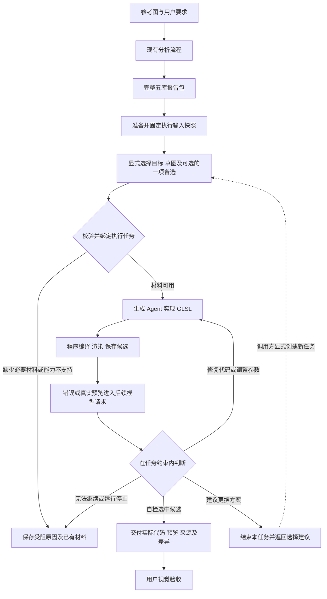

# Shader 生成与执行宏观设计草案

更新日期: 2026-10-03.

本文讨论如何把五库分析结果接入 Shader 生成, 覆盖整体流程、角色分工、执行输入、模块、技术选型和分阶段验收. 建议保留现有分析系统, 通过固定方案和输入的执行任务, 复用已有生成、渲染、预览回读与修正闭环.

**状态: 已完成方案复核的宏观分析, 下游能力尚未实施.** 本文保留流程选择的理由与审查结论; 具体目录、模块契约及四个实施分支以[整体架构与模块设计](generation-architecture.md)为主要记录, 各阶段按该文档的入口执行. 当前能力以[架构说明](architecture.md)及源码为准; 五库对象定义继续以[数据设计](analysis-five-libraries.md)为准; 分析职责继续以[分析架构设计](analysis-architecture-design.md)为准.

## 当前基础与设计目标

当前已有两条独立流程. 分析流程由持续主 Agent 登记元素、确定单个目标并派发一批独立探索, 探索产出 F/R/M/S, 整合只合并 F/R/M, 程序汇集草图、维护引用并发布五库包. 生成流程接收黑板任务, 通过真实 WebGL2 渲染、预览反馈和修正, 最终选择已检查候选.

| 能力 | 当前实现 | 下一阶段工作 |
| --- | --- | --- |
| 分析交付 | 完整五库包、短入口、按草图取材 | 复用, 保留全部方案及缺口 |
| 生成输入 | 用户目标、基线、指定候选、历史结果 | 增加固定报告快照与方案绑定 |
| 生成角色 | `create_deep_agent` 与受限工具循环 | 接入五库材料和执行结果语义 |
| 渲染反馈 | 单 Pass GLSL ES 3.00、PNG、编译日志、后续请求回读 | 复用, 明确目标区域和输出约定 |
| 运行记录 | 黑板、候选文件、生成 `run.json`; 分析另有 TaskStore | 明确生成输入身份、停止原因和来源追踪 |
| 自动交接与视觉评审 | 分析到生成、独立评审和自动全局采用尚未接入 | 按阶段建设 |

主要源码入口: [分析出口](../src/shader_deep/workflows/analysis.py)、[报告读取](../src/shader_deep/infrastructure/storage/report_package.py)、[生成工作流](../src/shader_deep/workflows/generation.py)、[生成角色](../src/shader_deep/agents/generation/agent.py).

首阶段建议完成“一个目标元素、一套明确方案、一个有结束条件的生成任务”. 同一草图可同时采用多个机制, 不能把它压成单个机制调用. 多方案比较、独立视觉评审、多元素整图组合作为后续阶段.

## 建议的整体流程

图中固定快照、方案绑定和主动受阻返回是新增设计. 图中的循环受任务预算、取消和结束状态约束; 不表示允许无限优化. 现有 `finish_shader` 只完成候选选择, 主动受阻返回的工具契约仍需设计.

首版由调用方指定 `sketch_id` 和可选的一项 `alternative`, 不把数组首项当作全局默认或最佳草图. 后续主 Agent 可以推荐选择并解释理由, 程序仍负责校验、登记和派发. 现有分析主 Agent 的职责保持不变; 首版新增独立执行入口, 流程稳定后再讨论向它开放受控的生成工具.

若需要补充分析, 新建明确范围的分析任务. 不向已经完成的单批探索隐式追加方向, 不让生成角色改写已交付五库.

## 任务粒度与输出范围

一次生成任务绑定一个草图的默认方案, 或该默认方案叠加一项局部备选后的完整有效选择. `composition` 表达组织方式, 不能把字典顺序视为执行顺序, 也不能把同一机制被多次引用理解为必须重复执行.

例如, 某草图采用轮廓遮罩、渐变和弧形亮斑三个机制. 调整亮斑的位置、宽度与强度属于任务内迭代; 改为另一项高斯亮斑备选时, 建议结束当前任务并以新选择创建任务. 两个任务可以沿用同一起始基线, 但不能覆盖原任务的输入记录.

“绑定方案”约束的是任务声明和来源. 程序无法仅凭 schema 证明 GLSL 忠实实现了自然语言机制; 代码审查、模型评审与图像证据仍承担语义检查. 模型若实际偏离绑定方案, 应记录偏离并报告, 不能因引用合法就宣称方案已得到验证.

建议在执行结果中保留“特征或关系 → 所选机制 → GLSL 实现位置或参数”的简短说明及偏离项. 这属于便于复核的模型自述, 不作为程序已经证明语义遵循的证据, 也不增加五库业务字段.

### 单元素画布与坐标

首版建议沿用原图纵横比和元素在原图中的位置, 明确输出尺寸、背景或透明度, 保留周围上下文作为观察材料. 背景模式必须进入执行输入; 本文不替用户选定具体颜色或透明输出. 单元素目标不自动承担整图其他对象的复现义务.

当前默认渲染尺寸为 512 × 512, 不自动从原图推导. 渲染器每次清空画布并由 shader 整体绘制, 没有固定背景模板或程序合成器. 因此保持原画布尺寸需要执行准备阶段显式装配参数; 背景作为模型重建或保护项时仍需视觉检查. 如果要求背景像素严格不变, 须另行设计固定背景资源和程序合成, 不能把提示词中的保护要求描述为像素级保证.

当前 `Element.region` 为自由文本, 不直接作为程序裁剪框或评价掩码. 如需局部裁剪或数值评价, 先登记明确的区域、坐标来源和变换: 原图坐标、裁剪坐标、输出画布坐标之间的关系必须可追溯. 原图测量采用左上原点, 渲染器传入的 `gl_FragCoord` 使用左下原点, 不应隐式混用.

评价区域与上下文区域分别记录. 参考图包含周围对象, 不表示这些对象都应计入本次误差. 尚无可信数值区域时, 可先进行有范围说明的人工或模型对照, 不宣称拥有精确的局部误差指标. 后续多元素组合还需单独设计遮挡、混合、坐标共享和跨元素关系, 不能靠拼接多个 GLSL 文件完成.

## 决策与程序保证

| 责任方 | 负责的判断或动作 | 保证范围 |
| --- | --- | --- |
| 调用方或后续主 Agent | 选择方案、决定是否试验其他方案、发起新任务 | 首版显式选择, 后续推荐仍需固定记录 |
| 生成 Agent | 组织代码、修复编译错误、调整参数、对照预览、自检或报告受阻 | 可以解释和建议, 不直接改变任务来源与全局基线 |
| 工作流与运行时 | 输入绑定、工具权限、计数、状态转换、候选登记、停止和发布 | 通过可执行规则检查, 不依赖提示词自觉遵守 |
| 后续评审角色 | 提供视觉差异、方案偏离和保护项回归的证据 | 提交评审结果, 不自行采用候选 |
| 用户 | 接受视觉效果和重要审美取舍 | 与程序完成状态独立记录 |

实现技巧、诊断方法和调参步骤可逐步沉淀为 Skill. 参考图是否固定、候选是否实际渲染、工具是否允许执行、预算是否耗尽等规则留在运行时. Skill 被读取或模型返回合法 JSON, 都不证明执行步骤、语义质量或用户验收已经满足.

## 执行输入与来源契约

以下为概念上的执行输入, 不冻结类名、文件名或公共函数签名. 优先复用现有 `TargetRecord`、`TaskRecord` 和 `GenerationOptions`, 仅补齐缺失的方案来源与绑定信息.

| 输入类别 | 固定内容 | 原因 |
| --- | --- | --- |
| 报告来源 | 本轮保留的报告快照、协议版本、内容指纹及可用来源信息 | 同一路径不保证文件内容不变 |
| 方案选择 | 包内元素与草图 ID、备选索引、解析出的有效选择和组织说明 | 短 ID 只在本包有效, 备选索引也依赖固定快照 |
| 用户目标 | 原始要求、约束、保护项、本次执行目标与允许范围 | 报告包不包含完整用户要求, 不能从元素名称猜测 |
| 基线 | 可选基线候选及固定代码、预览和来源 | 文件路径与内存记录都不能代替固定内容 |
| 渲染与评价 | 宽高、时间、坐标变换、背景、评价范围、可用渲染能力 | 使迭代和方案比较具有一致条件 |
| 运行策略 | 渲染次数、模型调用额度、请求超时、停止条件 | 区分模型请求与渲染尝试, 不继承分析流程的不设总额度语义 |

公开五库包只有参考图哈希, 当前 `read_report_package` 校验结构、引用及原图, 没有校验五库正文内容指纹; `schema_version` 表示格式版本, 不表示内容版本. 建议在执行准备阶段把完整包保存到本轮专属输入区, 校验后计算 manifest、五库正文及原图的稳定指纹, 明确覆盖范围与算法版本; 选择和执行引用同一份副本. 短入口由正文派生, 不作为业务身份的唯一依据. 正式绑定时核对选择所依据的指纹, 内容已变则拒绝复用该选择.

指纹保护的是本轮捕获内容的一致性, 不证明外部包来自可信历史提交, 也不证明机制语义正确. 若来源包含权威版本记录, 保留并核对对应关系; 独立外部包只声明本次导入的身份. 跨包引用以“包身份 + 包内 ID”解析, 不因都叫 M1 就共享机制身份.

当前执行要求与可获得的分析来源要求分别记录. 独立导入包缺少来源要求时标记未知, 由调用方提供本次执行要求, 不伪造分析时的用户意图. 解析出的有效选择是固定输入的派生投影, 不允许另行编辑后与原草图、备选选择分叉.

原图、基线代码和基线预览也纳入本轮输入固定策略. 当前生成上下文每轮按路径重新读文件, 不能把这一现状描述为输入内容已经不可变. 拟实施方案在入口捕获并加载固定材料, 后续请求复用内存内容; 需要重新加载持久化副本时核对身份, 发现变化则报告原因. 首版无需持续监控文件或每轮重新扫描整包.

程序检查不能止于 `completed` 或 `partial`. 结构损坏、所选对象缺失应拒绝启动; 已知不支持的依赖应报告受阻; 与当前方案无关的整轮缺口可保留后继续. 缺口是否相关、自然语言条件是否成立可能需要模型或人工判断, 判断依据和未知项必须保留. 不自动把所有未知项变成阻塞, 也不把全部未知项视为可以忽略.

## 模块职责与接口

设计目标是让 Module 在小而明确的 Interface 后承载完整职责. Interface 包括输入、不变量、调用顺序、失败方式和输出; 下表是职责划分, 不要求每一行都新增目录、类或进程.

| Module | Interface 的责任 | 建议归属与复用 |
| --- | --- | --- |
| 执行准备 | 接收报告与执行要求, 返回已绑定任务或明确预检失败 | `workflows/`; 纯业务规则放入 `domain/` |
| 方案绑定 | 解析有效选择, 校验引用、目标和固定输入身份 | 复用五库读取及领域校验, 新增执行侧绑定契约 |
| 生成上下文 | 将绑定方案、必要正文、实际图像与候选证据装配为请求材料 | 扩展 `agents/generation/context.py` |
| 生成角色 | 在固定任务内提出 GLSL、修正、候选选择或受阻结果 | 复用 `agents/generation/`, 单独补齐结束协议 |
| 渲染 | 接收 GLSL 与固定参数, 返回 PNG 或阶段错误 | 保持 `rendering/` 独立, 不导入 Agent 或黑板 |
| 运行生命周期 | 管理计数、停止、候选权限、资源释放及持久记录 | `runtime/` 与现有 `RenderSession`, 明确写入责任 |
| 结果发布 | 交付所选实际文件、来源、渲染条件和未完成事项 | `infrastructure/storage/` 与工作流出口 |

主要 Seam 位于“执行准备完成后交给生成角色”的 Interface. 生成角色消费明确材料, 不自行猜测报告目录、版本、全局采用状态或调用权限. 存储与模型的 Adapter 沿用现有实现, 只有实际出现不同实现需求时才增加抽象, 不为单一实现先建通用插件注册系统.

外部入口只负责一次明确执行请求. 保留现有 PNG 生成入口及公开签名; 新接口如何接入 CLI/Python API 留给实施设计. 业务模块不依赖 LangChain, 渲染模块不依赖业务状态, 基础设施不承担方案优劣判断.

## 上下文与结束协议

### 请求材料

每次模型请求都重新注入固定执行要求、已固定参考图、绑定草图及有效机制、必要观察与关系、适用条件、整轮状态及缺口; 候选代码、预览和错误按最新状态更新. 使用现有请求级 `override` 方式装配, 材料不重复追加进持久历史. 正因为临时材料不会写入历史, 不能只在首次请求提供固定方案, 然后假定后续请求仍然拥有它.

`read_sketch` 是有范围的视图, 不是所有引用已闭合的独立包. 其返回值可能仍含未加载候选的 ID. 首版建议由 Context Builder 完成选中方案的必要取材, 明确标记材料范围; 遇到缺失必要正文时先补读或返回受阻. 不能在生成 Agent 没有读取工具时要求它自行沿任意 ID 找文件, 也不能把未读候选称为已经比较过.

尤其要区分返回的原始 `sketch` 与有效的 `selected`: 原始草图仍包含原 `default` 及所有备选; 执行采用 `selected.choices`、`selected.composition` 及已选备选条件. 因条件、理由或关系参与项而加载的正文提供判断依据, 不自动成为采用的机制. Context Builder 应明确呈现这一区别, 防止模型把默认方案、已选备选和仅供参考的依赖混合执行.

当前生成上下文会展开本任务所有候选的代码与图片. 首版可在既有小额度下沿用此策略, 避免把输入接线与历史裁剪同时改造. 后续如只加载当前候选、基线及少量对比材料, `presented` 必须来自实际装入请求的预览 ID, 同步调整选择资格校验; 不能继续把所有成功渲染候选一律标为已提供预览. 验证应检查实际多模态请求, 不能只断言存在文件路径.

### 正常结束与受阻退出

现有角色只允许 `render_shader` 和 `finish_shader`. 后者必须选择本会话已成功渲染、且预览已经进入后续请求的候选. 同一批调用刚渲染的候选不能立即完成; 最终 GLSL 来自选中候选的实际文件, 这些规则继续保留.

当前角色没有主动提交“无法继续”的专用工具. 首阶段实施必须补齐这一出口, 否则模型只能反复解释直至耗尽预算. 建议新增一个只允许提交原因、已有证据与后续建议的受限停止动作; 它不能选择未渲染候选、改写五库或启动其他任务. 具体名称和参数待实施设计确定; 增加时同时更新工具暴露列表、执行白名单、终态规则与回归测试, 不静默放开其他内置工具.

运行停止原因与业务结果分开表达. 以下为建议语义, 不是要求立即替换现有枚举:

| 情况 | 程序处理 | 对外交付 |
| --- | --- | --- |
| 编译错误 | 保存代码和原始阶段日志, 在预算内允许修复 | 失败尝试可追溯 |
| 视觉偏差仍可在方案内修正 | 保持绑定方案, 保存新候选 | 每个版本独立, 不覆盖旧代码 |
| 模型建议更换方案 | 结束本任务并返回建议 | 调用方决定是否创建新任务 |
| 关键材料不足或能力不支持 | 主动受阻或预检失败 | 原因、影响范围及已有产物 |
| 额度耗尽 | 停止新增尝试 | 部分结果, 不自动把最后一份代码当成选中结果 |
| 取消或基础设施异常 | 关闭新执行入口, 清理资源并保存已知状态 | 单独记录取消或异常, 不冒充方案不成立 |
| 合法选中候选 | 固定选择并关闭新增候选入口 | 自检完成, 用户验收状态仍独立 |

拒绝在终态之后产生新结果; 并发或可恢复执行引入后, 迟到回执、重复完成、旧 attempt 撤权也应由运行时校验. 首版不宣称具有可中断任意 GPU 调用的能力; 模型请求与浏览器操作的超时、异常退出和资源释放须单独验证.

## 状态存储与恢复边界

当前状态有不同责任方, 不宜为了“统一 state”将它们合成一个巨型字典:

| 状态 | 当前责任方 | 下游设计要求 |
| --- | --- | --- |
| 用户目标、任务、候选与结果关系 | `BlackboardState` 与登记函数 | 保留固定引用; 工作流负责协调写入 |
| 分析 attempt、回执、版本与封存 | 分析 `TaskStore` 的 `commit.json` | 已封存分析运行不因生成而重新开启 |
| 五库版本正文与固定原图 | 分析已提交不可变版本及固定图像; 报告包为选定版本的交付投影 | 生成从报告包捕获固定输入快照, 不回写分析权威记录或报告 |
| 生成计数、成功/展示集合、选择及资源 | `RenderSession` | 会话资源与可持久化业务状态分别管理 |
| 模型历史、浏览器、线程、客户端 | 各自执行会话 | 不作为普通 JSON 对象持久化 |

生成 `run.json` 目前是保存下来的运行记录, 没有与分析 TaskStore 相同的加载恢复流程. 每次 RenderSession 新建目录和计数器, 因而“已有运行文件”不等于“可从断点继续”.

首版建议把输入、候选和结果保存在独立生成运行目录, 指向固定分析来源. 中断后能够检查已有产物; 如要继续, 以明确基线创建新任务, 不宣称恢复原模型会话. 重复请求必须能分辨新试验与重试, 不以覆盖旧目录的方式去重.

后续若需要同一逻辑任务恢复, 再适配 TaskStore 的固定输入、幂等回执、旧代次撤权与原子提交模式. 生成侧必须选定唯一权威运行记录, 黑板索引和 `run.json` 从它产生投影, 避免两个系统独立决定同一任务终态. 预算是否跨恢复累计、哪些工具结果可复用、预览重新进入请求的资格均需专门验证.

文件发布采用写齐并校验制品后再发布一份权威指针的模式; 多个文件分别替换不构成事务. 数据库或框架 checkpoint 也不能自动保证外部渲染、模型请求和文件写入恰好一次.

## 技术与模型选型

以下为结合现有项目的建议, 不要求为了新阶段升级依赖.

| 选型项 | 首版建议 | 重新评估的触发条件 |
| --- | --- | --- |
| 应用结构 | Python 模块化单体, 独立任务与资源会话 | 需要多机执行、独立部署或资源隔离 |
| Agent 框架 | 复用当前 DeepAgents 与 middleware | 有实测框架限制, 或只需更小能力集合且收益明确 |
| 外层编排 | 显式 Python 工作流, 程序维护状态转换 | 长时间暂停、多分支恢复与跨任务协调明显增多 |
| 业务契约 | 沿用 Pydantic 与 dataclass | 外部输入用运行时校验, 内部记录继续遵循既有登记规则 |
| 持久化 | 固定文件快照、制品与权威提交记录 | 多机协调、跨运行事务或大量查询需求 |
| 渲染 | 现有 Playwright、Chromium 和 WebGL2 | 真实方案需要纹理、反馈缓冲或多 Pass |
| 并发 | 首版单任务执行; 单会话渲染串行 | 多方案独立试验收益明确后引入受限并发 |
| 检索 | 本地包索引与按需读取 | 真实跨报告机制复用需求形成后再考虑检索库 |

DeepAgents、LangChain 和 LangGraph 是不同抽象层; 当前生成端已经使用 `create_deep_agent`, 首版重点是业务契约, 无需同时重写 Agent 框架和外层工作流. 后续如使用 LangGraph, checkpoint 管理图状态, 业务输入和外部制品的一致性仍需应用负责. 参考 [LangChain 官方技术栈说明](https://www.langchain.com/oss-overview)与[持久化说明](https://docs.langchain.com/oss/python/langgraph/persistence).

### 模型能力与评价

首版优先用同时支持图像输入、代码生成和稳定工具调用的模型完成生成与自检. 复用已有配置入口, 但不能把分析侧已经验证的流式检查、重试与推理块适配自动推广到生成侧; 两条链路的实际请求和失败行为需分别检查.

当前生成侧以渲染额度 N 和正常模型节点调用额度 N + 2 控制循环, 直接调用 `build_model`, 未接入分析侧完整的请求保护链. 这些计数不能被描述为所有 HTTP 重试、框架辅助模型调用或费用的总上限. 首阶段应核对 SDK 摘要、重试、超时和响应完整性, 为实际存在的额外调用定义明确控制与观测; 不通过重放已完成工具来重试网络请求.

具体型号在固定样本、统一预算和相同渲染条件下评测后决定. 候选不限定单一厂商, 以当时官方能力说明及实际网关支持筛选, 本文不冻结易过时的型号或价格. 记录有效工具调用、编译修复轮数、视觉偏好、方案遵循程度、总耗时及每个可接受结果的总成本. 未报告 token 用量时标记未知, 不计作零成本.

代码能力或视觉判断出现明确瓶颈后, 再比较“单个多模态生成角色”与“代码角色加独立视觉评审”. 独立评审提供证据, 不证明判断天然正确. 数值图像指标可辅助定位差异, 最终选择需结合任务目标与人工偏好校准; 不把单一误差最低等同于视觉验收通过.

## 分阶段实施与验收

三个能力阶段拆成四个实施分支: 第一阶段分别交付输入绑定与生成闭环, 后两阶段各对应一个分支. 文件范围、开发步骤和必要验证见[整体架构中的实施入口](generation-architecture.md#文档与实施入口). 下表是行为验收维度, 可由少量端到端案例与既有测试共同覆盖, 不要求每一行新增独立测试.

### 第一阶段 单方案可追溯闭环

完成固定输入、显式方案选择、上下文装配、生成渲染、自检选择、受阻退出和结果来源登记. 先用内容可控的测试包验证接线, 再以一份真实且有可用草图与机制的分析包验收. 现有分析离线测试和派发前模型测试不替代这一步真实内容验证; 先前交付检查见[五库实施记录](work-items/five-library-implementation.md).

| 验收场景 | 必须观察到的结果 |
| --- | --- |
| 原输入路径内容变化 | 继续使用已固定副本或明确失败, 不静默换图或换方案 |
| 跨包同名 ID、无效草图或备选 | 只按绑定包解析; 无效选择在模型调用前被拒绝 |
| partial 包存在可用方案 | 保留所有缺口, 明确当前方案可继续的依据 |
| 条件或组织说明引用必要材料 | 实际模型请求包含相关正文; 参考图为真实图像块 |
| 无基线首次生成与有基线迭代 | 两种输入都明确; 基线内容和任务引用固定 |
| 编译失败后修复 | 保存失败代码、日志和后续候选, 失败计入额度 |
| 同批渲染后立即结束 | 未回读预览的候选不可选 |
| 主动受阻、额度耗尽或异常 | 退出可解释, 保留产物, 不输出伪造的完成结果 |
| 模型请求重试与框架辅助调用 | 明确计数和控制范围, 已执行工具不随网络重试重放 |
| 合法完成 | 最终 GLSL 等于选中且实际渲染过的文件, 可追溯分析来源和条件 |

实施时按应用约定运行 `make test`、`make lint`、`make repository_check`; 由于涉及图像反馈与生成生命周期, 补充 `make integration_test`. 真实模型验收需单独记录图片、模型配置、执行条件和结果, 不把离线测试通过写成模型或视觉效果通过.

### 第二阶段 方案试验与差异比较

在固定参考图、起始基线和渲染条件下分别执行竞争方案, 记录候选与任务关系. 明确区分参数调整、方案切换和补充分析. 用户或后续决策角色依据证据选择下一任务, 不从一次较差输出推出机制一定不适用. 此阶段再按需要引入独立评审与受限并发.

### 第三阶段 多元素组合与持续优化

在单元素结果可追溯后, 设计元素间坐标、遮挡、共享机制与渲染组织. 采用新候选时显式建立新基线, 不回写旧任务. 多 Pass、动画、多机执行、跨图机制库和长期恢复均按真实需求独立评估, 不作为第一阶段的隐含完成条件.

## 复核结论与待确认事项

本轮复核保留“方案驱动、程序约束、复用现有生成闭环”的方向, 补充了以下容易被宏观流程图掩盖的事项:

- 固定路径不等于固定内容, 需要执行侧输入快照与身份校验.
- 报告不包含完整原始要求, 独立导入时必须另行提供执行要求.
- 取材视图不自包含, 没有读取权限的生成角色不能被要求自行解析缺失正文.
- 主动受阻返回需要新增受限结束协议, 现有两个工具尚未覆盖.
- 候选上下文裁剪会影响预览资格, 需要与 `presented` 同步设计.
- 分析 TaskStore 的恢复能力、供应商适配和测试结论不能直接套用到生成链路.
- 单元素输出和评价区域必须明确, 任务状态也不能替代用户视觉验收.

实施前需要收口的产品选择如下. 这些是建议的决策点, 本文没有把助手建议标为用户已确认:

| 决策 | 建议起点 | 影响 |
| --- | --- | --- |
| 首阶段输出形态 | 原画布位置的单元素复现, 显式设置背景 | 决定坐标、参考上下文与评价范围 |
| 首阶段方案选择 | 调用方明确指定草图及可选的一项备选 | 保持试验可追溯, 后续再增加自动推荐 |
| 新结束协议 | 在保留现有成功选择规则下增加受限受阻出口 | 涉及模型可见工具权限和终态行为 |

文档审查不证明生成接入已完成. 本轮只维护设计及导航, 未运行真实模型、浏览器或新生成链路; 实施后的检查结果应记录在对应工作记录, 再更新[当前架构](architecture.md).

本轮文档验证: `UV_CACHE_DIR=/private/tmp/shader-deep-uv-cache make repository_check` 通过, 0 findings; 本地链接及变更空白检查通过. 两路只读复核覆盖生成行为与执行状态设计, 已将发现的问题修订到正文. 未重跑单元测试或渲染测试, 此处不新增运行能力的验收结论.
