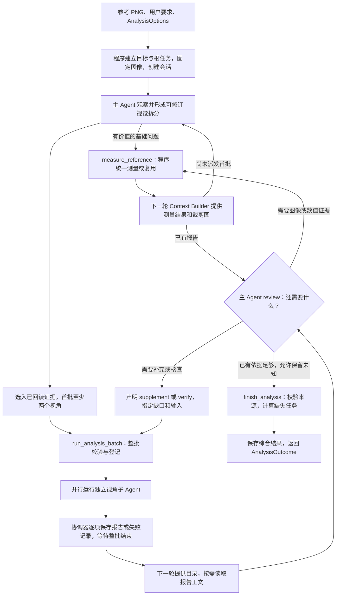

# 分析模块：流程图与数据结构

最近按源码核对：2026-09-17。

本文件随 `analysis/` 的实现维护，集中说明各流程、Agent 的输入输出和数据契约。字段及执行行为以源码为准；修改工具参数、上下文选材、结构字段、预算或结束状态时，同步更新对应章节。

当前范围：参考 PNG 和用户要求 → 可修订视觉拆分与按需基础取证 → 多视角细化与多假设 → 按需复核 → 结构化综合报告。分析到生成的自动交接、独立视觉评审和持续决策尚未接入。

运行预算、并发、超时和重试等模块参数维护在同目录的 [config.yaml](config.yaml)。分析 CLI 默认按模块位置加载该文件, 与启动目录无关; `--config` 可指定其他文件, 显式命令行参数优先。Python 调用方通过 `config.py` 的 `load_analysis_options()` 加载后传入 `options`。模型连接和凭据仍使用应用 `.env`, 配置用法见[应用 README](../../../README.md#yaml-运行配置)。

## 1. 角色与职责

| 执行者 | 输入 | 职责与输出 | 可调用工具 |
| --- | --- | --- | --- |
| 主分析 Agent | 原图、目标、主任务、预置视角、子任务报告与失败记录、本会话测量、剩余预算 | 观察、取证并修订视觉拆分，选择 / 创建视角，review 报告，决定测量及追加任务，提交 `AnalysisSummary` | `run_analysis_batch`、`measure_reference`、`read_analysis_file`、`finish_analysis`、`repair_analysis_submission` |
| 首轮视角子 Agent | 完整原图、目标、本任务、`LensConfig`、固定视觉初稿、明确选入的基础证据、自身预算 | 独立形成 `LensReport`，可以提出 `EvidenceRequest` | `submit_analysis_report`、`repair_analysis_submission` |
| 补充 / 复核子 Agent | 首轮子 Agent 的基础输入，加上明确选入的报告与证据 | 补充遗漏维度，或核查具体判断；输出仍为 `LensReport` | `submit_analysis_report`、`repair_analysis_submission` |
| 程序协调器 `AnalysisSession` | 主 Agent 的合法工具请求、工作线程返回值 | 登记任务、并发执行、集中提交黑板、测量、校验、保存快照 | 普通程序执行，不是额外的模型 Agent |
| Context Builder | Blackboard、当前任务及会话参数 | 为本次模型请求选择材料，构造含实际图片的 `HumanMessage` | 普通程序执行 |

所有视角共用 `LENS_PROMPT` 和执行模板，差异来自视角配置、任务目标与显式输入。主 Agent 的分析 review 是流程中的一步，没有单独的 Review Agent。补充 / 复核使用新的任务实例，不恢复原子 Agent 的聊天。

## 2. 整体流程图

流程图表示有效请求的主路径。无效工具参数会返回错误，模型可在剩余调用预算内修正；主调用预算耗尽或执行异常时，保存已有记录并返回未完成结果，详见第 8 节。

关键时序：

1. 首轮子任务接收完整原图、固定视觉初稿和明确选入的基础证据，不接收其他视角报告。共同材料下的独立分析不等于没有共同先验。
2. 子任务在报告里提出取证需求，不中途等待主 Agent 测量。主工具调用串行，批次内的子任务并行。
3. 报告先保存为只读 JSON；主请求提供目录，读取工具返回的正文进入下一模型请求后才允许引用。目录或同批刚执行的读取都不能跳过回读检查。
4. 测量允许在首批前和后续批次之间，始终共用预算与缓存。新证据进入后续主模型请求后，才能被引用到综合结果或选入复核任务。
5. 测量与追加分析均按需执行；测量后可以直接综合，也可以继续测量或派发复核。
6. 程序验证材料已进入请求、引用合法，不证明模型理解正确。未知机制可以保留，多视角一致不等于事实被证实。

## 3. 各阶段的数据交接

| 阶段 | 入口 / 输入 | 输出和持久化变化 | 主要实现 |
| --- | --- | --- | --- |
| 初始化 | `run_analysis(path, prompt, options=...)`，或已有黑板的 `run_analysis_task(...)` | `TargetRecord`、根 `TaskRecord`、固定的 `reference.png`、`AnalysisSession` | [agents/analysis.py][entry] |
| 视角规划 | 主 Agent 的上下文 | `AnalysisTaskRequest[]`，引用预置视角或携带 `LensDraft` | [prompts.py][prompts]、[presets.py][presets] |
| 批次登记 | `run_analysis_batch(requests, *, visual_decomposition=None)` | 每项请求变为绑定 `LensConfig` 的子 `TaskRecord`；会话另存不可变视觉结构、关注对象和证据输入，创建 `AnalysisExecution` | [session.py][session] |
| 独立分析 | 子任务固定快照、原图、显式选入材料 | `LensReport` → 成功的 `ResultRecord`；或 `blocked` 失败记录 | [worker.py][worker] |
| 主 Agent review | 报告目录、按需已读正文、可见证据、剩余预算 | 下一次测量、追加分析或结束工具请求；当前没有独立 `ReviewRecord` | [context/analysis.py][context]、[prompts.py][prompts] |
| 统一测量 | `MeasurementRequest[]` | `MeasurementRecord` 写入 `measurements`；裁剪写入 `evidence/`；保存调用及缓存命中 | [measurements.py][measurements]、[profiles.py][profiles] |
| 补充 / 复核 | 带目的、缺口、预期依据及显式引用的 `AnalysisTaskRequest[]` | 新的子任务及报告，原始报告保持不变 | [session.py][session]、[worker.py][worker] |
| 综合交付 | `finish_analysis(summary, text)` | `AnalysisSummary` → 根任务的 `ResultRecord` → `AnalysisOutcome` | [session.py][session]、[validation.py][validation] |

六个工具的参数外层固定如下。Python 元组在工具 JSON 中表示为数组。

| 工具 | 模型提交的参数 | 程序返回 |
| --- | --- | --- |
| `run_analysis_batch` | `{requests: AnalysisTaskRequest[], visual_decomposition?: VisualDecomposition}` | 简短结果回执；下一轮提供文件目录和来源索引 |
| `submit_analysis_report`、`repair_analysis_submission` | `{report: LensReport, summary: Text}` | 接收状态、结果 ID；`summary` 与 `report` 并列 |
| `measure_reference` | `{requests: MeasurementRequest[]}` | 每项的 `measured` / `cached` 与证据 ID，或 `invalid_measurement`；完整证据进入下一轮上下文 |
| `finish_analysis` | `{summary: AnalysisSummary, text: Text}` | `completed` / `partial` 与综合结果 ID |
| `read_analysis_file` | `{file_path: str, pointer: str = ""}` | 完整选中 JSON、来源和位置；过长时提示缩小范围 |
| `repair_analysis_submission` | `{draft_id: str, expected_revision: int, changes: [{op, path, value?}]}` | 修复后自动重新校验并提交，或下一批尚存错误 |

完整提交的失败统一返回 `invalid_submission`、草稿版本及带路径错误；批次和测量仍保留原拒绝回执。结构或引用校验失败不等于任务已经成功登记或报告已经接受。

## 4. 黑板记录与任务绑定

业务记录定义在 [shader_deep/schemas.py][business-schemas]。它们采用标准库 dataclass / TypedDict，登记与跨记录校验由程序完成；不能仅凭类型注解认为外部 JSON 已通过运行时校验。

### 4.1 `BlackboardState`

| 字段 | 类型 | 分析流程中的作用 |
| --- | --- | --- |
| `targets` | `dict[str, TargetRecord]` | 按目标版本保存用户要求和参考图路径 |
| `tasks` | `dict[str, TaskRecord]` | 保存根任务、视角子任务及其固定输入引用 |
| `candidates` | `dict[str, CandidateRecord]` | 与生成流程共用的候选表；分析不会生成 Shader 候选 |
| `results` | `dict[str, ResultRecord]` | 原始报告、失败记录、综合结果 |
| `measurements` | 可选 `dict[str, MeasurementRecord]` | 程序测量证据；可选是为了兼容旧黑板 |

Blackboard 不保存模型聊天历史、客户端、线程池或锁。图像保存为制品文件；每次模型输入由 Context Builder 重新选材。

### 4.2 `TargetRecord`

| 字段 | 类型 / 默认值 | 含义 |
| --- | --- | --- |
| `version` | `str`，必填 | 目标版本，在本黑板中唯一 |
| `request` | `str`，必填 | 用户要求 |
| `reference_path` | `str`，必填 | 原始参考图路径；字段本身不加载图片 |
| `constraints` | `tuple[str, ...] = ()` | 输出环境等约束 |
| `protected_features` | `tuple[str, ...] = ()` | 需要保护的特征 |

快捷入口 `run_analysis` 创建目标 `T1` 和根任务 `A1`。已有黑板入口要求传入一个尚未建立子任务的全新根分析任务。

### 4.3 `TaskRecord`

| 字段 | 类型 / 默认值 | 分析中的含义 |
| --- | --- | --- |
| `id` | `str`，必填 | 程序登记的任务 ID |
| `role` | `AgentRole`，必填 | 本流程使用 `analysis`；共享枚举另含 `generation`、`review` |
| `target_version` | `str`，必填 | 固定绑定目标版本 |
| `objective` | `str`，必填 | 具体分析任务 |
| `parent_task_id` | `str \| None = None` | 根任务为空；子任务指向根任务 |
| `lens_config` | `LensConfig \| None = None` | 根任务为空；子任务持有完整视角快照 |
| `related_result_ids` | `tuple[str, ...] = ()` | 明确选入的历史报告 |
| `analysis_purpose` | `initial / supplement / verify`，默认 `initial` | 首轮、补充或定向复核 |
| `analysis_gap` | `str \| None = None` | 追加任务要解决的缺口及影响 |
| `expected_evidence` | `str \| None = None` | 追加任务预期取得的依据 |
| `evidence_ids` | `tuple[str, ...] = ()` | 明确选入的测量证据 |
| `baseline_id`、`experiment_id`、`hypothesis` | 各为 `str \| None = None` | 共用任务结构中的可选字段，本分析流程不据此自动调度生成 |
| `candidate_ids`、`allowed_changes`、`stop_conditions` | 各为 `tuple[str, ...] = ()` | 共用任务结构中的输入和约束字段 |

请求的 `purpose`、`gap` 登记后分别映射到 `analysis_purpose`、`analysis_gap`。追加任务的报告和证据必须属于同一个根分析任务及目标版本。

### 4.4 `ResultRecord`

| 字段 | 类型 / 默认值 | 分析中的含义 |
| --- | --- | --- |
| `id`、`task_id` | 各为 `str`，必填 | 结果 ID 和所属任务，由程序赋值 |
| `status` | `completed / partial / blocked`，必填 | 业务结果状态，与模型执行状态分开 |
| `summary` | `str`，必填 | 简短结论或失败说明 |
| `analysis_detail` | `LensReport \| AnalysisSummary \| None = None` | 完整结构化内容；未提交报告的失败记录为空 |
| `candidate_ids` | `tuple[str, ...] = ()` | 共用候选引用字段；分析通常为空 |
| `observations`、`hypotheses`、`limitations` | 各为 `tuple[str, ...] = ()` | 分析结果保持为空，避免重复保存结构化正文 |
| `recommendation` | `str \| None = None` | 分析结果保持为空 |

视角成功报告为 `completed`，失败为 `blocked`；综合结果根据是否存在未完成子任务设置 `completed` 或 `partial`。`completed` 不表示视觉验收通过。

## 5. Agent 生成的数据结构

定义见 [analysis/schemas.py][analysis-schemas]。这些结构采用不可变、仅限关键字参数的 Pydantic dataclass，拒绝未声明字段。`Text` 表示严格字符串，去除首尾空白后不能为空。下表中 `T[]` 表示 Python 的 `tuple[T, ...]`；列表字段除特别说明外默认空元组。

### 5.1 主 Agent 的视角与派发请求

| 结构 | 字段 | 规则 |
| --- | --- | --- |
| `LensDraft` | `name: Text`、`focus: Text`；`method_notes: Text[] = ()`、`default_questions: Text[] = ()` | 主 Agent 创建新视角时提供内容，不提供 ID 或来源 |
| `LensConfig` | 继承 `LensDraft`，增加 `id: Text`、`origin: preset / generated` | 程序从预置配置选择，或为新视角分配标识，绑定到子任务 |
| `AnalysisTaskRequest` | `objective: Text`；`preset_id: Text \| None = None`、`lens: LensDraft \| None = None`；`related_result_ids: Text[] = ()`；`purpose: initial / supplement / verify = initial`；`gap: Text \| None = None`、`expected_evidence: Text \| None = None`；`evidence_ids: Text[] = ()` | `preset_id` 和 `lens` 必须恰好提供一个；其他阶段规则由会话检查 |

首批要求至少两个请求，全部为 `initial`，报告引用为空；证据可选入本会话已进入主模型请求的基础测量。后续请求必须为 `supplement` 或 `verify`，同时提供非空 `gap` 和 `expected_evidence`。整批请求全部合法后才提交登记，失败任务仍占总任务预算。

当前预置视角：

| `preset_id` | 名称 | 关注范围 |
| --- | --- | --- |
| `graphics-2d` | 2D 图形 | 轮廓、曲线、图层、排列与遮罩 |
| `spatial-3d` | 3D 空间 | 几何、投影、深度与遮挡 |
| `aesthetics` | 视觉与美学 | 构图、明暗、颜色层级和关键视觉特征 |
| `physical-composition` | 物理与组成 | 基础元素、组织机制、材质外观和依赖 |

### 5.2 视觉结构、修订和实现草图

| 结构 | 字段与语义 |
| --- | --- |
| `VisualDecomposition` | `elements`、`features`、`relations`，均默认空；整体缺失为 `None`，表示未提供 |
| `VisualElement` | `id`、中性 `name`、`region`，可选 `region_box`、`parent_id` |
| `VisualFeature` | `id`、非空 `element_ids`、`description`、`region`，可选 `region_box`；允许跨元素特征 |
| `VisualRelation` | `id`、至少两个元素的 `element_ids`、`description` |
| 三类视觉条目的依据 | `basis`、`evidence_ids`、`uncertainties`、`source_refs`；引用须符合实际可见范围 |
| `VisualRevision` | 非空 `target_ids` 与 `proposal`，提出修订，不覆盖输入 |
| `VisualMapping` | `source_id`、`target_id`、`kind` 和可选 `source_result_id`；空来源指首次提供的初稿，有来源时解析该报告新增对象及其绑定快照 |
| `ImplementationSketch` | `id`、非空 `hypothesis_ids`、`description`；可选 `element_ids`、`feature_ids`、`adjustable_variables`、`render_checkpoints` |
| `RenderCheckpoint` | `region`、`compare`，可选 `preserve` 和 `region_box`；仅说明后续渲染比较，不执行生成 |

任务请求可设置 `focus_element_ids`、`focus_feature_ids`；子 Agent 仍看到完整原图。观察和解释增加 `element_ids`、`feature_ids`。`LensReport.visual_additions` 保存报告内新增结构，`visual_revisions` 保存拆分意见，局部 ID 以来源报告区分。结构校验拒绝重复 ID、悬空引用及父子循环；不裁定自然语言判断真假。

子报告草图引用 `interpretations.id`，综合草图引用 `hypotheses.id`。旧假设没有 ID 仍兼容，但不能被草图引用。可调变量应标明估计或探索身份及单位；测得成品颜色不是已验证的 Shader 参数。

### 5.3 子 Agent 的报告

| 结构 | 字段 | 语义与校验 |
| --- | --- | --- |
| `Observation` | `id: Text`、`text: Text`、`region: Text`；`region_box: ImageRegion \| None = None`；`basis: visual / measurement_supported = visual`；`evidence_ids: Text[] = ()` | 直接观察；坐标不能可靠确定时只给文字位置 |
| `Interpretation` | `id: Text`、`text: Text`；`supporting_observation_ids: Text[] = ()`、`opposing_observation_ids: Text[] = ()`、`uncertainties: Text[] = ()`；`verification_question: Text \| None = None` | 解释及其支持 / 反对观察，只引用本报告中的观察 |
| `LensReport` | `scope: Text`、`observations: Observation[]`（至少一项）；`kind = lens_report`；`interpretations: Interpretation[] = ()`、`uncertainties: Text[] = ()`、`suggestions: Text[] = ()`、`evidence_requests: EvidenceRequest[] = ()` | 报告范围、事实、解释、未知、建议和取证需求分别保存 |

同一报告内，观察和解释的 `id` 不能重复。同一解释不能同时把一个观察列为支持和反对，也不能引用不存在的观察。子 Agent 不填写结果 ID、任务状态或执行计数。

### 5.4 主 Agent 的综合报告

| 结构 | 字段 | 语义与校验 |
| --- | --- | --- |
| `SourceRef` | `result_id: Text`；`item_id: Text \| None = None` | 引用原始视角报告中的具体条目；空 `item_id` 表示整份报告；可选 `kind` 声明真实类型，缺省按目录解析 |
| `SourcedStatement` | `text: Text`、`source_refs: SourceRef[]`（至少一项）；`basis: visual / measurement_supported = visual`；`evidence_ids: Text[] = ()` | 一个带原始报告来源及可选测量依据的综合陈述 |
| `AnalysisSummary` | `source_result_ids: Text[]`、`key_observations: SourcedStatement[]`（均至少一项）；`kind = analysis_summary`；`relationships`、`hypotheses`、`disagreements`、`open_questions`、`implementation_hints` 各为 `SourcedStatement[] = ()`；`missing_task_ids: Text[] = ()` | 综合内容和未知项；`missing_task_ids` 在接收时由程序重新计算 |

综合增加 `visual_decomposition`、`visual_mappings`、`implementation_sketches`；`SourcedStatement` 增加默认空的对象引用和可选 `id`，供假设关联。原始报告和初稿始终保留。

`hypothesis_links` 默认空，每项 `hypothesis_id` 关联当前综合假设，`derived_from` 只引用子报告解释。未关联列表由程序派生，不推断舍弃、不强制处置。

综合字段的用途：

| 字段 | 内容 |
| --- | --- |
| `source_result_ids` | 本次全部可用视角报告，非空且不重复，包含有效的追加报告 |
| `key_observations` | 关键视觉现象，必须引用具体 `Observation`，不能引用解释或整份报告冒充观察 |
| `relationships` | 元素间的组成、空间或依赖关系 |
| `hypotheses` | 竞争机制解释 |
| `disagreements` | 尚有分歧的判断 |
| `open_questions` | 未解决问题 |
| `implementation_hints` | 后续实现候选和建议，不会自动启动生成 |
| `missing_task_ids` | 执行状态不是 `completed` 的子任务，由程序填写，不能省略失败 |

其他综合条目可以引用观察、解释、报告本地 `visual_additions` 中的视觉对象或整份报告；不能把输入初稿冒充子报告新增来源。新增对象 ID 不得与本报告观察/解释 ID 冲突。视觉结构自身的 `source_refs` 仍只能引用观察，不能用机制解释充当可见事实。综合映射校验一次返回全部来源与目标错误，并标明 `visual_mappings[index]`。`measurement_supported` 必须引用本任务可见的数值测量；仅有裁剪不满足。合法引用仍不证明一句话中的所有判断都被数值支持，这是当前需要继续优化的语义边界。

## 6. 统一测量的数据结构

定义见 [evidence.py][evidence]。取证需求是子 Agent 的建议，测量请求是主 Agent 的调用，测量记录是程序产物，三者不能互相替代。

### 6.1 请求与区域

| 结构 | 字段 | 约束 |
| --- | --- | --- |
| `ImageRegion` | `left`、`top`、`right`、`bottom`，均为严格非负整数 | 原图左上原点；区域为 `[left, right) × [top, bottom)`；宽高必须为正，执行时再检查原图边界 |
| `MeasurementSpec` | `kind: crop / region_stats / line_profile`、`region: ImageRegion`；`axis: x / y = x` | `axis` 只影响剖面；沿该轴逐像素取样，对另一个轴取平均 |
| `EvidenceRequest` | `question: Text`、`why_it_matters: Text`；`measurement: MeasurementSpec \| None = None` | 子任务说明要确认什么及其影响，可以不给具体区域；提交不会触发测量 |
| `MeasurementRequest` | `question: Text`、`measurement: MeasurementSpec` | 主 Agent 请求程序执行，必须给出完整规格 |

### 6.2 `MeasurementRecord`

此结构由程序生成，为标准库不可变 dataclass。

| 字段 | 类型 / 默认值 | 含义 |
| --- | --- | --- |
| `id`、`parent_task_id`、`target_version` | 各为 `str`，必填 | 证据 ID、根任务和目标归属 |
| `image_sha256` | `str`，必填 | 固定参考图字节的哈希 |
| `spec` | `MeasurementSpec`，必填 | 归一化后的操作参数 |
| `question` | `str`，必填 | 首次产生该记录时的问题 |
| `image_size` | `tuple[int, int]`，必填 | 原图宽、高 |
| `method_version` | `str = reference-pixels-v1` | 测量方法版本 |
| `alpha_policy` | `str = composite_on_white_for_statistics` | 统计透明像素时采用白底合成 |
| `mean_rgb` | `tuple[float, float, float] \| None = None` | 区域 RGB 均值 |
| `mean_luma` | `float \| None = None` | 区域编码亮度近似值 |
| `profile` | `tuple[float, ...] = ()` | 完整的一维编码亮度剖面 |
| `profile_digest` | `ProfileDigest \| None = None` | 带原图坐标的剖面摘要 |
| `artifact_path` | `str \| None = None` | 裁剪 PNG 路径 |
| `metrics`、`aggregation`、`samples_per_value`、`units`、`limitations` | 默认空集合或 `None` | 实际计算指标、聚合范围、每值样本数、单位及局限；旧记录缺省表示未提供 |

`crop` 产生局部图像并保留透明度；`region_stats` 填写 `mean_rgb`、`mean_luma`；`line_profile` 填写 `profile`、`profile_digest`。数值统计对编码 RGB 加权，不是物理亮度。区域均值不是自动得到的孔内颜色，剖面是整行或整列条带平均，不提供 RGB / 色相路径、方差或计数。提示词要求分开数值读数、目测和机制推断；程序只校验可追溯的引用，不能证明自然语言解释正确。

### 6.3 剖面摘要

| 结构 | 字段 | 含义 |
| --- | --- | --- |
| `ProfilePoint` | `position: int`、`value: float`；`contrast: float = 0.0`、`neighbor_level: float \| None = None` | 原图轴坐标、编码亮度值及极值的双侧对比信息 |
| `ProfileDigest` | `count: int`、`samples: ProfilePoint[]`、`dark_extrema: ProfilePoint[]`、`bright_extrema: ProfilePoint[]`、`extrema_truncated: bool`；`radius_pixels: int = 3`、`minimum_contrast: float = 1.0`、`method_version: str = two-sided-extrema-v3`、`contrast_definition: str`（有默认说明） | 完整点数、采样点、暗谷 / 亮峰候选及方法限制 |

摘要最多提供 33 个均匀采样点、每种 16 个极值候选。`contrast` 是相对两侧邻点的较小方向差，`neighbor_level` 是对应的保守邻点值，不是未遮挡背景估计。极值不自动表示物体边界或网格线。

完整剖面超过 128 点时，Context Builder 省略上下文中的 `profile`，保留摘要及 `profile_note`；原始记录中的完整数组仍然存在。

### 6.4 复用与证据引用

- 在同一次固定图像会话内，以归一化 `MeasurementSpec` 为缓存键。相同操作、区域和有效轴参数复用相同 ID；问题文字不是缓存键。
- 裁剪和区域统计的无关 `axis` 归一化为 `x`，避免无意义重复；不同采样区域不合并。
- 每次调用的问题和 `cached` 状态保存在 `measurement_calls`，缓存命中不增加唯一测量计数。
- 子任务只能引用显式提供的 `evidence_ids`。主任务可读取本会话证据，但必须先在后续模型请求中收到它，才能用于追加任务或综合。
- 参考图最多 16,777,216 像素，单条剖面沿取样轴最多 4096 像素；越界、空区域及超限请求会被拒绝。

## 7. 每个 Agent 实际看到的上下文

`build_analysis_context` 返回 `HumanMessage`，不是新的黑板记录。消息包含 JSON 文本材料、原图实际图像数据，以及明确选入的裁剪图。模型看到文件路径本身不等于看到图像。

| JSON 字段 | 主分析 Agent | 视角子 Agent |
| --- | --- | --- |
| `kind` | `analysis_task_context` | 相同 |
| `task`、`target` | 根任务及绑定目标 | 本子任务及绑定目标 |
| `related_results` | 空数组，正文按需从文件读取 | 仅本任务 `related_result_ids` 指定的结果；首轮为空 |
| `child_tasks` | 本次全部子任务记录 | 空数组 |
| `preset_lenses` | 四种预置视角 | 空数组，实际视角在 `task.lens_config` |
| `limits` | 剩余子任务、主调用、测量额度，以及并发上限、子调用上限 | 本子任务剩余调用额度 |
| `image_size` | 原图宽、高 | 相同 |
| `evidence` | 本根任务所属测量 | 仅本任务 `evidence_ids` 指定的测量；首轮也可选入已回读证据 |
| `visual_decomposition` | 当前视觉结构 | 本任务固定的结构快照 |
| `focus_element_ids`、`focus_feature_ids` | 默认空 | 本任务关注范围 |
| `visual_snapshots`、`initial_visual_snapshot_id`、`task_visual_snapshot_ids` | 按内容去重的快照和任务绑定；`current` 指当前 `visual_decomposition` | 不暴露其他任务结构 |
| `report_files`、`source_catalog` | 有效报告目录和条目类型/Pointer，非已读内容 | 仅明确选入的报告来源目录 |
| `failed_results` | 失败任务的简短结果，不提供不存在的报告文件 | 不额外注入 |
| `submission` | 当前草稿 ID、版本和原工具名 | 本任务草稿状态 |
| `notes` | 材料使用说明 | 相同 |

`AnalysisLoop` 每轮用 `request.override` 注入当前材料，不把整份动态上下文持久追加到聊天历史。主 Agent 与各子 Agent 使用独立的循环实例和历史。历史末尾是用户消息时合并材料；否则在完整的模型 / 工具交互后追加多模态用户消息。

报告通过 `FilesystemBackend` 读取本地 JSON，再按 Pointer 取章节或条目；只有原工具调用 ID 下的完整正文出现在下一请求时，才记入 `presented_report_pointers`。已读章节可累计取得父对象/整报告资格；重复或已被父对象覆盖的读取不算新进展。来源存在/类型先校验，再校验实际回读；绑定初稿的映射按已注入快照判断。`presented_evidence` 继续记录实际注入的测量。上述状态不代表模型理解正确或用户验收。

## 8. 执行控制、状态与最终返回

定义见 [types.py][types]。模型负责内容，程序负责预算、标识、状态、错误和落盘。

### 8.1 `AnalysisOptions`

| 字段 | 类型 / 默认值 | 作用 |
| --- | --- | --- |
| `max_tasks` | `int = 6` | 全部子任务累计上限，包含首轮、追加和失败任务 |
| `max_parallel` | `int = 3` | 同时运行的视角工作线程上限 |
| `max_worker_calls` | `int = 0` | 每个子任务逻辑模型调用上限; 0 不限次数 |
| `max_main_calls` | `int = 0` | 主 Agent 规划、review、纠错和综合共用的逻辑调用上限; 0 不限次数 |
| `output_dir` | `Path \| None = None` | 本次独立运行目录的父目录 |
| `max_measurements` | `int = 8` | 唯一测量操作上限，复用不重复扣除 |
| `max_request_retries` | `int = 2` | 每次逻辑调用可增加的网络重试次数 |
| `request_timeout_seconds` | `int = 120` | 每次网络尝试的超时设置，不是整个分析的截止时间 |
| `stream_model_responses` | `bool = True` | 流式接收，完整输出后再执行工具 |
| `max_output_tokens` | `int = 16384` | 单次模型请求的输出 token 预算 |

模块 YAML 与 Python 默认均设置主、子调用为 0，表示不限调用和格式修复次数。CLI 的 `--max-main-calls 0`、`--max-worker-calls 0` 等价；显式正整数仍可选择有限调用模式。不限次数时上下文 `limits.model_calls_remaining` 为 `null`，仍累计并保存真实调用次数。LangGraph 必须接收正整数步数，程序沿用 `sys.maxsize` 代替常规轮数推导的图上限。网络重试仍最多额外 2 次，独立测量总额仍为 8，其他资源限制不变。

`max_repeated_no_progress` 为新增非负整数配置（CLI 同名连字符参数），默认 0 关闭。启用后仅主 Agent 连续相同拒绝、相同有效参数且没有新报告/测量/已读内容时停止；草稿版本不充当进展。

### 8.2 执行记录

| 结构 | 字段 | 归属 |
| --- | --- | --- |
| `AnalysisExecution` | `status: pending / running / completed / failed / stopped = pending`；`model_calls: int = 0`；`error: str \| None = None`；`request_attempts: RequestAttempt[] = ()`；`tool_feedback: ToolFeedback[] = ()`；`format_repair_calls: int = 0` | 主 Agent 一份，每个子 Agent 各一份；可变运行状态，不在业务黑板中 |
| `RequestAttempt` | `model_call: int`、`attempt: int`、`elapsed_seconds: float`；`error_type: str \| None = None`、`cause_types: tuple[str, ...] = ()` | 单次网络尝试及异常类别，不记录凭据 |
| `ToolFeedback` | `model_call: int`、`tool: str`、`message: str`；`category: str = unspecified` | 工具校验、输出上限和恢复反馈 |
| `AnalysisOutcome` | `state: BlackboardState`、`task_id: str`、`summary_result: ResultRecord \| None`、`run_dir: Path`、`stop_reason: str` | 同步入口最终返回，包含已完成的部分成果 |

逻辑调用计数包含纯文本回复、格式修复与输出截断后的重答；瞬时网络重试另记请求次数，不重放已执行工具。输出达到上限时不执行部分工具参数。流式与非流式响应均保留原始参数供严格 JSON 校验，拒绝缺失闭合符、重复键和非标准常量；仅允许丢弃完整且 schema 合法对象末尾多余的 1–2 个闭合符，不猜补内容。被拒绝的非法调用在记录诊断后从后续历史移除，避免产生无对应工具响应的调用；有限调用模式的格式修复最多两次，仍计入原有逻辑调用上限；主、子 Agent 不限次数时也取消对应格式修复次数上限，继续记录次数；业务拒绝记录轮次、工具、类别和原因。当前没有整个分析的 token 总额或硬墙钟截止时间。

### 8.3 结束状态

| 情况 | 运行 `stop_reason` | 业务结果 |
| --- | --- | --- |
| 综合被接受，所有已登记子任务交付 | `completed` | 根结果 `completed`，带 `AnalysisSummary` |
| 综合被接受，有子任务未交付 | `partial` | 根结果 `partial`，程序填写 `missing_task_ids` |
| 有限模式的主 Agent 耗尽调用预算 | `model_limit` | 不伪造综合报告；可读取已保存的子报告 |
| 显式启用的重复停滞检测触发 | `no_progress` | 保留已有报告和草稿，返回未完成 |
| 主流程执行异常 | `error` | 保存已有记录和错误；通过 `summary_result` 判断是否已有综合结果 |

子 Agent 单独失败或到限时返回 `blocked` 结果，兄弟任务仍可交付。替代任务成功不会删除原失败记录或自动把整轮升级为全部成功。启动阶段的输入、文件或配置错误可能直接抛出异常，尚未创建会话时不保证存在 `AnalysisOutcome` 或运行目录。

进程被外部强制中止不是当前模块独立定义的业务终态；不要据此假定原 `run.json` 必然写入终止标记。旧快照中的 `running` 需要结合进程与停止记录解释。

### 8.4 会话与落盘边界

`AnalysisSession` 在内存中持有 `state`、根任务 ID、配置、运行目录、固定原图、主执行记录、`workers` 执行表、报告读取状态、`presented_evidence`、综合结果、停止原因、工具锁和测量执行器。

工作线程只返回自己的 `ResultRecord` 与 `AnalysisExecution`。协调器按完成顺序合并到最新黑板并保存，避免旧状态覆盖其他线程结果；模型在整批结束后才继续执行。

| 制品 | 内容 |
| --- | --- |
| `reference.png` | 本次启动时固定的原图字节 |
| `evidence/*.png` | 局部裁剪，证据记录保存其路径 |
| `run.json` | `blackboard` 与运行信息：`kind`、`task_id`、`options`、`reference_snapshot`、`stop_reason`、`main_execution`、`worker_executions`、`summary_result_id`、`measurement_calls`、`reference_sha256`、`initial_visual_decomposition`、`visual_decomposition`、`task_inputs` |

`task_inputs` 逐任务保存完整请求（含关注对象、报告和证据引用）及固定视觉结构。结构自身引用的报告或证据也必须明确选入每个接收任务，不能通过初稿旁路传入。遗漏时批次反馈一次列出各请求的 `request_index`（从零开始）、`missing_evidence_ids` 和 `missing_related_result_ids`，不自动补选。

兼容接口扩展：`run_analysis_batch` 增加 `visual_decomposition=None`；`run_lens` 和 `build_analysis_context` 增加默认空的视觉结构与关注范围参数，Context Builder 另接收主任务溯源快照。新增参数均为带默认值的 keyword-only；`run_analysis`、`run_analysis_task` 和通用 `TaskRecord` 不变。

新增 `reports/<result_id>.json` 保存只读子报告；`submissions/<task_id>.json` 保存合法 JSON 的待校验参数、版本及完整错误；`events.jsonl` 以独立写锁实时记录主/子任务、模型/网络请求、拒绝、读取和草稿保存。事件回调不获取协调器批次锁，避免等待工作线程时死锁。

主、子提交共用 `SubmissionHandler`，在 schema 校验前保留草稿，局部修改只支持 JSON Pointer 的 `set/remove`。补丁先应用到副本，路径或版本错误不改草稿；修复后仍经原业务逻辑提交。锁内先判断已完成，成功后再来的完整提交或修复只返回已有结果。完整错误供本地诊断，模型每次收到至多四条当前错误并可继续修复。非法 JSON 不覆盖已有草稿。

快照用于追溯业务记录和执行状态，不是可恢复完整模型聊天会话的 checkpoint。取消与从旧材料重新综合仍是后续工作。

## 9. 维护入口与检查范围

| 变更类型 | 同步核对的实现 |
| --- | --- |
| 入口、输入固定、异常和返回 | [agents/analysis.py][entry] |
| 任务派发、review 规则、工具回执、结束条件 | [session.py][session]、[prompts.py][prompts]、[worker.py][worker] |
| 任务与结果记录、引用校验 | [shader_deep/schemas.py][business-schemas]、[blackboard.py][blackboard]、[analysis/schemas.py][analysis-schemas]、[validation.py][validation] |
| 测量结构、方法或缓存键 | [evidence.py][evidence]、[measurements.py][measurements]、[profiles.py][profiles] |
| 上下文可见范围及消息组合 | [context/analysis.py][context]、[loop.py][loop] |
| 预算、传输和格式恢复 | [types.py][types]、[transport.py][transport]、[tool_json.py][tool-json] |

对应行为案例位于 [test_analysis.py][test-analysis]、[test_analysis_evidence.py][test-evidence] 和 [test_analysis_recovery.py][test-recovery]。本文件描述实现，不把测试存在等同于测试已经通过。

运行方式见[应用 README][app-readme]。背景说明见[多视角分析文档][architecture]；已发现的问题和待优化项统一放在[问题与优化目录][issues]，不混入本文件作为已实现能力。

纯文档更新核对流程、字段、默认值和链接即可；涉及实际契约或行为变化时，再按应用 AGENTS.md 执行对应检查。不要为更新本文自动追加真实模型测试。

[entry]: /Users/douwen/Documents/HUAWEl/Shader-Agent/shader-deep/apps/shader_deep/src/shader_deep/agents/analysis.py
[session]: /Users/douwen/Documents/HUAWEl/Shader-Agent/shader-deep/apps/shader_deep/src/shader_deep/analysis/session.py
[worker]: /Users/douwen/Documents/HUAWEl/Shader-Agent/shader-deep/apps/shader_deep/src/shader_deep/analysis/worker.py
[prompts]: /Users/douwen/Documents/HUAWEl/Shader-Agent/shader-deep/apps/shader_deep/src/shader_deep/analysis/prompts.py
[presets]: /Users/douwen/Documents/HUAWEl/Shader-Agent/shader-deep/apps/shader_deep/src/shader_deep/analysis/presets.py
[business-schemas]: /Users/douwen/Documents/HUAWEl/Shader-Agent/shader-deep/apps/shader_deep/src/shader_deep/schemas.py
[blackboard]: /Users/douwen/Documents/HUAWEl/Shader-Agent/shader-deep/apps/shader_deep/src/shader_deep/blackboard.py
[analysis-schemas]: /Users/douwen/Documents/HUAWEl/Shader-Agent/shader-deep/apps/shader_deep/src/shader_deep/analysis/schemas.py
[validation]: /Users/douwen/Documents/HUAWEl/Shader-Agent/shader-deep/apps/shader_deep/src/shader_deep/analysis/validation.py
[evidence]: /Users/douwen/Documents/HUAWEl/Shader-Agent/shader-deep/apps/shader_deep/src/shader_deep/analysis/evidence.py
[measurements]: /Users/douwen/Documents/HUAWEl/Shader-Agent/shader-deep/apps/shader_deep/src/shader_deep/analysis/measurements.py
[profiles]: /Users/douwen/Documents/HUAWEl/Shader-Agent/shader-deep/apps/shader_deep/src/shader_deep/analysis/profiles.py
[context]: /Users/douwen/Documents/HUAWEl/Shader-Agent/shader-deep/apps/shader_deep/src/shader_deep/context/analysis.py
[loop]: /Users/douwen/Documents/HUAWEl/Shader-Agent/shader-deep/apps/shader_deep/src/shader_deep/analysis/loop.py
[types]: /Users/douwen/Documents/HUAWEl/Shader-Agent/shader-deep/apps/shader_deep/src/shader_deep/analysis/types.py
[transport]: /Users/douwen/Documents/HUAWEl/Shader-Agent/shader-deep/apps/shader_deep/src/shader_deep/analysis/transport.py
[tool-json]: /Users/douwen/Documents/HUAWEl/Shader-Agent/shader-deep/apps/shader_deep/src/shader_deep/analysis/tool_json.py
[test-analysis]: /Users/douwen/Documents/HUAWEl/Shader-Agent/shader-deep/apps/shader_deep/tests/unit_tests/test_analysis.py
[test-evidence]: /Users/douwen/Documents/HUAWEl/Shader-Agent/shader-deep/apps/shader_deep/tests/unit_tests/test_analysis_evidence.py
[test-recovery]: /Users/douwen/Documents/HUAWEl/Shader-Agent/shader-deep/apps/shader_deep/tests/unit_tests/test_analysis_recovery.py
[app-readme]: /Users/douwen/Documents/HUAWEl/Shader-Agent/shader-deep/apps/shader_deep/README.md
[architecture]: /Users/douwen/Documents/HUAWEl/Shader-Agent/shader-deep/documents/png-to-shader/多视角分析.md
[issues]: /Users/douwen/Documents/HUAWEl/Shader-Agent/shader-deep/documents/问题与优化/README.md

成功保存事件 `submission_saved` 区分实际调用工具 `invoked_tool` 与原提交工具 `submission_tool`。仅局部修复工具的 `accepted=true` 表示修复后正式提交通过；保存未通过草稿不算成功，终态重复回执不重复计数。
