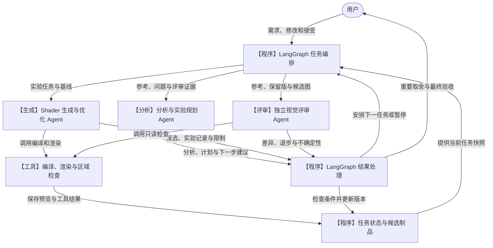
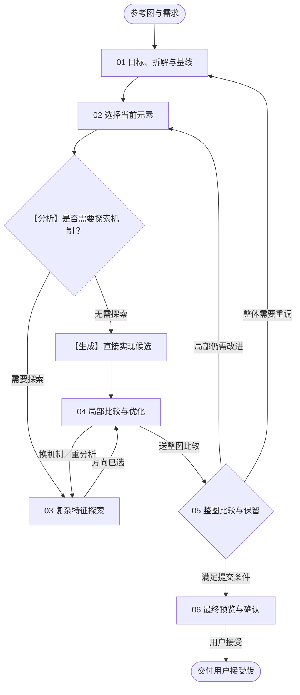
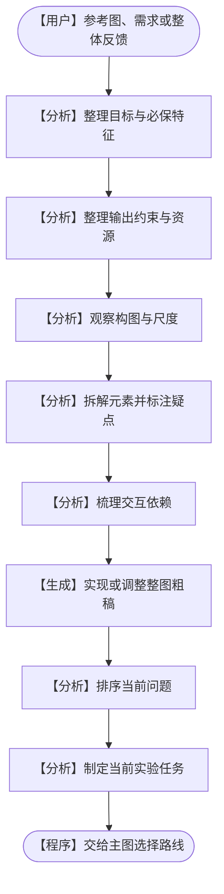
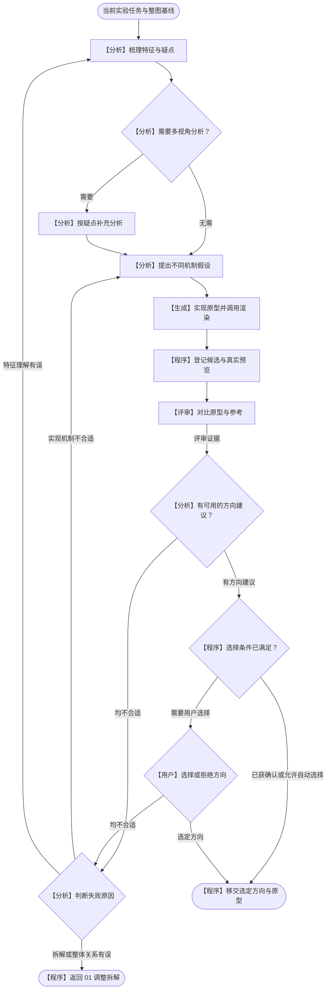
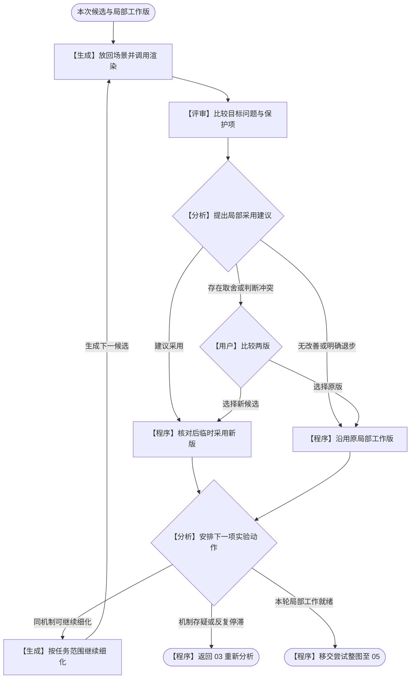
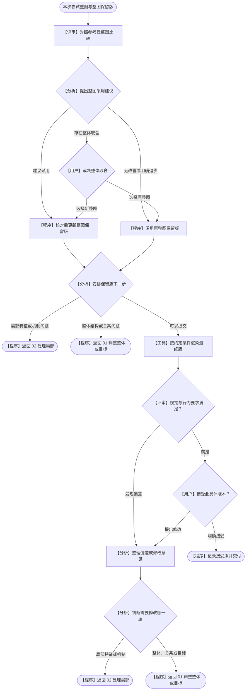

# PNG → Shader：三 Agent 架构与分层生成流程

V3 · 2026-09-09。本文是待实现的架构设计。

## 1. Agent 与执行层

首版确定三类独立 Agent。分析与生成分别拥有自己的任务上下文；多候选或多视角需要并行时，可以创建同类角色的多个任务实例。

| 角色 | 负责的工作 | 返回的结果 |
| --- | --- | --- |
| 分析与实验规划 Agent | 理解参考与需求，拆解元素和依赖，提出机制假设，选择当前问题，综合评审后安排下一步 | 分析结果、实验任务、采用或回退建议 |
| Shader 生成与优化 Agent | 实现原型与候选，修复编译，调用渲染，局部优化与场景组合 | Shader、真实预览、实验记录、实现限制 |
| 独立视觉评审 Agent | 对照参考、整图保留版与新候选，检查目标改善、保护项退步与整体观感 | 差异报告、观察区域、判断不确定性 |

分析 Agent 规划“做哪项实验”，生成 Agent 规划“怎样完成这项实验”。评审 Agent 负责证据；重要主观取舍和最终接受由用户决定。

| 执行组件 | 责任 |
| --- | --- |
| LangGraph 主图 | 根据分析建议派发任务，检查目标和基线版本，维护预算，执行状态更新，暂停与恢复 |
| Deep Agents | 用于搭建角色内部的工作循环，重点支持生成过程的文件操作、工具调用和上下文管理；各角色按需配置能力 |
| 普通工具与函数 | 编译、真实渲染、指标与区域检查、候选登记、版本保存与交付 |
| 任务状态与制品 | 保存目标、候选、整图保留版、用户接受记录、预算及对应的代码和预览 |

研究和多视角分析归分析 Agent；优化与合成归生成 Agent；局部与整图检查归评审 Agent。图中的“程序”和“工具”是普通代码职责。

## 2. 三 Agent 协作架构

下图显示任务与产物如何传递。任务编排和结果处理是同一个 LangGraph 主图中的逻辑部分；各节点不代表独立部署的服务。

- 三个 Agent 通过明确的任务输入和返回结果交接。全局派发由主图统一执行；同一角色可在不同阶段被多次调用。
- 评审 Agent 主要接收目标要求与真实图像，按需使用区域检查工具；生成者的实现解释不能替代图像证据。
- 分析 Agent 提出采用、暂存探索、放弃或回退建议；程序核对条件后更新状态。值得继续探索的候选不自动成为整图保留版。
- Agent 的完整聊天历史分别保留，主图只提取业务结果和制品引用，再按任务构造下一次输入。

## 3. 实验任务与交接

每次任务绑定一个明确的问题和基线。一次实验内部可以包含多次编译修复与小步试验，但每个有效候选和预览均需登记。

| 交接 | 最少需要的信息 |
| --- | --- |
| 主图 → 分析 | 用户目标、参考图、当前整图、问题记录、已有假设、最新评审和剩余预算 |
| 分析 → 主图 → 生成 | 目标版本、起始整图版本、作用元素或组合、待验证假设、允许修改范围、保护项、预算与结束条件 |
| 生成 → 主图 → 评审 | 候选代码与真实预览、捕获条件、起始基线、目标问题与保护项；明确未实现或尚未验证的内容 |
| 评审 → 主图 → 分析 | 可定位的视觉差异、改善和退步、判断依据与不确定性；观察与原因推测分开记录 |
| 分析 → 主图 | 下一步动作、作用范围、理由和依据的候选版本；程序负责检查与执行 |

- 内层允许完成编译修复和假设范围内的优化。需要改变核心假设、整体拆解或任务范围时，返回分析 Agent；新方向以新候选记录，保留原实验身份。
- 同轮并行候选共享固定基线并使用独立输出目录，汇总后统一选择。目标或基线变化后，旧结果先在新条件下重新渲染和评价。
- 原型预览、阶段 04 的局部工作版、阶段 05 的整图保留版，以及阶段 06 的用户接受版分别记录。

## 4. 六阶段总览

保留原有六阶段。流程框表示工作阶段，具体由谁完成在后续细节图中标注。

| 阶段 | 主要分工 |
| --- | --- |
| 01 目标、拆解与基线 | 分析整理目标、拆解和依赖；生成实现粗稿；程序登记初始基线 |
| 02 选择当前元素 | 分析选择当前问题，形成元素或关联组合的实验任务 |
| 03 复杂特征探索 | 分析提假设；生成原型；评审对比；分析形成选择建议；重要方向由用户确认 |
| 04 局部比较与优化 | 生成优化；评审检查；分析提出采用与后续动作；程序检查并执行 |
| 05 整图比较与保留 | 评审整图；分析综合建议；程序决定是否满足更新条件并记录整图保留版 |
| 06 最终预览与确认 | 工具按约定条件渲染；评审检查；用户接受；程序记录与交付 |

只返回 02 时复用当前场景；需要换机制或修正特征时回到 03；目标、拆解或整体关系变化时回到 01。六阶段不要求每轮从头重跑。

## 5. 细节 A：目标、拆解与元素选择

- 先明确静态参考复刻、审美改版或可控材质目标，以及尺寸、运行环境、时间、资源和需要验证的行为。
- 用户明确要求与模型推测分别记录。前者需要保护；后者标注不确定性，允许被后续证据推翻。
- 按目标影响、当前偏差与不确定性排序；强依赖元素作为组合处理，复杂程度不直接决定优先级。
- 分析整理的目标和约束须与用户需求一致。首次粗稿经技术检查后登记为初始整图保留版，登记不代表视觉达标；后续整体调整作为新尝试，在阶段 05 比较后再更新。
- 仅返回 02 时从“排序当前问题”继续。用户改变目标后更新目标版本，并重新评价历史候选。

## 6. 细节 B：复杂特征探索与分层回退

- 分析 Agent 按疑点选择研究或多视角任务。多视角属于分析角色的不同任务实例，由主图按计划派发。
- 不同候选应有明确、可验证的机制差异。生成 Agent 使用可比的场景、尺寸、时间与资源条件实现真实 Shader 原型。
- 评审 Agent 给出对比证据，分析 Agent 综合形成方向建议。程序只在已有明确授权范围内自动选择，否则等待用户选择；用户可以拒绝所有方向。
- 全部拒绝后，分析 Agent 判断是机制、特征理解还是整体拆解的问题，再由主图回到对应位置。原因不清时先安排能够区分解释的小实验。

## 7. 细节 C：局部工作版选择与下一步

- 评审提供“哪里改善、哪里退步”的证据；分析提出局部采用建议；程序核对目标与基线版本、捕获有效性和保护项条件后执行。检查不通过时不更新版本，刷新任务并交回分析处理。
- 有明确目标改善、保护项未超限退步且捕获条件等价时，才可在授权范围内自动临时采用。主观取舍冲突保留两版，由用户选择；改变必保要求须先更新目标。
- 图中的一轮指一次提交独立评审的候选检查点。生成 Agent 内部可进行多次编译修复和小步试验，无需每次工具调用都唤醒全部角色；实验结束、停滞或需要改向时交回分析。
- 细化从选定局部工作版出发，固定无关输入并重算受影响的倒影、光照或遮挡。临时采用不等于更新整图保留版。
- 连续几轮未解决同一问题时停止当前细化路线，由分析重新诊断。所有尝试保留记录，停滞阈值按任务预算设置。

## 8. 细节 D：整图保留、修改与交付

- 评审同时查看原参考、尝试整图与整图保留版，检查构图、尺度、关系、材质身份和保护项；分析综合提出采用建议。
- 程序核对目标、基线、真实预览与选择条件后更新整图保留版。目标或基线已变化时，先刷新任务并重新评价；局部收益不能直接覆盖整图退步。
- 采用与否确定后，分析基于所选整图安排下一步。未采用的候选可留作探索分支，后续共同任务继续使用整图保留版。
- 最终预览使用约定的运行环境、尺寸、时间和资源条件，先通过技术检查，再由评审检查视觉与行为要求。用户接受绑定具体代码、资源、条件与预览。
- 最终偏差和修改意见由分析判定范围，经主图返回实际修改；修改完成并重新评估后才能再次提交。重复绘制的返回出口指向相同的 01 或 02 阶段。

## 9. 共用执行规则

- 编译、渲染、测量、制品保存与版本更新由普通工具或图节点执行。视觉采用建议来自分析与评审证据，最终接受来自用户。
- 分析、生成、评审、编译修复与预览共用任务预算。预算耗尽、用户停止或无法继续时，保存现有整图与未解决问题，以未完成状态结束。
- 无效代码、不可信捕获或比较条件不一致时先修复，修复计入预算；这些结果不参加视觉选优。
- 同一候选的代码、资源、参数、预览和评价应能对应；重要选择记录理由和具体版本。
- 目标版本和整图基线是任务输入的一部分。任务恢复或并行结果返回时重新核对；历史结论不能自动适用于新目标。
- 每个 Agent 的工具、任务上下文和返回字段按职责配置。全局状态更新由主图集中执行，子 Agent 的完整内部状态不直接作为业务状态回写。
