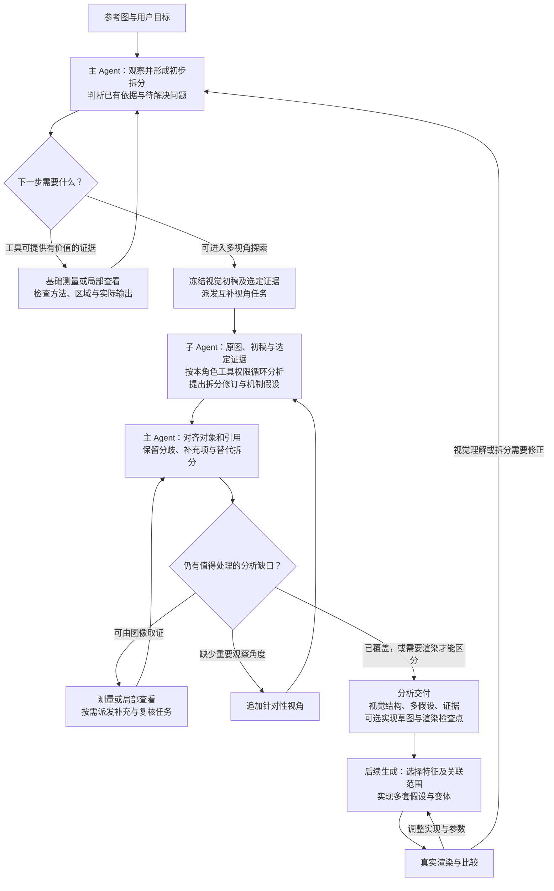

# 分析模块调整方案：视觉拆分与多假设探索

日期：2026-09-16；本次修订补充 ReAct 循环、前置基础取证及各阶段输入输出。  
状态：分析模块实现及本地工程验证已完成；初次两图因预算耗尽未交付综合，取消主调用上限后的两图复跑均已交付 `completed`，详见第 13 节。下文保留设计依据，实际字段以源码及第 13 节实施记录为准。  
范围：在现有独立多视角分析模块内增加视觉拆分，调整提示词、报告、上下文和校验；不接入生成调度。

## 1. 目标与原则

分析阶段负责从不同角度观察参考图，探索元素、特征、关系与可能的实现机制，向后续生成提供可追溯的多假设材料。

后续生成阶段将不同假设具体化为代码和变体，通过真实渲染及比较判断效果。分析阶段不要求确定唯一机制，也不要求还原原作者唯一的实现方式。

本次调整遵循以下原则：

- 整体顺序为：视觉拆分 → 多视角细化与实现拆分假设 → 多变体生成与渲染比较。
- 各 Agent 阶段按 ReAct 方式推进：观察材料、判断下一问题、按需调用允许的工具、读取结果、更新判断，再决定继续或提交。阶段表示职责与产物边界，一阶段可以包含多轮模型与工具调用。
- 视觉拆分期间允许先做基础取证。主 Agent 先判断已有材料能支持哪些观察，以及哪些问题值得测量，再选择操作与区域；结果可以修正先前判断。
- 能由合适工具可靠计算的属性直接使用程序证据，不必专门派多个视角重复估计。工具暂不支持、取样有歧义或涉及机制解释的问题，继续保留不确定性。
- 视觉拆分允许修订；多视角分析可以补充元素、拆分特征、修正关系或提出替代拆分。
- 明确区分可见现象、测量结果、机制解释和实现建议。发散应建立在尽可能可靠的观察上。
- 细粒度以可定位、可比较和可调整为目标，不要求每个特征对应独立代码模块。
- 一个视觉特征可能由多个实现组件共同产生；同一实现机制也可能同时影响多个特征。
- 多种实现可以同时有效。无法由单张参考图区分的机制，保留到生成阶段探索。
- 用户明确的要求与模型推测分别记录；模型认为重要的特征不自动升级为用户要求。

## 2. 改动范围

保留现有主 Agent、统一子 Agent 模板、视角配置、批次派发、独立上下文、测量工具、预算和结果持久化框架。

| 调整位置 | 拟增加或改变的内容 |
| --- | --- |
| 主 Agent 首次规划 | 在观察、基础取证与修订的循环中形成带证据的视觉初稿，再选择互补视角 |
| 子 Agent 提示词 | 围绕原图与视觉初稿独立观察，细化元素和特征，提出多个实现拆分假设 |
| 主 Agent 综合提示词 | 对齐对象和引用，保留分歧及替代假设，关联实现草图和渲染检查点 |
| 报告结构与上下文 | 增加元素、特征、关系的明确标识与引用，首轮可显式选入基础证据，支持后续按特征选择材料 |
| 工具调用时机 | 允许主 Agent 在首批视角任务之前测量；前置与后续取证共用预算、缓存和归属规则 |
| 校验与测试 | 检查结构引用、材料传递、首轮证据可见性、工具权限、循环预算与兼容行为 |

本方案不新增独立的视觉拆分 Agent，不实现分析到生成的自动调度，不扩展生成器、渲染器或独立评审 Agent。后续生成流程在本文中仅用于说明交接目标。

已有 JSON 参数完整性、测量解释和报告提交问题在第 10 节单独列出，不以架构方向成立代替可靠性修复。

## 3. 视觉拆分与实现拆分

| 层次 | 主要问题 | 应交付的内容 | 保留的边界 |
| --- | --- | --- | --- |
| 视觉拆分 | 看到了什么，出现在哪里，具有哪些特征，彼此有什么关系？ | 元素、特征、区域、关系及观察不确定性 | 不从视觉名称直接认定材质、物理机制或代码结构 |
| 实现拆分 | 哪些图元、计算过程或组合可以产生这些现象？ | 多个机制假设、可选实现草图、变量及渲染检查点 | 每套实现仍待编码和渲染验证 |
| 生成探索 | 哪些代码与参数组合能够得到合适效果？ | 可执行代码、真实预览、对照结果 | 渲染反馈可以要求修正视觉理解或重新拆分 |

例如，紫色过渡首先是一项可见特征。它可以与两个圆形区域的交互关联；是否需要单独的紫色图层，由不同实现假设分别表达。

视觉拆分形成的对象结构与实现组件结构不要求一一对应。允许同一视觉结构对应多套实现拆分，也允许不同视角对视觉对象的边界保留不同意见。

## 4. 调整后的流程

流程中的 Agent 节点可以多轮执行；任务登记、引用校验、缓存与制品保存继续由普通程序负责，不为这些确定性操作增加模型调用。



后续的反馈可以只修订相关局部，无需每次重新执行全部整图分析。图中的“返回视觉拆分”代表允许修订，不表示必须推翻整份初稿。

### 4.1 视觉拆分与前置基础取证

使用现有主 Agent 的多轮循环完成，不新增独立的视觉拆分 Agent，也不要求一次模型回复完成全部拆分。初步观察可以先形成，工具结果随后补充或修正它。所有实际模型调用都计入主 Agent 的调用预算。

- 从整体构图与主要区域开始，识别显著元素和关键视觉特征。
- 使用中性的视觉名称，例如“右上浅色圆形区域”；“磨砂玻璃”可作为解释候选。
- 关系优先描述可见的重叠、邻接、包含和重复；光学作用或因果依赖属于假设。
- 不要求一次枚举所有微小细节，不可靠的数量、边界或归属保留疑点。
- 初稿只提供共同观察入口。子任务仍接收完整原图，不能只看到裁剪区域或初稿文字。

每次行动前，主 Agent 需要明确：已有材料支持什么、下一问题影响什么、当前工具能否回答、应该在哪里取样。工具返回后先检查区域和方法是否合适，再决定使用结果、重新取样或保留未知。

| 基础问题 | 适合的操作 | 结果使用边界 |
| --- | --- | --- |
| 图像宽高、固定图像身份 | 程序读取尺寸、保存快照与哈希 | 不需要通过模型目测估计 |
| 局部颜色、明暗变化 | 区域统计、亮度剖面或局部裁剪 | 只支持实际采样区域和返回指标，不自动说明物理成因 |
| 明确分离的重复图形数量 | 在具备对应工具时，使用适合对象的分割、连通域或实例计数 | 保留计数对象、区域、方法、阈值及检测区域；连通域数不自动等于语义元素数 |
| 遮挡、透明叠加或对象归属 | 局部查看与针对性分析 | 计数或分割存在歧义时继续保留，不把程序返回整数直接当作真值 |
| 原图无法区分的实现机制 | 记录竞争假设与后续渲染检查点 | 不为获得唯一答案而反复测量 |

当前测量种类是 `crop`、`region_stats` 和 `line_profile`，尚无专用计数操作。支持前置调用可以先复用这些能力；如果实现数量统计，必须同时实现真实计算、方法说明与结果校验，不能只在提示词里声称已有计数能力。裁剪后的模型数数仍属于视觉判断。

工具能可靠回答的问题，不需要专门追加多个视角重复计算。多视角主要关注对象组织、特征细化、依赖关系以及机制和实现可能；仍可对明显不合理的基础测量提出复核。

### 4.2 多视角分析与初稿的关系

首轮各视角不共享彼此的报告与聊天历史；允许显式选入主 Agent 已取得、已回读的基础证据。参考图、视觉初稿和选定证据在派发时固定，首轮任务不会动态读取其他工作线程的新结果。

视觉初稿和基础证据可能是共同输入，因此这些报告属于“共享初稿及指定证据条件下的独立分析”，不能声称完全没有共同先验。独立性主要指各视角不提前接受其他视角的结论，且各自拥有独立历史。提示词需要明确允许质疑初稿和取样方法，并要求各视角先从原图核对其关注范围。

同一个证据 ID 被多个视角引用仍是一份证据，不累计成多次独立验证。为不同视角选择不同证据时，应保存实际可见范围，避免将未提供的材料写成该子任务已查看的依据。

子 Agent 可以：

- 对已有元素补充特征与观察。
- 发现遗漏的元素、交互区域或全局关系。
- 提出细分、合并、重新归属等拆分建议。
- 对同一特征提出不同的机制解释和实现组件组合。
- 标注无法从参考图确定、应留给渲染探索的问题。

首版继续由主 Agent 统一执行测量。子 Agent 使用本角色开放的工具，提交报告时可通过 `evidence_requests` 请求补充；主 Agent 获得结果后可派发新的定向任务。这是跨任务反馈，不声称已经实现原来的子任务暂停和恢复。是否为子 Agent 增加直接测量工具，属于后续按需要决定的权限扩展，ReAct 本身不自动授予该权限。

### 4.3 综合与停止条件

综合阶段负责组织材料、消除重复命名和标明争议。合并同义对象时保留来源；不同对象解释或不同机制不可仅因少数视角提出而被删除。

达到以下条件即可交付：

- 主要视觉区域与影响整体效果的特征得到覆盖，明显遗漏已补充或明确说明。
- 可用报告中的关键观察和候选假设有明确归属与来源。
- 重要分歧已记录，并说明它适合通过图像取证、生成实验还是更多输入解决。
- 剩余未知项不妨碍提出有意义的生成候选，或已有预算不足以继续分析。

不以“所有视角同意”“唯一机制确定”“用完所有预算”作为完成条件。不强制每张图使用所有预置视角，也不为凑齐假设数量编造替代解释。

### 4.4 ReAct 循环与执行边界

各 Agent 阶段共用以下工作顺序：

```text
查看当前材料与已有工具结果
    ↓
判断已有依据、待解决问题与预期信息增量
    ↓
选择本角色允许的行动，或直接提交当前产物
    ↓
程序校验参数、权限与预算并执行工具
    ↓
读取实际结果，检查它是否回答了问题
    ↓
更新观察、视觉拆分或假设
    ↓
继续探索、请求补充，或保留未知并结束
```

- 不要求每轮都调用测量工具；材料足够时可以直接提交。
- 已支持的观察可作为暂定依据继续工作，新的证据仍可要求修正。
- 主 Agent 的前置取证、批次派发和综合共用主调用预算；基础测量与后续测量共用唯一测量预算和缓存。
- 主 Agent 必须在后续模型请求中实际收到测量结果与裁剪图，才能引用它们或按证据 ID 派发任务。工具已执行不等于结果已进入模型上下文。
- 前置取证不要求清除全部不确定性，应为多视角探索和综合保留预算。到限时保存已取得的证据和停止原因，不通过绕过预算完成必需步骤。
- 分析的工具白名单保持只读观察、受控测量、派发与报告职责；代码编写、编译和渲染属于后续生成阶段。

后续生成也可以采用“编码 → 编译/渲染 → 查看预览 → 修正”的循环。本文只描述其交接要求，不新增生成实现或自动执行该流程。

## 5. 细粒度组织方式

视觉结构建议包含三类对象：

| 对象 | 含义 | 示例 |
| --- | --- | --- |
| 元素 | 可定位的视觉对象、对象组或区域 | 圆形区域、卡片、重复元件组 |
| 特征 | 某个元素或关联组合上的可观察性质 | 外轮廓、中心孔、渐变方向、过渡宽度 |
| 关系 | 多个对象之间可观察的组织关系 | 重叠、包含、相邻、重复与排列 |

特征可以关联多个元素。紫色过渡或后景边界软化可以属于交互区域，不必强行归给单一元素。

重复结构按“公共模板＋实例差异”组织。彩色元件的外轮廓与中心孔属于公共模板特征；各实例的位置和颜色属于实例差异。只有需要单独比较或调整的实例，才继续细化其记录。

后续生成任务可以选择一个特征，同时带入受影响的关联元素和保护项。例如：

> 比较交叠区域的软化实现。允许调整软化和颜色处理；保持两圆相对位置及外轮廓。每个候选都在同一参考区域和渲染条件下比较。

该任务足够细，但不要求只编辑一个函数。代码组件和渲染 Pass 的拆分由对应实现假设与运行约束共同决定。

## 6. 最小数据结构调整建议

以下为语义设计，实施时沿用现有不可变记录、Pydantic 校验、`analysis_detail` 和来源引用方式，不另建并行的完整报告体系。

### 6.1 视觉结构

建议增加一个可复用的 `VisualDecomposition` 结构，包含元素、特征和关系。首次规划保存初稿，综合报告保存整理后的结构；两者区分来源，不覆盖原始初稿。

| 记录 | 最少需要的内容 |
| --- | --- |
| 元素 | `id`、中性名称、文字区域、可选像素区域、可选父元素 |
| 特征 | `id`、关联元素 ID、可观察描述、适用区域、依据与不确定性 |
| 关系 | `id`、参与对象 ID、可见关系描述、依据与不确定性 |

初稿中的条目分别标明目测依据与数值依据；实际完成的前置测量通过 `evidence_ids` 关联到对应观察或特征，仍保留初稿可修订的身份。未测量内容不得伪造证据，主 Agent 自己的初始观察不得伪装为子报告来源。综合结构应关联真实来源，并显式保留尚未得到独立核对的内容。

### 6.2 观察、假设与视觉对象的关联

为现有观察和解释增加可选的元素、特征引用。子报告允许使用报告内部的新增对象 ID；其完整身份由“来源报告 ID＋内部 ID”确定，避免不同子任务的局部编号冲突。

主 Agent 综合时对齐重复对象，输出原始标识到综合标识的映射。无法可靠对齐时保留不同对象解释及其对应区域，不强行合并。

首版保存本次运行的初稿、基础证据、原始报告和最终映射，不引入跨运行的实体数据库或复杂版本系统。若当前接口允许后续批次使用修订结构，应为每批任务绑定不可变的结构快照和证据清单，保持已派发任务的输入不变。

### 6.3 逐假设的实现草图与渲染检查点

综合假设需要有可引用的标识，使实现建议能够明确指向一个或多个假设。建议在现有结构中增量表达以下内容：

| 内容 | 要求 |
| --- | --- |
| 作用范围 | 关联哪些元素和特征 |
| 机制解释 | 描述该假设如何解释现象 |
| 依据与局限 | 保留支持、反对和未确定的部分 |
| 可选实现草图 | 用简短文字说明一种或多种实现方向，不要求提供 GLSL |
| 可调变量 | 哪些量可以形成变体；未经验证的值标为估计或探索参数 |
| 渲染检查点 | 在什么区域比较哪些可见现象，哪些结构需要保持 |

实现草图允许为空，不为每个观察强制编写方案。实现建议不得仅作为一份全局配方存在；共用建议与分支专属建议要有明确作用范围。

测得的成品颜色、边界宽度等数值属于渲染结果的比较目标。将其转换为透明度、图层颜色、模糊参数或其他代码参数时，必须保留假设与单位说明。

### 6.4 兼容与校验

- 保留公开入口与既有字段语义。新增字段优先使用默认空值或默认空集合，旧记录缺少视觉结构时表示“未提供”，不能表示“图中没有元素”。
- 若给已有公开 Python 函数增加参数，使用带默认值的 keyword-only 参数，并在实施说明中明确签名变更。
- 首批派发可通过现有 `run_analysis_batch` 的新增可选参数携带视觉初稿。首次提供时与整批任务一起校验、保存和绑定；基础测量可在此之前独立保存，不因后续批次校验失败而丢失。历史调用未提供初稿时保留兼容路径。
- 首批仍至少两个视角，`purpose="initial"` 且 `related_result_ids` 为空；`evidence_ids` 可以引用本会话中主 Agent 已实际回读的基础证据。未提供证据时继续为空，不强制前置测量。
- 已调整 `_measure` 必须等待首批报告的旧限制，以及 `_validate_batch_plan` 禁止首轮引用测量的旧限制；新行为仍要求实际回读。保留参考图身份、目标版本、任务归属、实际可见性和预算检查。
- 初始阶段测量不依赖子报告；已有子报告需要用于后续决策时，仍要求主 Agent 先回读它们。所有证据都先登记再进入后续请求，不允许同一轮跳过结果回读而提交依赖该结果的判断。
- 校验对象标识唯一、引用存在、父子关系无循环、引用属于当前分析与目标版本。
- 允许不同视角提出冲突内容；程序检查引用与结构，不替模型裁定任意自然语言判断的真假。
- 不以“每份报告都在来源列表中”代替“关键替代假设已被保留”。原始报告始终保留，综合遗漏风险通过评估检查。

### 6.5 各阶段的输入输出

| 阶段 | 输入 | 输出及归属 |
| --- | --- | --- |
| 固定参考 | 图片、用户目标、输出约束 | 复用 `TargetRecord`；程序保存参考字节、哈希与尺寸 |
| 视觉拆分 ReAct | 完整原图、目标、已取得的证据、剩余预算 | 可修订的 `VisualDecomposition` 初稿、初始观察、真实 `MeasurementRecord` 及未确定项 |
| 视角派发 | 视觉初稿、选定证据、关注元素/特征、视角配置 | `AnalysisTaskRequest` 经校验登记为固定子任务；首轮没有其他子报告 |
| 子视角分析 | 原图、绑定的初稿与证据、任务目标和视角 | 扩展 `LensReport`：观察、拆分建议、解释、可选实现草图与 `EvidenceRequest` |
| 补充取证 | 具体问题与有效 `MeasurementSpec` | 程序生成证据或明确错误；主 Agent 回读后决定修订或派发补充任务 |
| 综合交付 | 初稿、可用报告、证据及失败记录 | `ResultRecord.analysis_detail` 中的扩展 `AnalysisSummary`，保留视觉结构、映射、多假设与未完成项 |
| 后续生成 | 选定特征、关联元素、假设/实现方案引用、固定基线与渲染条件 | 代码与真实候选预览，关联实际采用的假设和参数；自动交接尚未实现 |
| 后续比较 | 参考、真实候选、实验范围与保护项 | 特征级差异、影响范围和下一步建议；必要时要求局部重新拆分 |

最小关联链为：元素 → 特征 → 观察与证据 → 假设 → 实现方案 → 候选 → 反馈。对象 ID 说明在讨论什么，观察及测量引用说明依据是什么；文件路径由 Context Builder 解析并加载，不以路径文字代替实际图像或报告内容。

建议继续复用 `MeasurementRecord`，为测量结果显式表达实际指标与聚合方式。若增加计数能力，再补充计数对象、方法参数、检测区域及局限等相应字段，不提前预填尚未计算的结果。对旧记录可解释为“未提供该信息”，不能静默赋予新的证据语义。

ReAct 执行记录保存工具、参数或规格、结果引用、拒绝原因、调用轮次和停止原因即可；不要求额外保存模型的完整内部推理。观察记录按实际更新的条目关联证据，避免每次工具调用后重复生成整份长报告。

## 7. Prompt 调整方向

以下是拟加入的行为要求，实施时与现有工具格式、证据和预算说明合并，避免重复堆叠长提示词。涉及新增字段的提示词必须与 schema 同步上线，不能先要求模型提交当前结构不接受的字段。

### 7.1 主 Agent

首次规划：

> 先观察原图，判断已有材料足以支持哪些结论，以及下一项值得解决的问题。工具能够提供有价值的证据时，选择合适方法和区域，收到结果后检查其适用范围，再更新视觉拆分。名称保持中性，不提前确定物理机制或实现图层。初稿与已选基础证据足以支持探索时派发互补视角，允许子任务补充或质疑初稿，无需先消除所有未知项。

综合：

> 对齐各报告讨论的元素与特征，保留原始来源、不同拆分和机制假设。每个实现建议注明适用假设及特征。按“查看材料、选择问题、行动、读取结果、更新判断”的循环工作，把可以继续看图核查的问题与必须通过代码和渲染探索的问题分开。同一基础证据被多个报告引用仍只算一份依据，不把共享材料下的一致判断当成额外独立验证。不要把未验证的参数或某个视角偏好的方案写成默认事实。

补充分析：

> 仅当缺少重要观察角度、存在可核查的关键视觉误读，或新的证据值得重新解释时追加任务。已有参考图无法区分的机制可直接交给后续生成，不通过重复投票决定真伪。

### 7.2 子 Agent

共同要求：

> 以完整原图、用户目标、本视角关注点和明确提供的证据为依据。先核对你的观察范围，再选择下一项有价值的问题。视觉初稿只是共同定位材料，允许增加、细分、合并或质疑其中的对象。只使用本角色开放的工具；需要未开放的取证能力时提出具体证据请求，不假设已经执行测量。分别记录可见现象、机制解释和实现草图，将它们关联到具体元素或特征。为有依据的替代解释保留空间，不为满足数量要求编造假设。

实现拆分：

> 围绕关注的特征提出可能的图元、计算或组合方式。说明可调变量及渲染后值得比较的现象。视觉特征与实现组件可以多对多关联；不要求每个视觉元素成为独立图层。

证据边界：

> 数值只描述其实际采样区域和指标。条带均值不是自动得到的物体内部颜色，亮度剖面不提供 RGB 或色相路径。没有对应证据的精确参数保留为估计，不升级为已确认事实。

## 8. 两个案例的预期组织方式

以下用于说明产物结构，不是对参考图机制的最终判定，也不是预先固定生成方案。

### 8.1 `supah-frosted-glass.png`

视觉结构可先描述背景、左下圆形区域、右上浅色圆形区域；为重叠范围、紫色过渡和边界软化建立关联特征。若某视角认为还存在独立视觉对象，允许作为替代拆分提出。

前置循环示例：主 Agent 先定位背景和交叠区域，按需采样背景颜色或查看局部边界；回读工具结果后更新初稿，将有用证据显式提供给相关视角。两圆在图像中重叠，不能把整幅图的连通域数直接解释为圆的数量；“模糊还是渐变合成”也不需要在前置取证中选出唯一答案。

| 假设方向 | 可选实现草图 | 渲染比较点 |
| --- | --- | --- |
| 局部后景模糊 | 对程序化背景在圆形范围内进行多点采样或其他兼容当前渲染约束的近似 | 盘内后景边界软化、盘外轮廓、颜色过渡范围 |
| 颜色场与透明度场合成 | 用圆形遮罩约束独立的颜色和透明度变化 | 紫色区域形状、蓝到浅色的过渡、背景覆盖区域 |
| 额外紫色成分 | 在某个基础方案上增加可独立调节的紫色分量 | 是否改善目标区域，同时避免改变无关区域 |

这些假设可能互补或组合，不必全部视作互斥方案。后续生成需要结合单 Pass、外部纹理等实际约束选择可执行写法；本次不扩展渲染器。

### 8.2 `2d-physics-balls.png`

视觉结构先包括背景、卡片、重复彩色元件组，再分别描述元件模板和排列特征。

前置循环示例：主 Agent 看出重复元件后，先判断数量能否由现有工具可靠取得。若已有适用的计数工具，则检查其计数区域、对象分离结果及潜在漏计、重复计数，再将合格结果关联到排列特征；没有该工具时可裁剪辅助目测，并明确保留其视觉估计身份。已可靠取得的数量无需再专门让多个视角重复估计，但元件模板、组织关系和实现机制仍值得从不同角度探索。

| 关注范围 | 细粒度特征 | 可探索的实现方向 |
| --- | --- | --- |
| 单件模板 | 外轮廓、凹口、中心孔、朝向 | 圆与切口的布尔组合、周期轮廓、分段曲线等有依据的候选 |
| 元件排列 | 数量、相邻关系、行列节奏、整体外形 | 固定布局、程序化交错布局、模拟结果等候选 |
| 色彩组织 | 颜色集合、空间分布、实例颜色 | 明确实例配色或不同程序化分配方式 |

可先围绕一个模板的轮廓特征生成变体，再放回整体布局比较。观察到的凹口数应尽量核查，不能将任意错误计数包装成同等可信的机制假设。

## 9. 实施位置与步骤

### 9.1 主要文件

以下路径均相对于 `apps/shader_deep/`。

| 文件 | 预计调整职责 |
| --- | --- |
| `src/shader_deep/analysis/schemas.py` | 视觉结构、对象关联、逐假设实现建议的最小字段扩展 |
| `src/shader_deep/analysis/prompts.py` | 各 Agent 阶段的 ReAct 行为、前置取证、子 Agent 发散和主 Agent 综合要求 |
| `src/shader_deep/analysis/session.py` | 允许首批前测量；初稿与首轮选定证据的校验、冻结、传递和保存；全程共用预算与缓存 |
| `src/shader_deep/analysis/worker.py` | 将绑定的视觉初稿或指定材料传入子任务上下文 |
| `src/shader_deep/context/analysis.py` | 组织原图、视觉初稿、相关对象和显式选入的报告及证据 |
| `src/shader_deep/analysis/validation.py` | 新增对象及来源引用的合法性检查 |
| `src/shader_deep/analysis/evidence.py`、`measurements.py` | 明确测量指标与聚合方式；确有需要时再实现受控计数能力及其结果契约 |
| 分析相关单元测试 | 引用、隔离、兼容和实际请求材料验证 |
| 应用与分析模块 README | 同步真实已实现的字段、运行行为与边界 |

如实现确需把结构写入通用 `TaskRecord` 或黑板，应先核对其他角色的影响；首版优先通过分析会话及任务固定输入承载，不为本需求扩大整个黑板的数据模型。

### 9.2 建议顺序

1. 确定视觉对象、报告内新增对象、综合映射和证据引用的最小规则，保留旧调用与旧字段语义。
2. 调整主 Agent 前置测量与首轮证据选择的阶段限制，验证回读要求、归属检查、缓存和全程预算。
3. 将视觉初稿及选定证据接入首批派发、子任务上下文与运行快照，验证真实原图、实际证据及初稿身份均已提供。
4. 同步调整主、子 Agent 提示词与产物字段，使观察、取证、修订和提交按职责循环，允许替代拆分与逐假设建议。
5. 运行相关无网络测试与 lint；使用固定参考图做有限真实分析复测。独立评估是否需要计数工具，新增时单独验证计算和语义边界。
6. 将新旧分析产物用于后续受控的生成对照，评估基础取证和细粒度材料是否确实改善候选探索。

第 6 步属于后续验证计划，不代表当前自动交接已经实现。本次也不将每项视觉特征直接转换为自动派发的生成任务。

## 10. 单独处理的可靠性问题

前次 review 已记录以下问题。它们需要各自的修复与验证，不能仅靠添加视觉拆分或修改提示词解决。

| 问题 | 最小改善方向 |
| --- | --- |
| 条带平均值被解释为孔内颜色 | 显式给出采样范围与聚合方式；必要时提供局部位置材料，针对内部颜色使用合适 ROI |
| 测量问题与工具输出不匹配 | 对齐指标与能力说明；有实际需求时再增加 RGB 剖面、方差等指标 |
| 混合陈述整体标为有测量支持 | 将数值观察、目测估计和机制推断拆成独立陈述，明确各自证据范围 |
| 非法工具参数被底层部分解析后接受 | 工具执行前校验原始参数，严格限制并记录允许的恢复方式 |
| 完整报告反复截断或重交后耗尽预算 | 控制重复和输出粒度，为必要的格式修复设有界额度，保留诊断而不伪造有效报告 |
| 部分业务拒绝没有进入本地诊断记录 | 统一保存工具、轮次、拒绝类型和简短原因 |

前次两图运行使用 `max_output_tokens=16384`、`request_timeout_seconds=120`。撰写本文时，工作区 YAML 为 `163840` 和 `240`；新预算的实际收益尚未在本方案中验证，不能据此认定提交问题已经解决。

## 11. 验证与验收

### 11.1 工程验证

- 不增加新依赖即可完成结构和提示词调整；若实施中确有必要，单独说明理由。
- 主 Agent 可以在首批任务之前测量；结果回读前不能引用或派发依赖它的任务。
- 首批任务实际收到完整原图、视觉初稿和显式选入的基础证据，不收到其他首轮报告；未选入、跨会话或尚未回读的证据被拒绝。
- 无需取证时可直接进入首批分析；前置与后续的唯一测量共用同一预算，缓存命中不重复扣除测量额度，不因阶段切换重新发放额度。
- 分割或计数工具若被实现，验证相接、重叠、带孔图形和背景干扰等必要边界；没有工具时不伪造计数结果或数值支持标签。
- 子任务提出新增对象与替代拆分后，引用可解析、原报告可追溯，综合没有覆盖原始内容。
- 特征允许关联多个元素；多个实现草图能分别指向明确假设。
- 初稿、旧报告和缺失视觉结构的兼容调用能按声明的规则处理。
- 测量证据的图像身份、任务输入范围、工具白名单、预算和失败状态继续受程序约束；只有前置调用时机和首轮证据选择按本方案改变。
- 修改模型可见行为后执行 `make test` 和 `make lint`，保留完整失败输出。浏览器测试只在修改渲染或图像反馈链路时补跑。

### 11.2 分析质量检查

用固定参考图检查以下行为，不把判断唯一机制作为验收条件：

1. 关键视觉元素与特征是否可定位，重要交互是否有明确关联。
2. 子 Agent 是否能够纠正初稿中的遗漏或错误，而不是只复述初稿。
3. 候选之间是否存在有意义的表示或机制差异，是否仅更换名称重复同一方案。
4. 数值、目测和机制推断是否分开，错误取样是否被错误解释成新机制依据。
5. 综合是否保留有依据的替代解释及其来源，是否将暂定参数写成硬性要求。
6. 实现草图是否对应具体假设，渲染检查点是否指向可比较的可见现象。
7. 是否能够在合理预算内提交可用报告，并如实保留未完成任务。
8. 是否先判断问题与方法再测量，并在结果返回后检查它是否真正回答了问题；是否减少已可靠测得属性的重复估计。
9. 共享基础证据是否被误算为多个视角的独立验证，前置取证是否耗尽了后续探索和综合所需预算。

初稿和共享基础证据可能造成共同偏向，因此至少选择带有模糊边界或交互归属争议的样例，比较有无初稿及有无前置证据时关键观察与假设的遗漏情况，并单独记录这些输入差异。该对照用于评估设计影响，不作为每次正常分析的额外固定步骤。

### 11.3 下游价值验证

在相同参考图、模型、生成预算和渲染条件下，对照“仅原图”“原图＋既有报告”“原图＋新结构报告”。保留多次运行差异，结合人工视觉比较，关注：

- 生成能否明确针对一个特征及其依赖进行实验。
- 是否出现更多有实际差异且可执行的候选。
- 局部改善是否保持整体构图及其他重要特征。
- 报告是否减少重复理解工作，是否因错误观察造成无效探索。
- 效果改善与模型调用、输出量、耗时之间的关系。

分析报告字数、视角数量、假设数量和 `completed` 状态均不能单独证明生成效果提升。保留机制不确定性可以是正常交付；格式失败或关键材料缺失仍应如实记录。

## 12. 与现有架构的关系

- [分层生成流程](分层生成流程.md)：本方案细化“目标、拆解与基线”以及“复杂特征探索”的分析职责，保留局部修正与整体重拆的反馈关系。
- [Context Builder 设计 V0.2](Context-Builder-v0.2.md)：本方案为场景理解增加可定位的材料；进入黑板或快照不等于已进入后续生成模型请求。
- [独立多视角分析](多视角分析.md)：继续作为当前实现说明，与本次已落地行为同步维护。
- [当前分析报告结构](../../apps/shader_deep/src/shader_deep/analysis/schemas.py)：实施时在既有报告契约上做兼容扩展。
- [当前分析提示词](../../apps/shader_deep/src/shader_deep/analysis/prompts.py)：实施时同步字段、工具契约与行为要求。

本文选择独立 Markdown 保存。本次同步分析模块及应用说明，不修改分层生成架构正文及其生成的 HTML、SVG 和流程数据。


## 13. 本次实施记录

本次在原分析框架内完成，未增加依赖、独立拆分 Agent、计数工具或自动生成调度。保留开始时已有的 YAML、CLI、依赖声明及说明文档改动。

- `VisualDecomposition` 保存元素、特征、关系；任务可指定关注对象。子报告增量保存 `visual_additions` 与 `visual_revisions`，综合用 `visual_mappings` 保留来源。原始初稿、当前稿及逐任务固定输入分别保存，局部 ID 按来源报告解析。
- 首批前允许测量；取证、后续取证和缓存共用原预算。初稿及其中引用的材料也要通过主 Agent 回读、任务明确选入和归属检查。首批仍不含其他首轮报告，完整原图始终进入请求。初稿依赖漏选时一次列全各任务缺失的证据与报告 ID，避免逐个拒绝消耗预算。
- 观察与解释关联元素/特征，综合假设可设 ID；`implementation_sketches` 必须引用明确假设，可带可调变量和 `render_checkpoints`。既有无结构报告保持兼容，不将缺失解释为空图。
- 测量记录补充实际指标、聚合方式、每值样本数、单位及限制，旧记录缺省为未提供。提示词区分读数、目测与机制；程序校验引用，不替代语义判断。
- 流式/非流式保留原始工具参数，拒绝底层补齐、重复键及非标准常量。有限尾部恢复仅删除完整合法对象后多余的 1–2 个闭合符。格式修复最多两次且计入既有模型调用上限；非法调用诊断后从历史剥离，严格请求配对测试覆盖下一轮恢复；业务拒绝持久化类别、轮次和原因。

公开兼容扩展：`run_analysis_batch` 增加可选 `visual_decomposition`；`run_lens`、`build_analysis_context` 增加视觉结构及关注范围，后者另有主任务来源快照。所有新增参数均为带默认值的 keyword-only，保留旧调用；顶层 `run_analysis` / `run_analysis_task` 及通用黑板记录不变。

工程验证：`make test` 112 项通过；`make lint`（Ruff、格式及 ty）通过。修改前 99 项测试中的 JSON 语法错误位置反馈失败已修复。只增加保护新引用、材料隔离与参数完整性行为的必要测试；未改渲染链路，因此不运行浏览器集成测试。

### 13.1 两图真实分析结果

仅对 `supah-frosted-glass.png` 与 `2d-physics-balls.png` 各执行一次真实分析，沿用用户授权的 `www.micuapi.ai` 配置。两次均明确覆盖为：总任务 3、并发 2、子调用 3、主调用 8、唯一测量 4、请求额外重试 1、单次输出 24000 token、请求超时 120 秒。没有改动用户 YAML 中的预算。

| 图片 | 最终状态 | 主 / 子模型调用 | 原始子报告 | 测量 | 综合结果 |
| --- | --- | --- | --- | --- | --- |
| 磨砂圆图 | `model_limit` | 8 / (3, 1) | 2 份，10 条解释、5 套草图，6 条拆分修订 | 4 项 | `null` |
| 彩色元件图 | `model_limit` | 8 / (2, 3) | 2 份，9 条解释、3 套草图，6 条拆分修订 | 4 项 | `null` |

原始制品（本地忽略目录，不自动提交）：[磨砂圆图 run.json](../../apps/shader_deep/runs/visual-decomposition-smoke/run-7gpywi8e/run.json)、[彩色元件图 run.json](../../apps/shader_deep/runs/visual-decomposition-smoke/run-4c1xl1o2/run.json)。固定参考、裁剪证据、任务输入、诊断和原始报告均保留；[本地测试日志](../../apps/shader_deep/runs/visual-decomposition-smoke/tests.log)、[lint 日志](../../apps/shader_deep/runs/visual-decomposition-smoke/lint.log)和修改前失败日志在同一目录。

运行确认前置测量、回读后首轮选入、固定初稿、子任务修订和逐假设草图可以执行。子任务均完成，但输出截断和多次结构/引用修正消耗预算：彩色元件图第 8 次主调用才成功派发，已无综合额度；磨砂圆图在综合时误填字段或引用，最后把解释 `I6` 当视觉观察来源，被拒绝后到限。不能把子任务 `completed` 或条目数量当作整次分析成功。

本次运行触发的后续修复：一次列全各任务缺失的初稿证据/报告；一次汇总全部映射来源与目标错误；允许非关键观察的综合陈述引用报告本地新增视觉对象（仍拒绝初稿冒充产出）；补充模板化重复结构、测量 ID 与报告 ID 的区别、对象映射与观察来源的区别及空字段省略要求。独立审查另修复非法工具调用留在历史导致下一轮消息不配对的问题。**这些最终修复通过本地回归，未追加真实模型复测；不能声称最终版本已在两图上端到端成功。**

质量限制：子报告确实质疑初稿拆分，并保留不同实现方向与局限；但仍出现“目测渐变 + 局部均值”整条标为 `measurement_supported` 的混合陈述，以及由视觉推断前后层次的关系。数值元数据和引用合法性检查不能自动证明自然语言结论正确。彩色元件报告识别了一处取样跨黄色边缘与白底，并没有把该均值直接当作内部纯色。

下游生成对照、人工视觉验收和有无初稿的多轮消融不属于本次结果，不声称已验证生成效果提升。


### 13.2 后续预算调整

按用户后续要求，模块 YAML 的 `max_main_calls` 已由 8 改为 0，表示主 Agent 不限调用次数，同时取消主 Agent 两次格式修复上限。运行仍记录全部调用与拒绝；子 Agent、任务、测量、并发、输出 token 和网络重试配置维持各自额度。CLI 可用 `--max-main-calls 0`；Python `AnalysisOptions` 的内置默认值保留 8，可显式设为 0 或加载 YAML。

本次通过模拟传输验证主 Agent 连续 11 次修复、总计 13 次模型调用后能正确交付，有限模式的停止测试仍保留。没有追加外部图片测试；上节两次 `model_limit` 属于调整前的真实记录。


### 13.3 不限主调用次数后的两图复跑

用户明确要求重新运行两张图后，各启动一次新分析，沿用相同图片、目标文字及已授权模型端点；本轮未修改源码。完整采用当前模块 YAML：主调用 `0`（不限），子调用 3，总任务 6，并发 3，测量 8，额外网络重试 2，请求超时 240 秒，单次输出 163840 token。仅输出目录覆盖为 `runs/visual-decomposition-unlimited`。本轮较初轮同时改变了输出额度、任务和测量等有效参数，不将成功单独归因于取消主调用上限。

| 图片 | 状态 / CLI 退出码 | 主调用 | 子任务及调用 | 测量 | 综合假设 / 草图 / 渲染检查点 |
| --- | --- | --- | --- | --- | --- |
| 磨砂圆图 | `completed` / 0 | 14 | 5 份完成，调用 2、2、1、1、2 | 8 | 7 / 4 / 12 |
| 彩色元件图 | `completed` / 0 | 9 | 6 份完成，调用 1、1、3、1、1、1 | 8 | 9 / 3 / 6 |

两份综合的 `missing_task_ids` 均为空，所有草图均关联明确假设。磨砂圆图综合保留 8 个元素、16 个特征、8 个关系及 32 个来源映射；彩色元件图为 7 个元素、14 个特征、7 个关系及 28 个映射。

本地结果：[磨砂圆图完整输出](../../apps/shader_deep/runs/visual-decomposition-unlimited/glass-outcome.json)、[彩色元件图完整输出](../../apps/shader_deep/runs/visual-decomposition-unlimited/balls-outcome.json)、[精简运行汇总](../../apps/shader_deep/runs/visual-decomposition-unlimited/summary.json)。原始任务、固定输入、证据与诊断分别在 [run-1df4lftg](../../apps/shader_deep/runs/visual-decomposition-unlimited/run-1df4lftg/run.json) 和 [run-nqsvll6r](../../apps/shader_deep/runs/visual-decomposition-unlimited/run-nqsvll6r/run.json)。

仍有纠错成本：磨砂圆图主任务记录 8 条反馈，涉及不支持字段、追加任务参数、将解释当观察来源、JSON 多余内容等；彩色元件图主任务记录 4 条来源引用拒绝。磨砂圆图主任务累计 6 次格式修复仍能继续，实际验证了不限次数模式；非法 JSON 未被执行，最后通过重新提交获得有效综合。

质量边界：磨砂圆图保留紫色来源的不同解释、局部亮带身份和几何外推误差；彩色元件图明确红色采样被白色稀释，精确波瓣数、排列抖动及灰影机制仍待验证。`completed` 证明本轮结构化分析成功提交，不证明所有自然语言解释正确，也不代表 Shader 已生成、渲染或获人工视觉验收。
